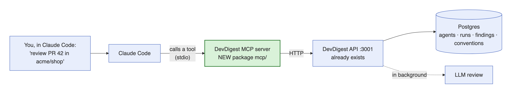
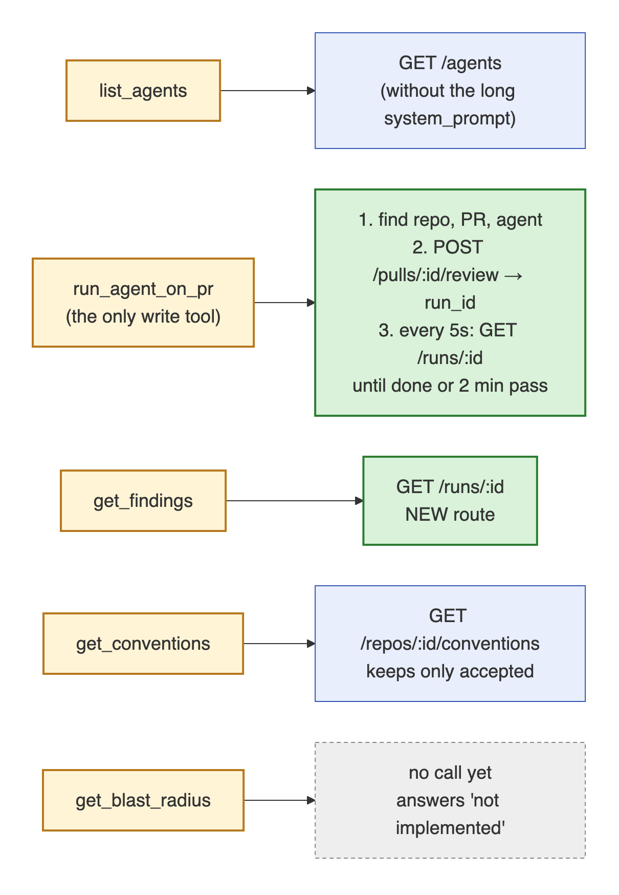
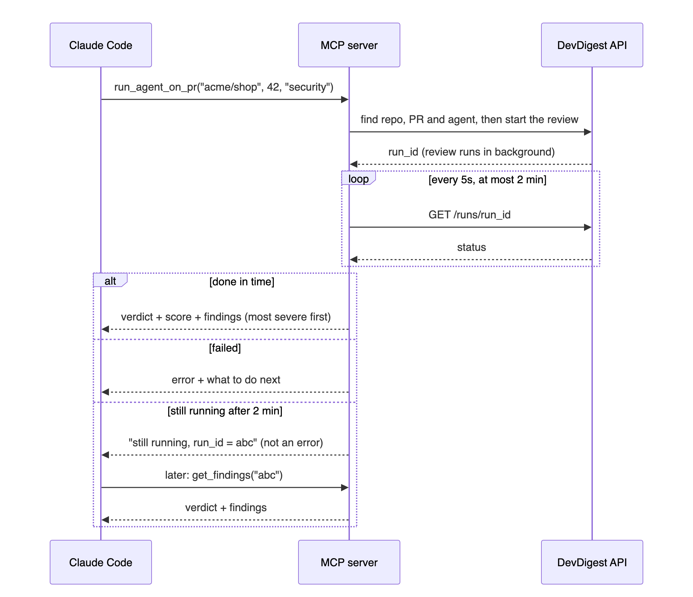
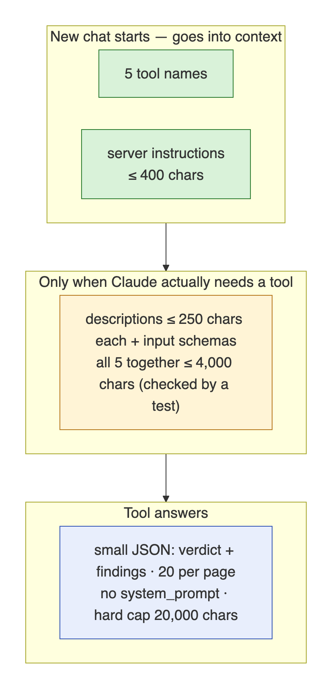
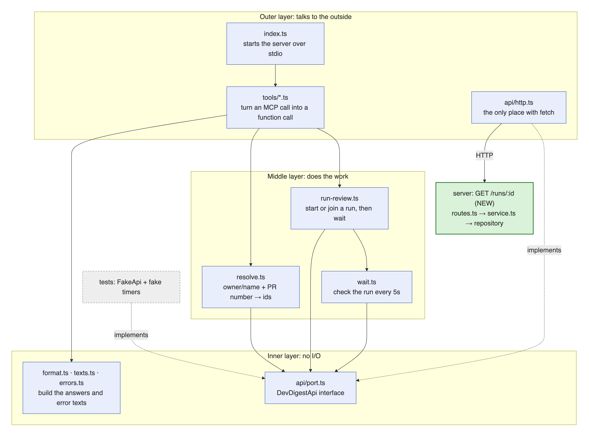
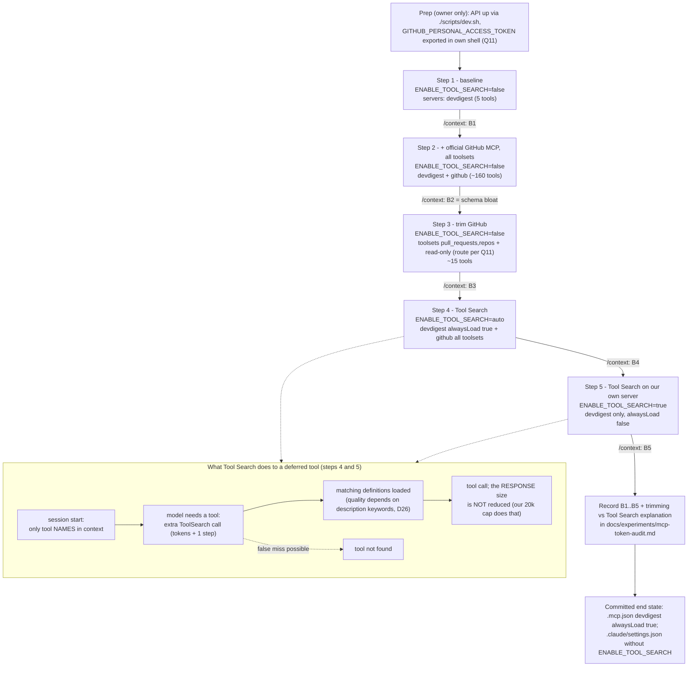
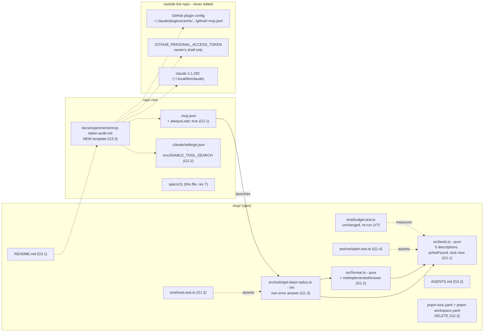

# 11 — `devdigest-mcp`: an MCP server over the DevDigest API

> Status: **implemented, revision 7 (course best-practice audit: always-load, searchable
> descriptions, non-error stub, token audit) implemented and verified** (2026-10-09).
> Scope: NEW `mcp/` package (local stdio server only), `server/` (one new read route plus a
> response schema on one existing route), `@devdigest/shared` (two additive contracts, both
> trees), repo root (`.mcp.json`, `.claude/settings.json`, CI, docs). EARS acceptance criteria in §8.
> Lesson: `README.md:85` — "L04: `devdigest-mcp` server · Blast Radius".
> Revisions are listed in §13. Revision 7 is §9 Phase G; Q11 and Q12 were resolved on 2026-10-08 (§12). Measured results: `docs/experiments/mcp-token-audit.md`.

## 1. Summary

This spec gives any MCP client (Claude Code first) five DevDigest tools. Each one has a
single role:

| Tool | Role |
|------|------|
| `list_agents` | The configured reviewers, and the source of a valid `agent` value |
| `run_agent_on_pr` | The **only write tool**. It starts a review, **blocks** for up to 120 s, and returns the finished verdict + findings |
| `get_findings` | A concise verdict for a run that has already finished. It is also the fallback when the 120 s cap was hit |
| `get_conventions` | The repo's conventions: the same `convention_candidates` that L02 / `specs/04-conventions.md` extract |
| `get_blast_radius` | The PR impact map. It is a **stub** for now and gets implemented later as homework. From revision 7 it answers a **non-error** `{"status":"not_implemented","next":…}` (D27) |

The server lives in a new top-level package, `mcp/` (confirmed by Oleh). It speaks MCP over
**stdio only** and is a thin HTTP wrapper over the running Fastify API (`:3001`), also
confirmed by Oleh. It never embeds `buildApp`, because a second in-process app would start
its own `runBus` and boot-time reaper, and both assume a single API process.

Arguments are flat scalars (P2): `repo: "owner/name"`, `pr` (the PR number) and `agent`
(a name or id). Answers are small JSON objects of the shape `{verdict, …, findings[]}`.
They carry only the fields a model needs (P3). Errors tell the model what to call next (P4).
Every model-visible text is fixed verbatim in §7b and snapshot-tested (AC-21).

Every definition is kept small: 1–2 sentence descriptions, flat inputs, no `outputSchema`,
and a fixed tool order. The **measured** `tools/list` was 3,339 chars (revision 6) against a
4,000-char budget; revision 7's keyword-enriched descriptions are estimated at **≈3,514**
(§7b budget check, AC-2).

**Revision 7 changes how the definitions reach the model.** Up to revision 6, Claude Code
deferred the devdigest tools behind Tool Search (only names + the 230-char `instructions`
entered context, and the first use needed a `ToolSearch` round trip). That was forced by
`"ENABLE_TOOL_SEARCH": "true"` in `.claude/settings.json:15-17`. From revision 7 (Oleh,
2026-10-08) the devdigest server is **always loaded** (`"alwaysLoad": true` in `.mcp.json`,
D24): the ≈3.5k chars of definitions are always in context, and no search step precedes a
devdigest call. The project no longer pins `ENABLE_TOOL_SEARCH` (D25), so Claude Code's
default applies and the token-audit steps can toggle it per session. The descriptions carry
search keywords (D26) so that clients which still defer them can find the tools.

Revision 7 also writes down the token audit from the course (five `/context` measurements,
D29) and the live verification path (MCP Inspector, then an agent-driven review, D30, D31).

Two server gaps have to close (revisions 1–6, implemented):
1. **Findings by run id.** Today findings can only be read per PR, and `RunSummary` has no `pr_id`. We add **one** workspace-scoped read route, `GET /runs/:id` → `RunDetail`. Both the wait loop and `get_findings` read it.
2. **Active-runs contract.** The existing `GET /pulls/:id/runs/active` has no contract, so re-attach would depend on a hand-copied shape. We add an `ActiveRun` contract and a response schema on that route (Q8, resolved).

§7c lists every change outside `mcp/`.

**Out of scope:**
- a real blast-radius implementation, i.e. any route over `container.repoIntel.getBlastRadius` (follow-up / homework)
- HTTP/SSE transport and remote hosting; MCP resources and prompts; the MCP Tasks extension
- a facade tool or "code mode" over the five tools (D33)
- `list_repos`, `list_prs`, list-duplicates or any other tool that `gh` already covers (D33)
- installing, configuring or committing the GitHub MCP server for normal sessions; it appears only inside the manual token audit (D29)
- entering, storing or committing a GitHub token by any agent (T8; Q11)
- a per-call wait argument (the bound is an env setting, D17)
- running several agents in one call (`all`, D9)
- running disabled agents (D9, Q1)
- UUID addressing for repo/PR (D5, Q2)
- cancelling the server-side run from MCP
- auth on the API
- accepting or dismissing findings
- a server-side `status` filter on conventions
- fixing the existing contract-tree drift in `knowledge.ts` / `trace.ts` / `eval-ci.ts` / `productionize.ts`
- retyping `ReviewDto.verdict` for `GET /pulls/:id/reviews`
- any `client/` UI
- re-rendering the revision 1–6 PNG diagrams (diagram 4 now describes the pre-revision-7 deferral; the Mermaid diagrams below supersede it)

### How it works (diagrams)

Mermaid sources: [`assets/11-diagrams.md`](assets/11-diagrams.md) — edit there and re-render the PNGs.

**1. The big picture.** Claude Code talks to the new MCP server; the MCP server only calls the API that already runs on :3001.



**2. What each tool calls.** `run_agent_on_pr` starts the review and then checks on it every 5 s. Green = new behaviour. Grey = the stub.



**3. Running a review.** One call starts the review and waits up to 2 minutes. If it finishes, you get the findings right away. If not, you get the `run_id` and read it later with `get_findings`.



**4. What costs tokens, and when (revisions 1–6).** Only the names and a short instructions text load when a chat opens. Revision 7 changes this for Claude Code: see diagram 6.



**5. Inside the `mcp/` package.** There are three layers: outer (talks to the outside), middle (does the work) and inner (no I/O). Tools never call `fetch`; they go through the `DevDigestApi` interface, so tests swap in a fake.



### Revision 7 diagrams

**6. Token audit and Tool Search lifecycle (five `/context` steps).** Each step is a fresh
Claude Code session started from the repo root with an isolated MCP config
(`--strict-mcp-config --mcp-config '<json>'`) and `ENABLE_TOOL_SEARCH` set on the command
line. The owner reads `/mcp` (which servers and how many tools) and `/context` (MCP tool
tokens) and writes the numbers into `docs/experiments/mcp-token-audit.md`. No number is
filled in by an agent.



**7. What revision 7 touches.** Solid = edited in Phase G; dashed = read or referenced only.



## 2. Decisions

### How Oleh's principles are satisfied

| Principle | Satisfied by |
|-----------|--------------|
| **P1 Result, not operation.** `run_agent_on_pr` creates the run, waits, and returns findings; it is the only write tool | D8 + D17 (block up to 120 s, return findings), D12 (the only tool with `readOnlyHint:false`), D18 (re-attach instead of duplicate runs) |
| **P2 Flat arguments.** `repo`, `pr`, `agent` are simple scalars | D5 (`repo` string, `pr` integer, `agent` string; no UUIDs), D9 (no `all` flag). AC-2 asserts that no input is an object or array |
| **P3 Concise structured answer.** `{verdict, findings[]}` with only the needed fields | D11 (one compact JSON object, a fixed field list, paginated, capped); exact templates in §7b |
| **P4 Error leads forward.** e.g. "agent not found, call list_agents" | D19; every error string is in §7b; revision 7 points `prNotFound` at `gh pr list` (D28) |

### How the course best practices are satisfied (revision 7 audit, 2026-10-08)

| # | Course practice | Status | Satisfied by |
|---|-----------------|--------|--------------|
| C1 | Five DevDigest-unique tools; `get_blast_radius` is a stub for homework | done | D10/D27, D13 |
| C2 | Connect via `.mcp.json`; MCP Inspector shows all 5 tools with descriptions, each callable by hand; `list_agents` from Inspector returns the agents before Claude Code is involved | **gap: no UI command, no `tools/call`, no recorded evidence** | D30, G3.1, V16, V17 |
| C3 | The agent runs a review itself: discovery `list_agents` → `run_agent_on_pr` → `get_findings`; it waits and quotes the findings | **gap: never run live** | D31, V20 (owner's call, Q12) |
| C4 | Token audit with `/context`, five measured steps, and the trimming-vs-Tool-Search explanation | **gap** | D29, G3.3, V19 |
| C5 | Tool Search limits: not everywhere (Haiku, Vertex, proxies); extra step + tokens → `alwaysLoad: true` for a frequently used server; false misses; quality depends on descriptions; does not fix large responses | **gap: devdigest is deferred; descriptions have few search words** | D24, D26; large responses already capped (D11, AC-19) |
| C6 | Facade pattern: not for five distinct tools | done | D33 |
| C7 | Four design principles (result, flat args, concise answer, error leads forward) | done; stub and `prNotFound` tightened | P1–P4 table, D27, D28 |
| C8 | No `list_repos` / `list_prs` / list-duplicates — `gh pr list` covers it | done; error text now names `gh pr list` | D33, D28 |

### Decision table

| # | Decision | Consequence |
|---|----------|-------------|
| D1 | New top-level package **`mcp/`** (**confirmed by Oleh**), name `@devdigest/mcp`, **npm** with its own `package-lock.json`. Same tooling pattern as `reviewer-core/` and `e2e/` (`reviewer-core/package.json:1-21`, `e2e/package.json:1-16`) | Avoids the pnpm `ERR_PNPM_IGNORED_BUILDS` gate. Adds a 7th CI workflow and one more lockfile. Runs from source via `tsx`, so there is no build step |
| D2 | **Thin HTTP wrapper** over the running API (**confirmed by Oleh**), at `DEVDIGEST_API_URL` (default `http://localhost:3001`). Never in-process `buildApp`. Local **stdio only** | Keeps the single-process `runBus`/reaper assumption intact. Needs the API up, and every tool says how to start it when it is down (AC-11) |
| D3 | SDK **`@modelcontextprotocol/sdk` 1.32.1** (v1 line: `McpServer.registerTool`, `StdioServerTransport`) + **`zod` ^3.25** inside `mcp/` only. v2 needs zod ^4.2 | Stays on Zod v3 like the rest of the repo (`server/package.json:39`) |
| D4 | `mcp/` imports `@devdigest/shared` **types only** (`import type`) through a tsconfig `paths` alias for `@devdigest/shared`. **No `zod` / `zod/*` paths pin** (unlike `reviewer-core/tsconfig.json`). Under SDK 1.32.1 the pin breaks `registerTool` typing (TS2589; `ZodNumber` not assignable to `AnySchema`). The reason is recorded in `mcp/AGENTS.md` and root `INSIGHTS.md` (2026-10-06). Hand-written literal lists that mirror a shared enum are tied to it by a compile-time assertion | Types and enum literals stay locked to the canonical contracts at typecheck time. Shared is imported type-only, so nothing from it loads at runtime: no duplicate zod and no runtime alias resolution |
| D5 | **Flat addressing (P2), Q2 resolved: no UUIDs.**<br>• `repo: "owner/name"`: case-insensitive match on `Repo.full_name`.<br>• `pr`: integer PR number, renamed from `pr_number` as on the slide.<br>• `agent`: a name or id.<br>They are resolved via `GET /repos`, `GET /repos/:id/pulls` and `GET /agents`. `run_id` is the only UUID input | Natural for any model. Costs 3 GETs before the POST. `GET /repos/:id/pulls` may sync from GitHub first (`server/src/modules/pulls/routes.ts:42-45`) |
| D6 | **One** new server route: `GET /runs/:id` → `RunDetail` = `RunSummary` + `pr_id` + `review: ReviewRecord \| null`, workspace-scoped | The wait loop and `get_findings` share one cheap read. Additive contract, no migration |
| D7 | `get_conventions` defaults to `status: "accepted"` (`accepted\|pending\|rejected\|all`) and filters **client-side**. Same data as spec 04 (L02) | No contract change |
| D8 | **Blocking with a bounded wait (Oleh: blocking, hard cap 120 s).** `run_agent_on_pr` starts the run, then polls `GET /runs/:id` every **5 s** until it leaves `running` or the cap passes. Outcomes:<br>• **done** → the P3 answer<br>• **failed / cancelled** → `isError` with the run `error` + a next step<br>• **cap exceeded** → **non-error** `{status:"running", run_id, next}` pointing to `get_findings` | One call gives the result in the common case (P1); `get_findings` is the fallback. 5 s polling = 12/min against the API-wide 120/min limit (`server/src/app.ts:102`) that the studio UI shares |
| D9 | Exactly **one agent** per call: `agent` is required, and there is no `all`. **A disabled agent is never run** (Q1 resolved): it is refused with the §7b forward-leading error, and nothing is POSTed | Matches `run_agent_on_pr(repo, pr, agent)`. No fan-out of LLM spend or of the 10/min review limit (`routes.ts:29`) |
| D10 | `get_blast_radius` **is registered** (inputs `repo`, `pr`). ~~It always returns the §7b `isError` text~~ **Superseded by D27 (revision 7):** it always returns the non-error `not_implemented` answer. Still no HTTP call and no env flag to hide it | Shows the L04 shape now. The schema is fixed for the homework implementation |
| D11 | **P3 answers:** every tool returns **one text block of compact JSON**, with no `outputSchema` / `structuredContent`. Exact templates are in §7b.<br>• Findings are sorted CRITICAL → WARNING → SUGGESTION, then file, then line.<br>• Pagination via `limit` (default 20, max 100) / `offset`.<br>• `detail:"full"` adds `rationale`/`suggestion` (≤ 600 chars each).<br>• All text is hard-capped at 20,000 chars with `"truncated":true` | Structured for the model, with no double-send of text and JSON. This cap is also what keeps large tool **responses** small — Tool Search does not (C5) |
| D12 | **All four annotations explicit on every tool:**<br>• read tools: `readOnlyHint:true, destructiveHint:false, idempotentHint:true, openWorldHint:false`<br>• `run_agent_on_pr`: `readOnlyHint:false, destructiveHint:false, idempotentHint:false, openWorldHint:true` | Read and write are clearly separated. The explicit `destructiveHint:false` overrides the default of `true` |
| D13 | No `devdigest_` prefix (the client shows `mcp__devdigest__<tool>`). Fixed order: list_agents, run_agent_on_pr, get_findings, get_conventions, get_blast_radius | Deterministic `tools/list`, which keeps prompt caching stable |
| D14 | Root **`.mcp.json`**: server `devdigest`, command `mcp/node_modules/.bin/tsx mcp/src/index.ts`. Env holds only `DEVDIGEST_API_URL` and `DEVDIGEST_MCP_RUN_WAIT_SEC` and **no secrets** (the API reads its own from `~/.devdigest/secrets.json`). Revision 7 adds `"alwaysLoad": true` (D24) | Zero-setup after `npm ci` in `mcp/`. Launching from the repo root with these relative paths was verified (§12 Q3, resolved) |
| D15 | **Rings inside `mcp/`** (map in §7c):<br>• **Rim:** `index.ts`, `config.ts`, `api/http.ts` and the thin `tools/*.ts` handlers.<br>• **Application:** `run-review.ts`, `resolve.ts`, `wait.ts`.<br>• **Pure:** `format.ts`, `texts.ts`, `errors.ts`, and the `api/port.ts` interface.<br>Pure modules import only from other pure modules, or `import type` from the port and shared. `fetch` lives only in `http.ts` | Each file sits in exactly one ring. Application code is tested directly with `FakeApi` and fake timers, with no network and no LLM |
| D16 | `RunDetail.review` is built by a NEW pure helper `reviewToRecord(...)` in `server/src/modules/reviews/helpers.ts`. It narrows `verdict` with `Verdict.safeParse` (unknown → `null`) and uses no `as`. `reviewToDto` is untouched | It typechecks with the response schema kept. A legacy bad verdict becomes `null`, not a 500 |
| D17 | **Wait cap.**<br>• `DEVDIGEST_MCP_RUN_WAIT_SEC` defaults to **120 s**, the value Oleh chose.<br>• Q10 resolved: the env var may raise it **up to 900 s** and may also lower it (clamp 0–900). `0` means start and return at once, with a non-error running answer.<br>• The poll interval is fixed at 5 s.<br>• Q9 resolved: the §7b texts that say "2 min" **stay fixed** and are not re-rendered from the env value. The `RUNNING` answer prints the real `<waitSec>` | Claude Code: `MCP_TOOL_TIMEOUT` is a long wall clock (~28 h per the docs), and stdio idle is 30 min, so 120 s is safe. Claude Desktop's limit is **unverified**; users there can lower the env value. Fixed texts keep E6 and the AC-2 budget stable |
| D18 | **Progress, cancellation, re-attach.**<br>• **Progress:** when the request carries `_meta.progressToken`, send `notifications/progress` `{progress: elapsedSec, total: waitSec, message:"review running"}` on each poll.<br>• **Cancellation:** honour the handler's `AbortSignal`, which stops polling. The server run is **not** cancelled.<br>• **Re-attach:** if `GET /pulls/:id/runs/active` (`routes.ts:95`) shows a run whose `agent_id` equals the agent, wait on it instead of POSTing. It matches on **agent only, with no head-SHA check** (Q7 resolved).<br>• **Shape:** the `ActiveRun` shape is the **shared contract** (D23), consumed in `mcp/` via `import type` | Progress is cheap. Not cancelling keeps paid LLM work readable via `get_findings`. A model's retry after a timeout becomes free instead of a second paid run. A server-side rename of an `ActiveRun` field now fails tsc and the route serializer, instead of silently breaking re-attach |
| D19 | **P4:** every `isError` text names the next call or action. The exact strings are in §7b | The model recovers without asking the user |
| D20 | **Verbatim texts:** every model-visible string comes from one pure module, `mcp/src/texts.ts`, copied byte-for-byte from §7b: the instructions, titles, descriptions, `.describe()` strings, and the success/error templates. `mcp/test/verbatim.test.ts` holds the §7b strings as literals and asserts equality against `tools/list` and the rendered templates (AC-21) | Wording changes need a spec change first. The budget numbers in §7b stay true |
| D21 | **Error types live in the pure leaf `mcp/src/errors.ts`:**<br>• `ApiError` (`status: number \| null`, `code`) and `ToolFailure` (`text`)<br>• `toToolError(err, apiUrl)`, which maps an error to the §7b text using `texts.ts`<br>`apiUrl` is passed in by the rim (tool handlers get it from `createServer` opts) | `ApiError` and `ToolFailure` can be told apart with no application-ring import. The "unreachable" text gets `<apiUrl>` without a pure module reading env |
| D22 | **`run-review.ts` owns the `run_agent_on_pr` orchestration.** Signature: `runReview(api, ids: { prId, agentId }, { signal, onTick, waitSec, pollMs }) → Promise<ReviewOutcome>`. It does attach-or-start → `waitForRun` → outcome. `ReviewOutcome` is:<br>• `{ kind:'done', detail, attached }`<br>• `{ kind:'failed' \| 'cancelled', detail }`<br>• `{ kind:'running', runId, agentName, attached }`<br>It also exports `fetchRun(api, runId)` for `get_findings`. The handler only resolves, maps MCP `extra` to `signal`/`onTick`, and formats | The core P1 logic is testable without an MCP transport. The handlers stay thin rim code |
| D23 | **`ActiveRun` contract in this PR** (Q8 resolved, option A).<br>• A Zod `ActiveRun` goes in `review-api.ts` in **both** trees, in the same Phase A edit as `RunDetail`, byte-identical.<br>• `response: { 200: z.array(ActiveRun) }` is added on the existing `GET /pulls/:id/runs/active` (`routes.ts:95`).<br>• The shape is exactly that of `run.repo.ts:14`, in snake_case. There is no handler change.<br>• A route test asserts the shape | No hand-copied shape in `mcp/`. The studio UI's existing call gets the same JSON; the serializer only adds a guard |
| D24 | **Revision 7 (Oleh, 2026-10-08): the devdigest server is always loaded.** Add the per-server boolean `"alwaysLoad": true` to `mcpServers.devdigest` in `.mcp.json`. Evidence the key exists: the config schema bundled in the installed `claude` 2.1.292 (`~/.local/share/claude/versions/2.1.292`) declares, on the stdio server entry next to `command`/`args`/`env`/`timeout`, `alwaysLoad: boolean (optional)` — "When true, all tools from this server are always included in the prompt and never deferred behind tool search … When false, all tools from this server are deferred behind tool search." The same field exists on `http`/`sse` entries. **Gate:** if V18 does not show the devdigest tools loaded (not deferred) in a fresh session, the implementer **stops and reports**; no other key is tried | devdigest is used in nearly every review session, so a `ToolSearch` round trip before each first use costs more than the ≈3.5k chars of definitions (C5). Costs: those chars are now always in context, even in sessions that never review a PR. Tools-level `_meta["anthropic/alwaysLoad"]` is **not** used (server-level is enough and keeps `tools/list` unchanged) |
| D25 | **Revision 7: the project stops pinning Tool Search.** Remove the `env` block (`"ENABLE_TOOL_SEARCH": "true"`) from `.claude/settings.json:15-17`, leaving `hooks` untouched. Unset = Claude Code's default (`auto`); the binary treats unset and `auto` alike (threshold function: `if(!e)return …; if(e==="auto")return …`). The audit sets the value per session on the command line (`ENABLE_TOOL_SEARCH=false claude …`) | `true` forced deferral of **every** MCP tool in **every** session of this repo, which is why devdigest needed a `ToolSearch`. A project-settings env value would also compete with the per-step command-line value during the audit. Removing it is simpler than setting `"auto"`, which would pin the same default and re-create that competition. This affects every developer session in the repo (§10) |
| D26 | **Revision 7 (Oleh, 2026-10-08): descriptions carry search keywords** ("code review", "pull request (PR)", "GitHub", "security/bug findings", "severity", "style rules"). Only the five `description` strings change; titles, `instructions` and `.describe()` strings stay. Exact texts in §7b. Estimated `tools/list` ≈3,514 chars (+175 over the measured 3,339) against the unchanged 4,000 budget; longest description 190 ≤ 250 | Tool Search ranks deferred tools by their names and descriptions, so clients that still defer devdigest (D24 is Claude-Code-only) can find it from words a user actually types. The budget test (E4) re-measures it; the remaining headroom is ≈486 chars |
| D27 | *(Superseded by spec 12: `get_blast_radius` is implemented and calls `GET /pulls/:id/blast`; see `specs/12-blast-radius.md` §7.3.)* **Revision 7 (Oleh, 2026-10-08): the stub answers without an error.** `get_blast_radius` returns `isError` **false** with `{"status":"not_implemented","next":"get_blast_radius is not implemented yet. Use run_agent_on_pr or get_findings for review results."}`, built by a NEW pure `notImplementedAnswer(next)` in `format.ts`. Input schema (`repo`, `pr`), title, annotations and "no API request" are unchanged. Supersedes D10's `isError` and AC-17 | A known, intended limitation is not a failure; an `isError` result can make an agent retry or report a broken server. The status field still tells the model to go elsewhere (P4). The homework implementation keeps the same input schema |
| D28 | **Revision 7: `prNotFound` leads to `gh pr list`.** New text: `PR #<pr> not found in <repo>. Check the number with gh pr list --repo <repo>; if it is listed, open the PR in the DevDigest studio to sync it, then call run_agent_on_pr again.` | The model can verify the number itself with `gh` (the reason there is no `list_prs`, C8). The studio fallback stays because `GET /repos/:id/pulls` syncs from GitHub only when the API has a GitHub client (`server/src/modules/pulls/routes.ts:38-45`); without one, a PR that `gh` lists can still be unknown to the API |
| D29 | **Revision 7: the token audit is a manual, owner-run experiment written up in NEW `docs/experiments/mcp-token-audit.md`.** The file is a template: the five steps of diagram 6 with exact commands, a results table whose numbers are `—` until the owner measures them, and the trimming-vs-Tool-Search explanation. Each step is isolated with `claude --strict-mcp-config --mcp-config '<json>'` (both flags exist in `claude` 2.1.292; `--mcp-config` takes "JSON files or strings") and `ENABLE_TOOL_SEARCH=<value>` on the command line. The GitHub entries use only `${GITHUB_PERSONAL_ACCESS_TOKEN}` placeholders, never a token | Reproducible numbers with no side effect on `.mcp.json`, the plugin config or other sessions. No agent invents or fills numbers. Whether `${…}` is expanded inside an inline `--mcp-config` string, and which trimming route works, are open (Q11) |
| D30 | **Revision 7: MCP Inspector is the first live check (C2).** `mcp/README.md` gains the UI-mode command, the CLI `tools/list` command (kept) and a CLI `tools/call list_agents` command. The owner records the outcome (date, 5 tools listed, agent count returned) in the "Inspector check" section of the audit doc | Proves the server and API work before Claude Code is involved. The Inspector CLI flags are not verifiable offline; G3.1 confirms them with `--help` first (stop and report on a mismatch) |
| D31 | **Revision 7: the agent-driven review (C3) is a manual, top-level verification (V20), never an implementer step.** Prompt, verbatim: `review PR #3 in the demo repo with security-reviewer, are there critical findings`. Expected chain: `list_agents` → `run_agent_on_pr` → (if `running`) `get_findings`, and the answer quotes findings. Candidate demo repo: `OlegDEma/dev-digest`, whose PR #3 is the experiment fixture `exp/api-contract-breaking-change` (`docs/experiments/skills-control-experiments.md:10-11`) | Spends LLM tokens, so it is Oleh's call. Whether that is the demo repo and whether a `security-reviewer` agent exists is open (Q12) |
| D32 | **Revision 7: delete the stray `mcp/pnpm-lock.yaml` and `mcp/pnpm-workspace.yaml`.** Both are untracked (all of `mcp/` is untracked on `LO4`); `mcp/` is npm (D1, T9) | Only `mcp/package-lock.json` remains, so nobody runs pnpm in an npm package by accident |
| D33 | **Revision 7 records two non-changes.** (a) No facade / single dispatch tool: the five tools have different roles, inputs and annotations (one writes), so a facade would hide the read/write split (D12) and force nested args (P2). (b) No `list_repos` / `list_prs` / list-duplicates: `gh pr list` and `gh repo list` already answer them, and every error that needs such a list names the call (`repoNotFound` lists known repos, D28 names `gh pr list`) | Keeps `tools/list` small and the five tools DevDigest-unique (C1, C6, C8) |

## 3. What already exists — do not rebuild

| Layer | Already there | File |
|-------|---------------|------|
| API | List agents (includes disabled, carries large `system_prompt`) | `server/src/modules/agents/routes.ts:74`, contract `server/src/vendor/shared/contracts/knowledge.ts:296-314` |
| API | Start review, fire-and-forget, returns run ids; rate limit 10/min | `server/src/modules/reviews/routes.ts:27-46`, `server/src/modules/reviews/service.ts:103-138` |
| API | `resolveTargets`: `agentId` → that agent (disabled not checked; MCP refuses disabled itself, D9) | `server/src/modules/reviews/service.ts:46-57` |
| API | In-flight runs for a PR, `{run_id: string; agent_id: string\|null; agent_name: string\|null; ran_at: string\|null}[]`. Before this spec it had **no shared contract and no response schema**; D23 adds both | `server/src/modules/reviews/routes.ts:95`, `server/src/modules/reviews/repository/run.repo.ts:10-37` (type at `:14`) |
| API | Run history per PR (`RunSummary`, no `pr_id`) | `server/src/modules/reviews/routes.ts:101`, `server/src/vendor/shared/contracts/trace.ts:98-120` |
| API | Reviews + findings per PR only | `server/src/modules/reviews/routes.ts:129`, `server/src/vendor/shared/contracts/review-api.ts:15-38` |
| API | Conventions per repo, all statuses; `ConventionStatus` enum | `server/src/modules/conventions/routes.ts:36`, `server/src/vendor/shared/contracts/knowledge.ts:228-247` |
| API | Repos (`full_name`) and PRs per repo (`PrMeta.id` nullish, GitHub sync on read only when a GitHub client is available) | `server/src/modules/repos/routes.ts:33`, `server/src/modules/pulls/routes.ts:26-45`, `server/src/vendor/shared/contracts/platform.ts:140-160` |
| API | Global rate limit 120/min | `server/src/app.ts:102` |
| DB | `reviews.run_id` links review → run (no FK) | `server/src/db/schema/reviews.ts:27-28` |
| DB | `agent_runs` has `pr_id`, `workspace_id`, `status`, `error` | `server/src/db/schema/runs.ts:19-46` |
| Domain | Review persisted **before** run is marked `done` | `server/src/modules/reviews/run-executor.ts:291-317` |
| Domain | Missing LLM key → run persisted `failed` with `error` | `server/src/modules/reviews/run-executor.ts:172-178` |
| Mapping | `reviewToDto` / `findingRowToDto`; `ReviewDto.verdict` is `string \| null` | `server/src/modules/reviews/helpers.ts:18-74` (`:25`) |
| Mapping | `RunSummary` row mapping (inline in `listRunsForPull`) | `server/src/modules/reviews/repository/run.repo.ts:40-69` |
| Domain | Blast radius computation (not exposed; out of scope) | `server/src/modules/repo-intel/service.ts:220` |
| Errors | `{error:{code,message,details}}`, 404 `not_found`, 422 validation | `server/src/platform/errors.ts:7-23`, `server/src/app.ts:122-168` |
| Test | testcontainers PG fixture, `buildApp({db})` + `inject`; hermetic helpers test | `server/test/helpers/pg.ts:43`, `server/test/run-cost.it.test.ts:1-120,183-188`, `server/test/reviews-helpers.test.ts` |

None of the following existed before this spec: MCP code, `.mcp.json`, an `mcp/` directory,
a `GET /runs/:id` route, an `ActiveRun` contract. Verified 2026-10-06 by:
- `rg -il mcp`: only `README.md:85`, `INSIGHTS.md:119` and spec 05.
- `ls .mcp.json`: absent.
- `rg "'/runs" server/src/modules`: no GET on `/runs/:id`.
- `review-api.ts:1-78`: no `ActiveRun`.

There is no `server/.dependency-cruiser.cjs` and no `arch:check` script, so the boundaries
are enforced by review only.

### Revision 7 — what already exists (verified 2026-10-08)

| Area | Already there | File |
|------|---------------|------|
| Verbatim texts | all five descriptions, `prNotFound`, `BLAST_RADIUS_STUB` | `mcp/src/texts.ts:16-40`, `:69-70`, `:88-89` |
| Stub handler | returns `errorResult(T.BLAST_RADIUS_STUB)`, final input schema, `READ_ONLY` annotations | `mcp/src/tools/get-blast-radius.ts:8-22` |
| Non-error result helper | `okText(text)` | `mcp/src/tools/types.ts:16` |
| Error result helper | `errorResult(text)` | `mcp/src/errors.ts:24-26` |
| JSON shaping + cap | `toText`, `runningAnswer` pattern to copy for the stub | `mcp/src/format.ts:18`, `:98-100` |
| `prNotFound` call site | `resolvePr` | `mcp/src/resolve.ts:26` |
| Snapshot literals | descriptions `verbatim.test.ts:24-57`; `prNotFound` `:95-97`; stub `:108-110` | `mcp/test/verbatim.test.ts` |
| Stub behaviour test | asserts `isError` true | `mcp/test/tools.test.ts:319-327` |
| Budget test | instructions ≤ 400, description ≤ 250, total ≤ 4,000, logs size | `mcp/test/budget.test.ts:5-16` |
| Registration | `devdigest` stdio entry, no `alwaysLoad` | `.mcp.json:1-13` |
| Project settings | `"env": {"ENABLE_TOOL_SEARCH": "true"}` (uncommitted on `LO4`; `git log -S` finds no commit) | `.claude/settings.json:15-17` |
| GitHub MCP | plugin `github@anthropic-plugin-directory`, remote `http` server `https://api.githubcopilot.com/mcp/`, header `Authorization: Bearer ${GITHUB_PERSONAL_ACCESS_TOKEN}`; enabled in user settings | `~/.claude/plugins/cache/anthropic-plugin-directory/github/d4226d062928-0e62e4cb/.mcp.json`, `~/.claude/settings.json:5` |
| CLI | `claude` 2.1.292 with `--mcp-config`, `--strict-mcp-config`, per-server `alwaysLoad`, `ENABLE_TOOL_SEARCH` values `true` / `false` / `auto` / `auto:N` | `~/.local/bin/claude` → `~/.local/share/claude/versions/2.1.292` |
| Inspector docs | only the CLI `tools/list` command | `mcp/README.md:29-32` |
| Experiments folder | one prior write-up (format to follow) | `docs/experiments/skills-control-experiments.md` |
| Stray pnpm files | `mcp/pnpm-lock.yaml`, `mcp/pnpm-workspace.yaml` (untracked) | `mcp/` |

Nothing for the audit doc, the `alwaysLoad` key or the non-error stub is pre-staged —
verified by `rg -n "ENABLE_TOOL_SEARCH|alwaysLoad|Tool Search" --glob '!server/clones/**'` (only
`.claude/settings.json`) and `ls docs/experiments` (no `mcp-token-audit.md`).

### Code map — files this change touches

| File | Why it changes | Anchor |
|------|----------------|--------|
| `server/src/vendor/shared/contracts/review-api.ts` | add `RunDetail` + `ActiveRun` | `review-api.ts:38` |
| `client/src/vendor/shared/contracts/review-api.ts` | identical mirror | same |
| `server/src/modules/reviews/repository/run.repo.ts` | `toRunSummary`, `getRunForWorkspace` | `run.repo.ts:40-69` |
| `server/src/modules/reviews/repository/review.repo.ts` | `reviewForRun` | `review.repo.ts:57-74` |
| `server/src/modules/reviews/repository.ts` | facade | `repository.ts:62-83` |
| `server/src/modules/reviews/helpers.ts` | `toVerdict`, `reviewToRecord` | `helpers.ts:55-74` |
| `server/src/modules/reviews/service.ts` | `runDetail` | `service.ts:156-178` |
| `server/src/modules/reviews/routes.ts` | `GET /runs/:id`; `ActiveRun` response schema on `:95`; doc comment | `routes.ts:10-17`, `:95`, `:106-112` |
| `server/test/reviews-helpers.test.ts` | `reviewToRecord` cases | existing |
| `server/test/run-detail.it.test.ts` | NEW tests for both routes | pattern `run-cost.it.test.ts` |
| `mcp/package.json`, `mcp/tsconfig.json`, `mcp/package-lock.json` | NEW package | `reviewer-core/package.json`, `reviewer-core/tsconfig.json` |
| `mcp/src/config.ts` | NEW env parsing | — |
| `mcp/src/log.ts` | NEW stderr logger | — |
| `mcp/src/texts.ts` | NEW verbatim §7b strings + templates. **Rev 7:** 5 descriptions, `prNotFound`, stub `next` | `texts.ts:16-40`, `:69-70`, `:88-89` |
| `mcp/src/errors.ts` | NEW pure `ApiError`, `ToolFailure`, `toToolError(err, apiUrl)` | — |
| `mcp/src/api/port.ts` | NEW `DevDigestApi` interface (types only) | — |
| `mcp/src/api/http.ts` | NEW fetch adapter | — |
| `mcp/src/resolve.ts` | NEW resolution (rev 7: no code change; its text changes in `texts.ts`) | `resolve.ts:26` |
| `mcp/src/wait.ts` | NEW bounded poll | — |
| `mcp/src/run-review.ts` | NEW `run_agent_on_pr` orchestration + `fetchRun` | — |
| `mcp/src/format.ts` | NEW pure P3 shaping + cap. **Rev 7:** + `notImplementedAnswer(next)` | `format.ts:98-100` |
| `mcp/src/tools/{list-agents,run-agent-on-pr,get-findings,get-conventions,get-blast-radius}.ts` | NEW thin handlers. **Rev 7:** `get-blast-radius.ts` returns `okText(notImplementedAnswer(…))` | `get-blast-radius.ts:4,8,21` |
| `mcp/src/server.ts`, `mcp/src/index.ts` | NEW server + stdio entry | — |
| `mcp/test/{tools,run-review,budget,http,verbatim}.test.ts` + helper `mcp/test/fake-api.ts` | NEW hermetic tests. **Rev 7:** `verbatim.test.ts` literals, `tools.test.ts` stub case | `verbatim.test.ts:24-57,95-97,108-110`, `tools.test.ts:319-327` |
| `mcp/AGENTS.md`, `mcp/CLAUDE.md`, `mcp/README.md` | NEW module map. **Rev 7:** README Inspector commands + audit link; AGENTS conventions bullets | `README.md:5-11,29-32`, `AGENTS.md:22-40` |
| `mcp/pnpm-lock.yaml`, `mcp/pnpm-workspace.yaml` | **Rev 7: DELETE** (stray, D32) | — |
| `.mcp.json` | NEW registration. **Rev 7:** `"alwaysLoad": true` | `.mcp.json:3-11` |
| `.claude/settings.json` | **Rev 7:** remove the `env` block | `.claude/settings.json:15-17` |
| `docs/experiments/mcp-token-audit.md` | **Rev 7: NEW** audit template (D29) | pattern `docs/experiments/skills-control-experiments.md` |
| `.github/workflows/mcp.yml` | NEW CI | `.github/workflows/reviewer-core.yml` |
| `AGENTS.md`, `TESTING.md`, `specs/README.md` | links/rows | `AGENTS.md:35,46,66,86`, `TESTING.md:32` |

## 4. Data model

No change. `GET /runs/:id` and `GET /pulls/:id/runs/active` read existing `agent_runs` and
`reviews`/`findings`. **No migration.** T4 does not apply. Revision 7 does not touch `server/`.

## 5. Contracts (`@devdigest/shared`)

Additive only. Add this to **both** `server/src/vendor/shared/contracts/review-api.ts` and
`client/src/vendor/shared/contracts/review-api.ts`, in one edit, byte-identical. They are
byte-identical today (`cmp`, 2026-10-06) and must stay so (V3):

```ts
import { RunSummary } from './trace.js';

/** `GET /runs/:id` — one run's status + the PR it ran on + the review it produced
 *  (null while running, or when the run failed/was cancelled before persisting). */
export const RunDetail = RunSummary.extend({
  pr_id: z.string().nullable(),
  review: ReviewRecord.nullable(),
});
export type RunDetail = z.infer<typeof RunDetail>;

/** `GET /pulls/:id/runs/active` — one in-flight run (status='running').
 *  Mirrors the repository return type at server/src/modules/reviews/repository/run.repo.ts:14. */
export const ActiveRun = z.object({
  run_id: z.string(),
  agent_id: z.string().nullable(),
  agent_name: z.string().nullable(),
  ran_at: z.string().nullable(),
});
export type ActiveRun = z.infer<typeof ActiveRun>;
```

- Casing (T2/T3): every field is snake_case.
  - `ActiveRun` keeps the exact keys the repo already emits (`run.repo.ts:31-36`).
  - `Severity` UPPERCASE, `FindingCategory` lowercase, `Verdict` lowercase (`findings.ts:11,14,26`).
  - `status` is a plain nullable string (`running|done|failed|cancelled`).
- T6: nothing becomes required on an existing contract. `RunSummary` is identical in both
  trees, and the `trace.ts` drift is comment-only. No barrel edit.
- The client has no consumer of either schema yet. The mirror exists only so the trees stay identical.
- MCP answer shapes (§7b) are **not** shared contracts. They are `mcp/`-local. Revision 7's
  `not_implemented` answer is also `mcp/`-local; **no contract change in revision 7** (T1, T6 do not apply).

## 6. Server

All in `server/src/modules/reviews/`, following the existing reference module. Revision 7 changes nothing here.

**Presentation: `routes.ts`**
- **New:** `app.get('/runs/:id', { schema: { params: IdParams, response: { 200: RunDetail } } }, …)`
  next to `DELETE /runs/:id` (`routes.ts:107`). The handler is `getContext` → `service.runDetail(workspaceId, id)`.
- **Existing route, schema only (D23):** at `routes.ts:95`, change the options of
  `GET /pulls/:id/runs/active` to `{ schema: { params: IdParams, response: { 200: z.array(ActiveRun) } } }`.
  The handler body is unchanged.
- T5:
  - **`GET /runs/:id`**
    - auth: `getContext` / `LocalNoAuthProvider`, as on sibling routes
    - authz: both queries filter `workspace_id`, so another workspace's run gives 404
    - validation: `IdParams` uuid → 422
    - rate limit: global 120/min
  - **`/runs/active`**: auth/authz are unchanged (already workspace-scoped via `getContext`, `run.repo.ts:26`); it gains response validation only.
- Update the doc comment at `routes.ts:10-17`.

**Application: `service.ts`**
- `runDetail(workspaceId, runId): Promise<RunDetail>`:
  1. `getRunForWorkspace`; missing → `NotFoundError('Run not found')`.
  2. `reviewForRun`.
  3. `reviewToRecord(review, findings, run.agent_name)`.
  4. Return `{...run, review: record ?? null}`.
- No Drizzle, no casts. `activeRuns` (`service.ts:65`) is unchanged.

**Pure transforms: `helpers.ts`**
- `toVerdict(v)`: `Verdict.safeParse` → data or `null`.
- `reviewToRecord(review, findings, agentName?): ReviewRecord`: `{...reviewToDto(...), verdict: toVerdict(review.verdict)}`. Explicit return type, no `as`.

**Data access: `repository/run.repo.ts`**
- Extract `toRunSummary` from `listRunsForPull` (`:51-68`), with no behaviour change.
- Add `getRunForWorkspace(db, workspaceId, runId)`: select run + agent name with `leftJoin agents`, filter id + workspaceId, return `{...toRunSummary(...), pr_id: run.prId}`.
- `activeRunsForPull` is unchanged. Optionally retype its return as `Promise<ActiveRun[]>` via `import type`; the shape is identical.

**Data access: `repository/review.repo.ts`**
- `reviewForRun(db, workspaceId, runId)`: the newest review for runId + workspaceId, plus its findings.

**Facade: `repository.ts`**
- Delegates both new functions, as at `repository.ts:62-83`.

**Infrastructure:** no container/port change.

## 7. Client

No UI change. The only `client/` edit is the contract mirror in §5. Revision 7 does not touch `client/`.

## 7a. MCP package (`mcp/`, NEW, npm, stdio only)

The rings are in D15 and §7c. Only `index.ts` constructs `HttpDevDigestApi` and passes
`{ apiUrl, runWaitSec, pollMs }` into `createServer`.

**Package setup**
- **`package.json`**
  - `"type": "module"`, `private`.
  - Scripts: `start: tsx src/index.ts`, `typecheck: tsc --noEmit -p tsconfig.json`, `test: vitest run`.
  - deps: `@modelcontextprotocol/sdk` `1.32.1` exact, `zod ^3.25.0`.
  - devDeps as in `reviewer-core/package.json:15-20`.
  - **One lockfile only:** `package-lock.json`. No `pnpm-lock.yaml` / `pnpm-workspace.yaml` (D32).
- **`tsconfig.json`**: based on `reviewer-core/tsconfig.json`.
  - `paths`: **only** `@devdigest/shared` → `../server/src/vendor/shared/index.ts`.
  - **No `zod` / `zod/*` paths pin.** Under SDK 1.32.1 the pin breaks `registerTool` typing (TS2589; `ZodNumber` not assignable to `AnySchema`). The reason is recorded in `mcp/AGENTS.md` and root `INSIGHTS.md` (2026-10-06).
  - Shared stays type-only, so nothing from it loads at runtime.
  - `include`: `src/**/*.ts`, `test/**/*.ts`.

**Rim**
- **`src/config.ts`**: `loadConfig(env = process.env)` → `{ apiUrl, runWaitSec }`.
  - `apiUrl` defaults to `http://localhost:3001`, with any trailing `/` stripped.
  - `runWaitSec` defaults to **120** and is clamped to 0–900 (D17); a non-numeric value → 120, logged to stderr.
  - `POLL_MS = 5000`.
- **`src/log.ts`**: one JSON line to `process.stderr`. No `console.log` in `mcp/src`.
- **`src/api/http.ts`**: `HttpDevDigestApi(apiUrl) implements DevDigestApi`.
  - `fetch` with `AbortSignal.any([AbortSignal.timeout(15_000), signal?])`.
  - non-2xx → `ApiError` (from `errors.ts`) built from `{error:{…}}`.
  - network/timeout → `ApiError(null,'unreachable')`.
- **`src/tools/*.ts`**: thin handlers. Each exports `register(server, api, opts)` → `server.registerTool(name, { title, description, inputSchema, annotations }, handler)`. A handler only:
  1. calls `resolve.ts` and/or an application function,
  2. maps `extra` to `signal`/`onTick` (run tool only),
  3. formats with `format.ts`,
  4. catches into `toToolError(err, opts.apiUrl)`.
  - Handlers never call `api.getRun` / `activeRuns` / `startReview` directly (V8 check 6). `get_findings` uses `fetchRun`.
  - The texts come from `texts.ts`; the inputs are exactly as in §7b.
  - **`get-conventions.ts` enum tie:**
    ```ts
    const STATUS_FILTER = ['accepted', 'pending', 'rejected', 'all'] as const;
    import type { ConventionStatus } from '@devdigest/shared';
    type Listed = Exclude<(typeof STATUS_FILTER)[number], 'all'>;
    type Equal<A, B> = [A] extends [B] ? ([B] extends [A] ? true : false) : false;
    const _statusInSync: Equal<Listed, ConventionStatus> = true; // tsc fails on drift
    void _statusInSync;
    ```
  - **`run-agent-on-pr.ts` handler** (the whole of it):
    1. `resolveRepo` → `resolvePr` → `resolveAgent` (a disabled agent → `ToolFailure`, D9).
    2. `runReview(api, { prId, agentId }, { signal: extra.signal, onTick, waitSec: opts.runWaitSec, pollMs: opts.pollMs })`. Here `onTick` sends `notifications/progress` through `extra.sendNotification` only when `extra._meta?.progressToken` is set; otherwise it is `undefined`.
    3. Map the outcome:
       - `done` → `reviewAnswer`
       - `failed` / `cancelled` → `isError` run-outcome text
       - `running` → `runningAnswer`
  - **`get-blast-radius.ts` handler (revision 7, D27):** `async () => okText(notImplementedAnswer(T.BLAST_RADIUS_NEXT))`. It imports `okText` from `./types.js` and `notImplementedAnswer` from `../format.js`; the `errorResult` import goes. No API call; `_api` stays unused.
- **`src/server.ts`**: `createServer(api, { apiUrl, runWaitSec, pollMs })` → `new McpServer({ name: 'devdigest', version }, { instructions: INSTRUCTIONS })`, then registers the tools in D13 order.
- **`src/index.ts`**: `loadConfig` → `createServer(new HttpDevDigestApi(cfg.apiUrl), { apiUrl: cfg.apiUrl, runWaitSec: cfg.runWaitSec, pollMs: POLL_MS })` → `connect(new StdioServerTransport())`. Process error handlers log to stderr.

**Application**
- **`src/resolve.ts`**: `resolveRepo` / `resolvePr` / `resolveAgent(api, …)`. Each throws `ToolFailure` (from `errors.ts`) with a §7b text. `resolveAgent` matches the exact id, then the case-insensitive name, and refuses a disabled agent.
- **`src/wait.ts`**: `waitForRun(api, runId, { waitSec, pollMs, signal, onTick })` → `RunDetail | { timedOut: true }`.
  - The loop is `getRun` → stop when `status !== 'running'` → `onTick?.(elapsedSec, waitSec)` → `sleep(pollMs, signal)`.
  - Up to 3 consecutive failures (including 429) are tolerated; the 4th → `ToolFailure(lostContact(runId))`.
  - Abort → throws, with no cancel call. `waitSec = 0` → no `getRun`.
- **`src/run-review.ts`** (D22):
  - `runReview(api, { prId, agentId }, { signal, onTick, waitSec, pollMs }): Promise<ReviewOutcome>`:
    1. `api.activeRuns(prId)` → `ActiveRun[]`. If one has `agent_id === agentId`, attach to it (`attached = true`). The match is on agent only (D18, Q7).
    2. Otherwise `api.startReview(prId, { agentId })` → `runs[0]`.
    3. `waitForRun(...)`. `timedOut` → `{kind:'running', runId, agentName, attached}`. Otherwise map the status:
       - `done` → `{kind:'done', detail, attached}`
       - `failed` / `cancelled` → `{kind, detail}`
  - `fetchRun(api, runId)` is a one-line wrapper over `api.getRun`, used by `get_findings`.
  - It does no formatting and knows nothing about MCP.

**Pure** (imports only other pure modules, or `import type` from `api/port.ts` and `@devdigest/shared`)
- **`src/api/port.ts`**:
  - `interface DevDigestApi { listRepos(): Promise<Repo[]>; listPulls(repoId): Promise<PrMeta[]>; listAgents(): Promise<Agent[]>; activeRuns(prId): Promise<ActiveRun[]>; startReview(prId, body: RunRequest): Promise<ReviewRunResponse>; getRun(runId, signal?): Promise<RunDetail>; listConventions(repoId): Promise<ConventionCandidate[]> }`.
  - **Every** type, `ActiveRun` included, is `import type` from `@devdigest/shared`.
  - There is no local copy and no runtime code.
- **`src/texts.ts`** (D20): `INSTRUCTIONS`, the per-tool `TITLE`/`DESCRIPTION`/`DESCRIBE`, and template functions for every §7b text, byte-for-byte. No other file contains model-visible prose. Revision 7 renames `BLAST_RADIUS_STUB` → `BLAST_RADIUS_NEXT` (same sentence; it is now the `next` value of a success answer, not an error text).
- **`src/errors.ts`** (D21):
  - `class ApiError extends Error { status: number | null; code: string }`.
  - `class ToolFailure extends Error { text: string }`.
  - `toToolError(err: unknown, apiUrl: string): CallToolResult` maps:
    - `ToolFailure` → its text
    - `ApiError` `status:null` → unreachable(apiUrl)
    - 429 → rate-limited
    - other → apiError(status, code, message)
    - anything else → apiError(500, 'internal', message)
  - It imports only `texts.ts`, plus `import type` of the SDK's `CallToolResult`.
- **`src/format.ts`**:
  - `reviewAnswer`, `runningAnswer`, `agentsAnswer` and `conventionsAnswer` build the §7b JSON. The sort key is typed `Record<Severity, number>`.
  - **Revision 7:** `notImplementedAnswer(next: string): string` → `toText({ status: 'not_implemented', next })`, next to `runningAnswer` (`format.ts:98-100`). Pure; no new import.
  - `toText(obj)` is a compact `JSON.stringify` capped at 20,000 chars. When it cuts, it drops trailing items and sets `"truncated":true` plus `next_offset`, so the output stays valid JSON.

## 7b. Tool descriptions (VERBATIM)

**Implementation rule (D20, AC-21):**
- Every string in this section goes into `mcp/src/texts.ts` **byte-for-byte**: the text between the Markdown code backticks, or inside the fenced block.
- No string contains a backtick.
- `<placeholders>` are filled at runtime.
- `mcp/test/verbatim.test.ts` asserts equality.
- Any wording change is made here first.
- Input validation errors (wrong type, missing field) are produced by the SDK before the handler runs, so they are not ours to word.
- Per Q9 (resolved), the "2 min" wording is fixed regardless of `DEVDIGEST_MCP_RUN_WAIT_SEC`.
- **Revision 7 (D26, D27, D28):** the five descriptions, the `prNotFound` text and the stub answer changed. Each changed entry shows the revision 6 text struck through for the reviewer; only the **rev 7** text goes into `texts.ts`.

**Shared `.describe()` strings:**
- `repo` → `GitHub repo as owner/name`
- `pr` → `Pull request number`
- `limit` (findings) → `Max findings to return`

**Shared error texts (used by every API-backed tool):**

| Case | Text (`isError: true`) |
|------|------------------------|
| API unreachable | `DevDigest API not reachable at <apiUrl>. Start it with ./scripts/dev.sh (or set DEVDIGEST_API_URL), then retry.` |
| HTTP 429 | `Rate limited by the DevDigest API (review runs: 10 per minute). Wait a minute, then retry.` |
| Other API error | `DevDigest API error <status> <code>: <message>` |
| Repo not found (known repos exist) | `Repo '<repo>' not found. Known repos: <full_name, …up to 10>. Use one of them as repo (owner/name).` |
| Repo not found (none connected) | `Repo '<repo>' not found and no repos are connected. Add the repo in the DevDigest studio first.` |

**Shared success templates** (compact JSON, no whitespace):

- `REVIEW` (a done run):
  `{"run_id":"<uuid>","agent":"<agent name>","status":"done","verdict":"<request_changes|approve|comment|null>","score":<0-100|null>,"summary":"<≤400 chars|null>","total":<n>,"offset":<n>,"next_offset":<n|null>,"findings":[{"severity":"CRITICAL","category":"security","file":"<path>","start_line":<n>,"end_line":<n>,"title":"<title>"}]}`
  - With `detail:"full"`, each finding also has `"rationale":"<≤600>","suggestion":"<≤600|null>"`.
  - A re-attached run adds `"attached":true`.
  - When the cap cuts the text: `"truncated":true`.
- `RUNNING` (from `run_agent_on_pr`):
  `{"run_id":"<uuid>","agent":"<agent name>","status":"running","next":"Review still running after <waitSec>s. Call get_findings with run_id \"<uuid>\" in ~30s."}`
- `RUNNING` (from `get_findings`):
  `{"run_id":"<uuid>","agent":"<agent name>","status":"running","next":"Review still running. Call get_findings again in ~30s."}`
- `NOT_IMPLEMENTED` (from `get_blast_radius`, **rev 7**, `isError` false):
  `{"status":"not_implemented","next":"get_blast_radius is not implemented yet. Use run_agent_on_pr or get_findings for review results."}`

**Shared run-outcome errors** (`isError: true`):

| Case | Text |
|------|------|
| Run failed | `Review run <run_id> failed: <error or "unknown error">. Fix the cause (e.g. the provider API key in Settings), then call run_agent_on_pr again.` |
| Run cancelled | `Review run <run_id> was cancelled. Call run_agent_on_pr to start a new one.` |

---

### Server `instructions` (230 chars, unchanged in rev 7)

```
DevDigest code review via the local API. Address a PR as repo "owner/name" + pr number. Get an agent from list_agents. run_agent_on_pr runs it and waits up to 2 min; if it answers status "running", call get_findings(run_id) later.
```

### 1. `list_agents`

| Field | Value |
|-------|-------|
| name | `list_agents` |
| title | `List reviewer agents` |
| description, **rev 7** (147 chars) | `List the configured code review agents (e.g. security, bug or style reviewers). Use an agent's name or id as the agent argument of run_agent_on_pr.` |
| description, rev 6 (104 chars) | ~~`List the configured reviewer agents. Use an agent's name or id as the agent argument of run_agent_on_pr.`~~ |
| inputs | none (`{}`) |
| annotations | `readOnlyHint:true, destructiveHint:false, idempotentHint:true, openWorldHint:false` |

- **Success:** `{"agents":[{"id":"<uuid>","name":"<name>","provider":"<openai|anthropic|openrouter>","model":"<model>","enabled":<bool>,"description":"<≤100 chars>"}]}`. Every agent is listed, disabled ones included so the model can see why one is refused, and `system_prompt` is never included.
- **Empty:** `{"agents":[],"next":"No agents configured. Create one in the DevDigest studio (Agents page)."}`
- **Errors:** the shared API errors.

| Practice | How |
|----------|-----|
| P1 result, not operation | n/a (read) — returns the ready list, not a handle |
| P2 flat args | no args |
| P3 concise structured | 6 fields per agent; `system_prompt` dropped |
| P4 error leads forward | empty → "Create one in the studio"; API down → `./scripts/dev.sh` |
| 1–2 sentence description | 2 sentences, 147 chars |
| search keywords (D26) | code review, security, bug, style, reviewers |
| deferred load / budget | always loaded in Claude Code (D24); ≈464 chars of `tools/list` (rev 6 estimate ≈421 + 43) |
| explicit annotations | all four |
| no prefix | `list_agents` |
| read/write separated | read-only |
| pagination | n/a (agent count is small) |

### 2. `run_agent_on_pr`

| Field | Value |
|-------|-------|
| name | `run_agent_on_pr` |
| title | `Run a review on a PR` |
| description, **rev 7** (190 chars) | `Run a code review of a GitHub pull request (PR) with one reviewer agent, wait up to 2 min and return the verdict and security/bug findings. If still running, returns run_id for get_findings.` |
| description, rev 6 (155 chars) | ~~`Run one reviewer agent on a pull request, wait for it (up to 2 min) and return the verdict and findings. If still running, returns run_id for get_findings.`~~ |
| annotations | `readOnlyHint:false, destructiveHint:false, idempotentHint:false, openWorldHint:true` |

| Param | Zod | Default | `.describe()` |
|-------|-----|---------|---------------|
| `repo` | `z.string()` | required | `GitHub repo as owner/name` |
| `pr` | `z.number().int().positive()` | required | `Pull request number` |
| `agent` | `z.string()` | required | `Agent name or id from list_agents` |
| `limit` | `z.number().int().min(1).max(100)` | `20` | `Max findings to return` |

- **Success (done):** `REVIEW`.
- **Over the cap:** `RUNNING` (run_agent_on_pr variant), **not** an error.
- **Errors** (`isError: true`):

| Case | Text |
|------|------|
| PR not found, **rev 7** (D28) | `PR #<pr> not found in <repo>. Check the number with gh pr list --repo <repo>; if it is listed, open the PR in the DevDigest studio to sync it, then call run_agent_on_pr again.` |
| PR not found, rev 6 | ~~`PR #<pr> not found in <repo>. Check the number, or open the PR in the DevDigest studio to sync it.`~~ |
| Agent not found | `Agent '<agent>' not found. Call list_agents to get a valid name or id.` |
| Agent disabled | `Agent '<name>' is disabled. Enable it in the DevDigest studio, or call list_agents and pick an enabled agent.` |
| Lost contact while waiting | `Lost contact with the DevDigest API while waiting. The review keeps running; call get_findings with run_id "<run_id>" in ~30s.` |
| Run failed / cancelled | shared run-outcome errors |
| Repo / API | shared errors |

| Practice | How |
|----------|-----|
| P1 result, not operation | creates the run, waits ≤ 120 s, returns findings; re-attaches instead of duplicating (`run-review.ts`) |
| P2 flat args | 3 required scalars + 1 optional int |
| P3 concise structured | `REVIEW` JSON: verdict, score, summary, 6 fields per finding |
| P4 error leads forward | every error names `list_agents` / `gh pr list` / studio / `get_findings` / `run_agent_on_pr` |
| 1–2 sentence description | 2 sentences, 190 chars |
| search keywords (D26) | code review, GitHub, pull request, PR, security, bug, findings |
| deferred load / budget | always loaded in Claude Code (D24); ≈859 chars (rev 6 estimate ≈824 + 35) |
| explicit annotations | all four; the only write tool |
| no prefix | yes |
| read/write separated | the single write tool |
| pagination | `limit`; the rest via `get_findings` `offset` |

### 3. `get_findings`

| Field | Value |
|-------|-------|
| name | `get_findings` |
| title | `Get findings of a run` |
| description, **rev 7** (135 chars) | `Get the verdict and code review findings (severity, file, line) of a PR review run started by run_agent_on_pr. Pages with limit/offset.` |
| description, rev 6 (97 chars) | ~~`Get the verdict and findings of a review run started by run_agent_on_pr. Pages with limit/offset.`~~ |
| annotations | `readOnlyHint:true, destructiveHint:false, idempotentHint:true, openWorldHint:false` |

| Param | Zod | Default | `.describe()` |
|-------|-----|---------|---------------|
| `run_id` | `z.string().uuid()` | required | `run_id returned by run_agent_on_pr` |
| `limit` | `z.number().int().min(1).max(100)` | `20` | `Max findings to return` |
| `offset` | `z.number().int().min(0)` | `0` | no describe |
| `detail` | `z.enum(['brief','full'])` | `'brief'` | `full adds rationale and suggestion` |

- **Success (done):** `REVIEW`.
- **Running:** `RUNNING` (get_findings variant), not an error.
- **Errors:**

| Case | Text |
|------|------|
| Unknown run (404) | `Run '<run_id>' not found. Use a run_id returned by run_agent_on_pr, or call run_agent_on_pr to start a review.` |
| Run failed / cancelled | shared run-outcome errors |
| API | shared errors |

| Practice | How |
|----------|-----|
| P1 | n/a (read) — returns the finished verdict, never a raw run row |
| P2 flat args | 1 uuid + 3 scalars |
| P3 concise structured | `REVIEW`; `detail:"full"` only on request |
| P4 | unknown run → "call run_agent_on_pr"; running → "call again in ~30s" |
| 1–2 sentence description | 2 sentences, 135 chars |
| search keywords (D26) | code review, findings, severity, PR, review |
| deferred load / budget | always loaded in Claude Code (D24); ≈832 chars (rev 6 estimate ≈794 + 38) |
| explicit annotations | all four |
| no prefix | yes |
| read/write separated | read-only |
| pagination | `limit` / `offset` / `next_offset` / `total` |

### 4. `get_conventions`

| Field | Value |
|-------|-------|
| name | `get_conventions` |
| title | `Get repo conventions` |
| description, **rev 7** (119 chars) | `Get the coding conventions and style rules extracted for a GitHub repo, used by code review (accepted ones by default).` |
| description, rev 6 (75 chars) | ~~`Get the coding conventions extracted for a repo (accepted ones by default).`~~ |
| annotations | `readOnlyHint:true, destructiveHint:false, idempotentHint:true, openWorldHint:false` |

| Param | Zod | Default | `.describe()` |
|-------|-----|---------|---------------|
| `repo` | `z.string()` | required | `GitHub repo as owner/name` |
| `status` | `z.enum(STATUS_FILTER)` = `accepted\|pending\|rejected\|all` | `'accepted'` | no describe |
| `limit` | `z.number().int().min(1).max(200)` | `50` | no describe |

- **Success:** `{"repo":"<owner/name>","status":"<status>","total":<n>,"conventions":[{"category":"<category>","rule":"<rule>","evidence_path":"<path>","evidence_line":<n|null>}]}`
- **Empty, `status` accepted:** add `"next":"No accepted conventions yet. Extract them in the DevDigest studio (repo → Conventions), or call get_conventions with status \"pending\"."`
- **Empty, other status:** add `"next":"No <status> conventions for <repo>."`
- **Errors:** the shared repo/API errors.

| Practice | How |
|----------|-----|
| P1 | n/a (read) — returns the ready rule list |
| P2 flat args | 1 string + enum + int |
| P3 concise structured | 4 fields per rule; no snippet, no confidence |
| P4 | empty → how to extract or which status to try; repo unknown → known repos |
| 1–2 sentence description | 1 sentence, 119 chars |
| search keywords (D26) | coding conventions, style rules, GitHub, code review |
| deferred load / budget | always loaded in Claude Code (D24); ≈673 chars (rev 6 estimate ≈629 + 44) |
| explicit annotations | all four |
| no prefix | yes |
| read/write separated | read-only |
| pagination | `limit` + `total` |

### 5. `get_blast_radius` (stub)

> **Superseded by spec 12 (`specs/12-blast-radius.md` §7.3).** The tool is now implemented; title, description and answers below are historical.

| Field | Value |
|-------|-------|
| name | `get_blast_radius` |
| title | `PR blast radius (not implemented)` |
| description, **rev 7** (82 chars) | `Not implemented yet. Will map which files and symbols a pull request (PR) affects.` |
| description, rev 6 (67 chars) | ~~`Not implemented yet. Will map which files and symbols a PR affects.`~~ |
| annotations | `readOnlyHint:true, destructiveHint:false, idempotentHint:true, openWorldHint:false` |

| Param | Zod | Default | `.describe()` |
|-------|-----|---------|---------------|
| `repo` | `z.string()` | required | `GitHub repo as owner/name` |
| `pr` | `z.number().int().positive()` | required | `Pull request number` |

- **Every call, rev 7 (D27)** (`isError` **false**, no API request): `NOT_IMPLEMENTED` =
  `{"status":"not_implemented","next":"get_blast_radius is not implemented yet. Use run_agent_on_pr or get_findings for review results."}`
  — the `next` sentence is `BLAST_RADIUS_NEXT` in `texts.ts`.
- ~~Every call, rev 6 (`isError: true`): `get_blast_radius is not implemented yet. Use run_agent_on_pr or get_findings for review results.`~~

| Practice | How |
|----------|-----|
| P1 | n/a (stub) |
| P2 flat args | 2 scalars, the final signature |
| P3 | a 2-field JSON status answer |
| P4 | `next` points to `run_agent_on_pr` / `get_findings` |
| 1–2 sentence description | 2 sentences, 82 chars |
| search keywords (D26) | pull request, PR, files, symbols |
| deferred load / budget | always loaded in Claude Code (D24); ≈575 chars (rev 6 estimate ≈560 + 15) |
| explicit annotations | all four |
| no prefix | yes |
| read/write separated | read-only |
| pagination | n/a |

### Budget check (AC-2; Q4 resolved: budgets stay 4,000 / 400)

The pre-implementation estimate of the `tools` JSON was ≈3,234 chars. The revision 6 values
were **measured** from the implemented server's `tools/list` (2026-10-06). The revision 7
values are an **estimate**: measured 3,339 + the sum of description length deltas
(+43 +35 +38 +44 +15 = **+175**). None of the new descriptions contains a character that
`JSON.stringify` escapes, so a char of description is a char of JSON. E4 re-measures it (V7).

| Item | Rev 6 (measured) | Rev 7 (estimate) | Budget |
|------|------------------|------------------|--------|
| instructions | 230 | 230 (unchanged) | ≤ 400 |
| longest description | 155 (`run_agent_on_pr`) | 190 (`run_agent_on_pr`) | ≤ 250 |
| `tools` JSON total (5 tools) | **3,339** | **≈3,514** | ≤ 4,000 |

Revision 7 headroom ≈486 chars. If V7 measures more than 4,000, the implementer **stops and
reports**; no description is shortened without a §7b change.

## 7c. Changes outside `mcp/`

**Every non-`mcp/` change:**

| Area | File | Change |
|------|------|--------|
| Shared contract | `server/src/vendor/shared/contracts/review-api.ts` | add `RunDetail` + `ActiveRun` (§5) |
| Shared contract mirror | `client/src/vendor/shared/contracts/review-api.ts` | byte-identical copy (T1, V3) |
| Server, data access | `server/src/modules/reviews/repository/run.repo.ts` | `toRunSummary` extract + `getRunForWorkspace` |
| Server, data access | `server/src/modules/reviews/repository/review.repo.ts` | `reviewForRun` |
| Server, data access facade | `server/src/modules/reviews/repository.ts` | two delegating methods |
| Server, pure transforms | `server/src/modules/reviews/helpers.ts` | `toVerdict`, `reviewToRecord` |
| Server, application | `server/src/modules/reviews/service.ts` | `runDetail` |
| Server, presentation | `server/src/modules/reviews/routes.ts` | new `GET /runs/:id`; `response: {200: z.array(ActiveRun)}` on the existing `GET /pulls/:id/runs/active` (`:95`); doc comment |
| Server tests | `server/test/reviews-helpers.test.ts`, `server/test/run-detail.it.test.ts` (NEW) | helper + both routes |
| Registration | `.mcp.json` (NEW, repo root) | `devdigest` stdio server; env without secrets. **Rev 7:** `"alwaysLoad": true` (D24) |
| Project settings | `.claude/settings.json` | **Rev 7:** remove the `env` block with `ENABLE_TOOL_SEARCH` (D25); `hooks` unchanged |
| CI | `.github/workflows/mcp.yml` (NEW) | npm typecheck + test; paths `mcp/**`, `server/src/vendor/shared/**` |
| Docs | `AGENTS.md` | Commands, Where-things-live, npm list, CI list |
| Docs | `TESTING.md` | `mcp` suite row |
| Docs | `specs/README.md` | spec 11 in "Current specs" |
| Docs | `INSIGHTS.md` (root) | 2026-10-06 entry: no `zod` paths pin in `mcp/` (D4). Rev 7: the implementer's `engineering-insights` entry (G3.4) |
| Docs | `docs/experiments/mcp-token-audit.md` (NEW) | **Rev 7:** token-audit template (D29) + Inspector check (D30) + live scenario (D31) |

There is **no** change to: the DB schema or migrations, `client/src` outside the vendored
contract, `reviewer-core/`, `e2e/`, `platform/container.ts`, or `README.md` (its L04 row
already names the server). Revision 7 changes nothing in `server/`, `client/`,
`reviewer-core/`, `e2e/`, the GitHub plugin config, or any user-level Claude Code file.

**Onion rings, applied twice.** Each file sits in exactly one ring.

| Ring | Server (`server/src/modules/reviews/`) | Inside `mcp/` |
|------|----------------------------------------|----------------|
| Rim / presentation | `routes.ts`: HTTP, Zod params + response schemas | `index.ts` (stdio), `config.ts` (env), `tools/*.ts`: thin handlers that map MCP args/`extra` → calls → `format`/`toToolError` |
| Application | `service.ts`: `runDetail` orchestration | `run-review.ts` (attach-or-start → wait → outcome; `fetchRun`), `resolve.ts`, `wait.ts`. They call the port only |
| Pure | `helpers.ts` (`reviewToRecord`, `toVerdict`) | `format.ts` (rev 7: + `notImplementedAnswer`), `texts.ts`, `errors.ts`. No I/O; they may `import type` from `api/port.ts` and shared, and import other pure modules |
| Port | n/a (no new external I/O on the server) | `api/port.ts`: the `DevDigestApi` interface only, every type `import type` from shared |
| Adapter / infrastructure | `repository/*.repo.ts` (Drizzle, the only DB access) via the `repository.ts` facade | `api/http.ts` (`fetch`, the only network access); `test/fake-api.ts` is the test adapter |
| Contracts | `@devdigest/shared` `RunDetail`, `ActiveRun` (value imports, Zod) | `@devdigest/shared` **type-only** imports (incl. `ActiveRun`) |

Revision 7 keeps every file in its ring: the stub handler (rim) gains imports of `format.ts`
and `tools/types.ts` and drops `errors.ts`; `format.ts` (pure) gains a function that imports
nothing new. No new import direction appears, so the list below is unchanged.

Allowed imports in `mcp/` (arrows point inward; nothing points outward):
- `index.ts` → `config.ts`, `server.ts`, `api/http.ts`
- `server.ts` → `tools/*.ts`, `texts.ts`
- `tools/*.ts` → `resolve.ts`, `run-review.ts`, `format.ts`, `errors.ts`, `texts.ts`, and **type-only** `api/port.ts`
- `run-review.ts` → `wait.ts`, `errors.ts`, and **type-only** `api/port.ts`
- `resolve.ts` and `wait.ts` → `errors.ts`, `texts.ts`, and **type-only** `api/port.ts`
- `api/http.ts` → `errors.ts`, and **type-only** `api/port.ts` and shared
- `format.ts`, `errors.ts`, `texts.ts` → each other only, plus **type-only** `api/port.ts` and shared

Server direction: routes → service → helpers/repository. No inner module in either package
imports `http.ts`, Drizzle or Fastify. V8 greps for this.

## 8. Acceptance criteria (EARS)

- **AC-1** When a client calls `tools/list`, the system shall return exactly `list_agents`, `run_agent_on_pr`, `get_findings`, `get_conventions`, `get_blast_radius`, in that order, each with all four annotations set as in §7b.
- **AC-2** When a client initializes and calls `tools/list`, the system shall:
  - keep `instructions` ≤ 400 chars,
  - keep each `description` ≤ 250 chars,
  - keep `JSON.stringify(tools)` ≤ 4,000 chars,
  - include no `outputSchema`,
  - use only scalar input properties (string / integer / number / boolean / enum).
- **AC-3** When `list_agents` is called, the system shall return every agent (enabled and disabled) in the §7b shape without any `system_prompt` text.
- **AC-4** When `run_agent_on_pr` is called with a resolvable `repo`, `pr` and enabled `agent`, and the run finishes `done` within the wait cap, the system shall return, in that same call, the `REVIEW` answer with at most `limit` findings sorted by severity.
- **AC-5** While the run is still `running` when the cap (default 120 s) passes, the system shall return the non-error `RUNNING` answer pointing to `get_findings`.
- **AC-6** If the run ends `failed` or `cancelled`, then `run_agent_on_pr` and `get_findings` shall return `isError: true` with the §7b run-outcome text.
- **AC-7** When the client cancels a waiting `run_agent_on_pr`, the system shall stop polling `GET /runs/:id` and shall not cancel the server run.
- **AC-8** Where the request carries a `progressToken`, the system shall send `notifications/progress` on each poll; without one it shall send none.
- **AC-9** Where the same agent already has a `running` run on the PR, `run_agent_on_pr` shall wait on that run (`"attached":true`) and shall not POST a new review. The match is on agent alone, regardless of head SHA.
- **AC-10** If `repo`, `pr` or `agent` does not resolve, or the agent is disabled, then the system shall return the matching §7b `isError` text and make no POST. A disabled agent is never run.
- **AC-11** If the API is unreachable, then every API-backed tool shall return the §7b unreachable text with the configured base URL.
- **AC-12** If the API answers 429, then the system shall return the §7b rate-limit text.
- **AC-13** When `get_findings` is called for a `done` run, the system shall return `REVIEW`, paginated by `limit`/`offset` with `total`/`next_offset`, with `rationale`/`suggestion` only for `detail:"full"`. For a `running` run it shall return `RUNNING`.
- **AC-14** When `GET /runs/:id` is requested for a run in the caller's workspace, the API shall return 200 `RunDetail` (`review:null` while running). An unknown id or another workspace's run gives 404 `not_found`; a non-uuid gives 422.
- **AC-15** Where a stored `verdict` is outside the enum, `GET /runs/:id` shall return 200 with `review.verdict: null`.
- **AC-16** When `get_conventions` is called without `status`, the system shall return only `accepted` conventions; with `"all"` it shall return every status.
- **AC-17** ~~When `get_blast_radius` is called, the system shall return the §7b stub text with `isError: true` and make no API request.~~ **Superseded by AC-25 (revision 7).**
- **AC-18** The system shall never write to stdout except MCP protocol frames.
- **AC-19** The system shall cap every tool's text at 20,000 chars, keeping the output valid JSON with `"truncated":true` when it cuts.
- **AC-20** Where `DEVDIGEST_MCP_RUN_WAIT_SEC` is set, the system shall use it, clamped to 0–900, as the cap. Unset → 120. `0` → `RUNNING` immediately after start.
- **AC-21** The system shall expose `instructions`, titles, descriptions, `.describe()` strings and all success/error texts byte-identical to §7b, as asserted by `mcp/test/verbatim.test.ts`.
- **AC-22** When `GET /pulls/:id/runs/active` is requested, the API shall return 200 with an array validated by `z.array(ActiveRun)`. Each item has exactly the snake_case keys `run_id`, `agent_id`, `agent_name`, `ran_at`, and the server and client `review-api.ts` stay byte-identical.

**Revision 7:**

- **AC-23** When Claude Code starts a session from the repo root with the committed `.mcp.json`, the system shall load the five devdigest tool definitions into context without a `ToolSearch` call (devdigest listed as always loaded / not deferred in `/context` or `/mcp`), because `mcpServers.devdigest.alwaysLoad` is `true`.
- **AC-24** When a client calls `tools/list`, each of the five descriptions shall equal its §7b **rev 7** text, so that `run_agent_on_pr`'s description contains "code review", "pull request" and "security/bug findings", and `JSON.stringify(tools)` shall stay ≤ 4,000 chars (measured value logged by E4).
- **AC-25** When `get_blast_radius` is called with a valid `repo` and `pr`, the system shall return `isError` false (absent) with exactly the §7b `NOT_IMPLEMENTED` JSON, and shall make no API request.
- **AC-26** If `run_agent_on_pr` is called with a `pr` number not in the repo's PR list, then the system shall return `isError: true` with the §7b rev 7 PR-not-found text, which names `gh pr list --repo <repo>`, and make no POST.
- **AC-27** While `.claude/settings.json` is in effect, the system (the repo's project settings) shall not set `ENABLE_TOOL_SEARCH`; its `hooks` block shall be byte-identical to before.
- **AC-28** Where `mcp/` is the package, the system shall contain exactly one lockfile, `mcp/package-lock.json`, and no `pnpm-workspace.yaml`.
- **AC-29** When the owner follows `mcp/README.md` "Try it", MCP Inspector (UI mode and CLI) shall list the five tools with their §7b rev 7 descriptions, and a CLI `tools/call` of `list_agents` shall return the `{"agents":[…]}` answer from the live API.
- **AC-30** When `docs/experiments/mcp-token-audit.md` is opened, it shall contain the five audit steps of diagram 6 with exact commands, a results table with one row per step (numbers `—` until measured by the owner), the Inspector-check and live-scenario sections, and a trimming-vs-Tool-Search explanation that covers every C5 limitation; it shall contain no token value.
- **AC-31** When the live scenario prompt (D31) is given to Claude Code with the API up and a matching agent, the session shall call `list_agents`, then `run_agent_on_pr`, then (only if it answered `running`) `get_findings`, and its reply shall quote at least one finding or state that there are none. (Manual, owner's call: spends LLM tokens.)

## 9. Implementation plan

T9: phase A edits files only. Phase B uses **direct binaries** in `server/` (pnpm package).
Phases C–E use **npm** in `mcp/`. Phase F has no package manager. **Phase G (revision 7)
uses npm in `mcp/` only (G1) and no package manager elsewhere; it never runs pnpm.**

### Phase A — Contracts (both trees)
| # | Step | Files | Skill | AC |
|---|------|-------|-------|-----|
| A1 | Add `RunDetail` and `ActiveRun` exactly as in §5 | `server/src/vendor/shared/contracts/review-api.ts` | `zod` | AC-14, AC-22 |
| A2 | Byte-identical edit; confirm with `cmp` | `client/src/vendor/shared/contracts/review-api.ts` | `zod` | AC-14, AC-22 |

Checkpoint: V1, V2, V3.

### Phase B — Server: `GET /runs/:id` + `ActiveRun` response schema
| # | Step | Files | Skill | AC |
|---|------|-------|-------|-----|
| B1 | Extract `toRunSummary`; add `getRunForWorkspace` | `server/src/modules/reviews/repository/run.repo.ts` | `drizzle-orm-patterns`, `onion-architecture` | AC-14 |
| B2 | Add `reviewForRun` | `server/src/modules/reviews/repository/review.repo.ts` | `drizzle-orm-patterns` | AC-14 |
| B3 | Facade methods | `server/src/modules/reviews/repository.ts` | `onion-architecture` | AC-14 |
| B4 | Pure `toVerdict` + `reviewToRecord` (no `as`) | `server/src/modules/reviews/helpers.ts` | `zod`, `typescript-expert`, `onion-architecture` | AC-14, AC-15 |
| B5 | `runDetail` (no Drizzle, no casts) | `server/src/modules/reviews/service.ts` | `onion-architecture`, `typescript-expert` | AC-14 |
| B6 | Register `GET /runs/:id` (`IdParams`, `response:{200:RunDetail}`). Add `response:{200: z.array(ActiveRun)}` to the existing `GET /pulls/:id/runs/active` (`:95`), with the handler unchanged. Update the doc comment | `server/src/modules/reviews/routes.ts` | `fastify-best-practices`, `zod` | AC-14, AC-22 |
| B7 | `reviewToRecord` cases: `'approve'`, `'APPROVE'`→null, `null`, snake_case findings | `server/test/reviews-helpers.test.ts` | `zod` | AC-15 |
| B8 | NEW DB-backed test, rows inserted directly (no LLM):<br>(a) running → `review:null`, `pr_id`<br>(b) done → casing<br>(c) unknown → 404<br>(d) `abc` → 422<br>(e) other workspace → 404<br>(f) bogus verdict → null<br>(g) `GET /pulls/:id/runs/active` with one running run and one done run → 200, length 1. `Object.keys(item).sort()` equals `['agent_id','agent_name','ran_at','run_id']`, and `ActiveRun.array().parse(body)` succeeds | `server/test/run-detail.it.test.ts` (NEW) | `fastify-best-practices`, `drizzle-orm-patterns` | AC-14, AC-15, AC-22 |

Checkpoint: V1, V3, V4.

### Phase C — `mcp/` scaffold, pure modules, adapter, application (npm)
| # | Step | Files | Skill | AC |
|---|------|-------|-------|-----|
| C1 | `package.json` per §7a | `mcp/package.json` (NEW) | `typescript-expert` | — |
| C2 | `tsconfig.json` per §7a: `@devdigest/shared` path only, **no `zod` paths pin** (D4) | `mcp/tsconfig.json` (NEW) | `typescript-expert` | — |
| C3 | `cd mcp && npm install`. Confirm SDK 1.32.1, `dist/esm/inMemory.js`, `server/mcp.js`, `server/stdio.js`, and the handler `extra` fields `signal`, `_meta`, `sendNotification` in the `.d.ts`. **Stop and report** if any is missing (§12 Q5) | `mcp/package-lock.json` (generated) | — | — |
| C4 | `loadConfig` (default 120, clamp 0–900) + `POLL_MS` | `mcp/src/config.ts` (NEW) | `typescript-expert` | AC-20 |
| C5 | Stderr logger | `mcp/src/log.ts` (NEW) | `typescript-expert` | AC-18 |
| C6 | **All §7b strings and templates, byte-for-byte** | `mcp/src/texts.ts` (NEW) | `typescript-expert` | AC-21 |
| C7 | Pure `ApiError`, `ToolFailure`, `toToolError(err, apiUrl)`; imports only `texts.ts` | `mcp/src/errors.ts` (NEW) | `onion-architecture`, `typescript-expert` | AC-11, AC-12 |
| C8 | `DevDigestApi` interface. Every type, incl. `ActiveRun`, is `import type` from `@devdigest/shared`; no runtime code | `mcp/src/api/port.ts` (NEW) | `onion-architecture`, `typescript-expert` | AC-9, AC-22 |
| C9 | Pure answers + `toText` cap | `mcp/src/format.ts` (NEW) | `typescript-expert` | AC-3, AC-13, AC-19 |
| C10 | `HttpDevDigestApi` (throws `ApiError` from `errors.ts`) | `mcp/src/api/http.ts` (NEW) | `typescript-expert` | AC-11, AC-12 |
| C11 | `resolveRepo` / `resolvePr` / `resolveAgent` (disabled → `ToolFailure`) | `mcp/src/resolve.ts` (NEW) | `onion-architecture`, `typescript-expert` | AC-10 |
| C12 | `waitForRun` | `mcp/src/wait.ts` (NEW) | `typescript-expert` | AC-5, AC-7, AC-8 |
| C13 | `runReview(api, ids, {signal, onTick, waitSec, pollMs}) → ReviewOutcome` + `fetchRun` (D22) | `mcp/src/run-review.ts` (NEW) | `onion-architecture`, `typescript-expert` | AC-4–AC-7, AC-9 |

Checkpoint: V5.

### Phase D — Thin tool handlers, server, entry
| # | Step | Files | Skill | AC |
|---|------|-------|-------|-----|
| D1 | `list_agents` per §7b.1 | `mcp/src/tools/list-agents.ts` (NEW) | `zod` | AC-3 |
| D2 | `run_agent_on_pr` handler: resolve → `runReview` with `extra.signal` + progress `onTick` → map outcome (§7a) | `mcp/src/tools/run-agent-on-pr.ts` (NEW) | `zod`, `typescript-expert` | AC-4–AC-10, AC-20 |
| D3 | `get_findings` per §7b.3 (via `fetchRun`) | `mcp/src/tools/get-findings.ts` (NEW) | `zod` | AC-5, AC-6, AC-13 |
| D4 | `get_conventions` per §7b.4 + the enum assertion | `mcp/src/tools/get-conventions.ts` (NEW) | `zod`, `typescript-expert` | AC-16 |
| D5 | `get_blast_radius` per §7b.5 | `mcp/src/tools/get-blast-radius.ts` (NEW) | `zod` | AC-17 (rev 7: AC-25) |
| D6 | `createServer(api, {apiUrl, runWaitSec, pollMs})` with `INSTRUCTIONS`, D13 order | `mcp/src/server.ts` (NEW) | `typescript-expert` | AC-1, AC-2 |
| D7 | Stdio entry | `mcp/src/index.ts` (NEW) | `typescript-expert` | AC-18, AC-20 |

Checkpoint: V5.

### Phase E — Hermetic tests (`mcp/`, npm; FakeApi, no live LLM)
| # | Step | Files | Skill | AC |
|---|------|-------|-------|-----|
| E1 | `FakeApi implements DevDigestApi`: fixtures typed with the shared `ActiveRun`/`RunDetail`, a call log, a scripted `getRun` status sequence; includes a disabled agent and a 5,000-char `system_prompt` | `mcp/test/fake-api.ts` (NEW) | `typescript-expert` | — |
| E2 | Tool tests via `InMemoryTransport.createLinkedPair()` + `Client`. Cases:<br>• order + annotations<br>• no prompt in agents<br>• resolution errors (incl. disabled agent) with no POST<br>• `get_findings` paging / `detail` / unknown run<br>• conventions default + empty `next`<br>• stub makes no call<br>• 500 findings → valid JSON ≤ 20,000 with `truncated`<br>• **handler mapping:** with a `progressToken` ≥ 1 `notifications/progress` arrives, without one 0; a client abort reaches `runReview` | `mcp/test/tools.test.ts` (NEW) | `typescript-expert` | AC-1, AC-3, AC-6, AC-8, AC-10, AC-13, AC-16, AC-17, AC-19 |
| E3 | **`runReview` directly**, no MCP transport, with `vi.useFakeTimers()` + `advanceTimersByTimeAsync`. Cases:<br>(a) done at poll 3 → `{kind:'done'}`, `getRun` ×3<br>(b) `waitSec:10` always running → `{kind:'running'}`<br>(c) failed → `{kind:'failed', detail.error}`<br>(d) abort mid-wait → rejects; no further `getRun`; no cancel in the call log<br>(e) `onTick` is called once per poll with `(elapsed, waitSec)`<br>(f) an active run for the agent → `attached:true`, no `startReview`; an active run for a different agent → `startReview` called<br>(g) `waitSec:0` → `{kind:'running'}`, `getRun` not called<br>(h) 3 transient failures then done → done; 4 failures → `ToolFailure` with the lost-contact text | `mcp/test/run-review.test.ts` (NEW) | `typescript-expert` | AC-4–AC-9, AC-20 |
| E4 | Budget: instructions ≤ 400, descriptions ≤ 250, tools JSON ≤ 4,000 (logs the real size), no `outputSchema`, scalar-only properties | `mcp/test/budget.test.ts` (NEW) | — | AC-2 |
| E5 | Adapter, config and errors with stubbed `fetch`. Cases:<br>• unreachable → `toToolError(err, apiUrl)` text contains that URL<br>• 429 / 404 texts<br>• `DEVDIGEST_API_URL` honoured<br>• clamp `-5`→0, `5000`→900, `abc`→120, unset→120 | `mcp/test/http.test.ts` (NEW) | — | AC-11, AC-12, AC-20 |
| E6 | **Verbatim snapshot:** literal copies of every §7b string (`instructions`, titles, descriptions, `.describe()` from `tools/list` `inputSchema`) compared with `toBe`. Each §7b template is rendered with fixed placeholder values and compared too | `mcp/test/verbatim.test.ts` (NEW) | — | AC-21 |

Checkpoint: V5, V6, V7.

### Phase F — Registration, CI, docs (no package manager)
| # | Step | Files | Skill | AC |
|---|------|-------|-------|-----|
| F1 | `{"mcpServers":{"devdigest":{"type":"stdio","command":"mcp/node_modules/.bin/tsx","args":["mcp/src/index.ts"],"env":{"DEVDIGEST_API_URL":"http://localhost:3001","DEVDIGEST_MCP_RUN_WAIT_SEC":"120"}}}}`. No secrets | `.mcp.json` (NEW) | — | AC-1, AC-20 |
| F2 | Workflow mirroring `reviewer-core.yml` (`npm ci`, typecheck, test). Paths: `mcp/**`, `server/src/vendor/shared/**`, the workflow file | `.github/workflows/mcp.yml` (NEW) | — | — |
| F3 | Module map. Cover:<br>• npm; `npm start` needs the API<br>• the stdout ban<br>• the §7c ring and import rules<br>• type-only shared imports + enum assertion<br>• **why there is no `zod` paths pin (D4)**<br>• "texts only from §7b / `texts.ts`"<br>• P1–P4 for new tools<br>• the wait env<br>Plus `CLAUDE.md` = `@AGENTS.md`, and a README with the tool table and Inspector command | `mcp/AGENTS.md`, `mcp/CLAUDE.md`, `mcp/README.md` (NEW) | — | — |
| F4 | `mcp/` rows: Commands (`AGENTS.md:35`), Where-things-live (`:46`), npm list (`:66`), CI list (`:86`) | `AGENTS.md` | — | — |
| F5 | `mcp` suite row | `TESTING.md` | — | — |
| F6 | Spec 11 in "Current specs" | `specs/README.md` | — | — |

**Top-level session runs this, not the implementer:** after F1, confirm the server connects
from the repo root using the `.mcp.json` config. Use `claude mcp list`, or an MCP stdio
client with the same config where there is no `claude` CLI. Then call `list_agents` once.

The implementer records insights at the end (`engineering-insights`, root `INSIGHTS.md`).

### Phase G — Revision 7 (course best-practice audit, 2026-10-08)

Order: texts and tests first (G1, ends green), then config (G2), then docs (G3). G4 is
**not** implementer work. Package managers: G1 runs **npm** in `mcp/` (`npm run typecheck`,
`npm test`) — never pnpm (T9). G2 and G3 run no package manager. Nothing in `server/`,
`client/`, `reviewer-core/` or `e2e/` changes, so V1–V4 are not re-run.

#### G1 — Verbatim texts, non-error stub, tests (`mcp/`, npm)

| # | Step | Files | Skill | AC |
|---|------|-------|-------|-----|
| G1.1 | In `TOOL_TEXTS` (`texts.ts:16-40`) replace the five `description` strings with the §7b **rev 7** texts byte-for-byte (titles unchanged). Replace `prNotFound` (`:69-70`) with the rev 7 template: `` `PR #${pr} not found in ${repo}. Check the number with gh pr list --repo ${repo}; if it is listed, open the PR in the DevDigest studio to sync it, then call run_agent_on_pr again.` `` (signature `(pr: number, repo: string)` unchanged). Rename `BLAST_RADIUS_STUB` (`:88-89`) to `BLAST_RADIUS_NEXT`, same sentence, and move it under the "success-answer `next` strings" heading (`:91`). `INSTRUCTIONS` and `DESCRIBE` untouched | `mcp/src/texts.ts` | `typescript-expert` | AC-21, AC-24, AC-26 |
| G1.2 | Add `export function notImplementedAnswer(next: string): string { return toText({ status: 'not_implemented', next }); }` after `runningAnswer` (`format.ts:98-100`), with a one-line doc comment "`NOT_IMPLEMENTED` answer (§7b, D27)". No new import (pure ring) | `mcp/src/format.ts` | `onion-architecture`, `typescript-expert` | AC-25 |
| G1.3 | Handler returns `okText(notImplementedAnswer(T.BLAST_RADIUS_NEXT))`. Imports: drop `errorResult` from `../errors.js` (`:4`); add `notImplementedAnswer` from `../format.js`; import `okText` with `READ_ONLY` from `./types.js` (`:6`). Update the comment at `:8` to "Stub (D27): non-error not_implemented answer, no API request. The input schema is final." Input schema and annotations unchanged | `mcp/src/tools/get-blast-radius.ts` | `onion-architecture`, `typescript-expert` | AC-25 |
| G1.4 | Snapshot literals: the five description literals (`verbatim.test.ts:24-26,29-31,38-40,47-49,55-57`) → rev 7 texts; `prNotFound(7,'a/b')` (`:95-97`) → `'PR #7 not found in a/b. Check the number with gh pr list --repo a/b; if it is listed, open the PR in the DevDigest studio to sync it, then call run_agent_on_pr again.'`; `T.BLAST_RADIUS_STUB` (`:108-110`) → `T.BLAST_RADIUS_NEXT`, same literal. In the "success templates" test add `expect(notImplementedAnswer(T.BLAST_RADIUS_NEXT)).toBe('{"status":"not_implemented","next":"get_blast_radius is not implemented yet. Use run_agent_on_pr or get_findings for review results."}')` and add `notImplementedAnswer` to the `format.js` import (`:5`). Literals stay literals — never import them from `texts.ts` (file header `:1-2`) | `mcp/test/verbatim.test.ts` | `typescript-expert` | AC-21, AC-24, AC-25, AC-26 |
| G1.5 | Rewrite the stub case (`tools.test.ts:319-327`) as "non-error not_implemented answer, with no API call (AC-25)": `expect(res.isError).toBeFalsy()`; `expect(jsonOf(res)).toEqual({ status: 'not_implemented', next: T.BLAST_RADIUS_NEXT })`; keep `expect(api.calls).toEqual([])`. The PR-not-found case at `:138` already uses `T.prNotFound` and needs no edit. Add to the existing tools/list test one assertion that `run_agent_on_pr`'s description contains `'code review'` and `'pull request'` | `mcp/test/tools.test.ts` | `typescript-expert` | AC-24, AC-25, AC-26 |
| G1.6 | No edit to `mcp/test/budget.test.ts`. Run it (V7) and copy the logged `tools/list size` into the §7b budget table **only by reporting it back** (the implementer does not edit this spec). If > 4,000: **stop and report** | — | — | AC-2, AC-24 |

Checkpoint: V5, V6, V7, V8, V14.

#### G2 — Registration, project settings, stray files (no package manager)

| # | Step | Files | Skill | AC |
|---|------|-------|-------|-----|
| G2.1 | Add `"alwaysLoad": true` to `mcpServers.devdigest` (after `"args"`, before `"env"`). Nothing else changes; no secret is added (T8). **Gate:** V18 in a fresh session; if devdigest is still deferred, revert this line and **stop and report** (D24) | `.mcp.json` | `update-config` | AC-23 |
| G2.2 | Remove the `"env": { "ENABLE_TOOL_SEARCH": "true" }` block (`.claude/settings.json:15-17`) and the comma that precedes it, so the file is valid JSON with only `hooks`. The `hooks` block stays byte-identical. Do not add `ENABLE_TOOL_SEARCH` anywhere else (not `settings.local.json`, not user settings) | `.claude/settings.json` | `update-config` | AC-27 |
| G2.3 | Delete `mcp/pnpm-lock.yaml` and `mcp/pnpm-workspace.yaml` (untracked; plain file deletion, no pnpm command) | `mcp/pnpm-lock.yaml`, `mcp/pnpm-workspace.yaml` | — | AC-28 |

Checkpoint: V15 (JSON validity), V21 (lockfiles).

#### G3 — Docs (no package manager)

| # | Step | Files | Skill | AC |
|---|------|-------|-------|-----|
| G3.1 | Before editing, run `npx @modelcontextprotocol/inspector --help` and `npx @modelcontextprotocol/inspector --cli --help` (output to the terminal only) and confirm the flags `--cli`, `--method`, `--tool-name`, `--tool-arg`. **Stop and report** if any is missing. Then: tool table row `get_blast_radius` (`README.md:11`) → "Stub: answers `{"status":"not_implemented"}` (not an error) pointing at the other tools"; "Setup" (`:21-24`) notes that `.mcp.json` sets `alwaysLoad: true` (D24); "Try it" (`:28-32`) lists, from the repo root: (1) UI mode `npx @modelcontextprotocol/inspector mcp/node_modules/.bin/tsx mcp/src/index.ts` (open the URL it prints, Connect, Tools → List, call `list_agents`); (2) the existing CLI `tools/list` line; (3) `npx @modelcontextprotocol/inspector --cli mcp/node_modules/.bin/tsx mcp/src/index.ts --method tools/call --tool-name list_agents`; (4) `cd mcp && npm test`. Add a link to `../docs/experiments/mcp-token-audit.md` | `mcp/README.md` | — | AC-29 |
| G3.2 | Conventions (`AGENTS.md:22-40`): add bullets (a) "`.mcp.json` sets `alwaysLoad: true` for devdigest; descriptions double as Tool Search keywords — keep them keyword-rich and within the `tools/list` budget (spec 11 D24, D26)"; (b) "`get_blast_radius` is a non-error `not_implemented` stub until the homework lands; keep its input schema (D27)"; (c) "npm only: `package-lock.json` is the only lockfile (D32)" | `mcp/AGENTS.md` | — | AC-28 |
| G3.3 | NEW audit template, following the layout of `docs/experiments/skills-control-experiments.md`. Sections, in order:<br>1. **Purpose + date line** (date left as `YYYY-MM-DD` until run).<br>2. **Prerequisites:** API up (`./scripts/dev.sh`); `cd mcp && npm ci`; run every command from the repo root; the owner exports `GITHUB_PERSONAL_ACCESS_TOKEN` in their own shell for steps 2–4 (never written to a file, never pasted into a chat, T8); `/mcp` at the start of every step confirms exactly the expected servers.<br>3. **Steps 1–5** exactly as diagram 6, each with one command of the form `ENABLE_TOOL_SEARCH=<v> claude --strict-mcp-config --mcp-config '<json>'`, where `<json>` uses the devdigest entry from `.mcp.json` (with `alwaysLoad` as the step requires) and, for steps 2–4, a `github` `http` entry with `"url":"https://api.githubcopilot.com/mcp/"` and `"headers":{"Authorization":"Bearer ${GITHUB_PERSONAL_ACCESS_TOKEN}"}` in single quotes so the shell does not expand it. Step 3 shows **both** trimming routes from Q11, each marked *unverified*: (a) remote headers `X-MCP-Toolsets: pull_requests,repos` + `X-MCP-Readonly: true`; (b) local `github-mcp-server stdio` with env `GITHUB_TOOLSETS=pull_requests,repos`, `GITHUB_READ_ONLY=1`. Step 5 uses `ENABLE_TOOL_SEARCH=true` and devdigest `alwaysLoad:false`, then the prompt `list the devdigest reviewer agents` to observe the `ToolSearch` call.<br>4. **Results table:** columns Step · `ENABLE_TOOL_SEARCH` · servers · tools listed in `/mcp` · MCP tool tokens in `/context` · total context tokens · Δ vs step 1 · notes; five rows, every number `—`.<br>5. **Trimming vs Tool Search:** trimming removes tools at the server (fewer capabilities; no search step; works on every model and proxy; nothing to miss); Tool Search keeps every tool but defers definitions (names only until a search; one extra step + tokens per search; not available on Haiku, Vertex or proxies that drop `tool_reference` blocks; false misses possible; ranking depends on description keywords, D26); **neither** shrinks tool responses (devdigest caps them at 20,000 chars, D11); a frequently used server gets `alwaysLoad: true` (D24).<br>6. **Inspector check (D30):** date, 5 tools listed, agent count from `tools/call list_agents` — blanks.<br>7. **Live scenario (D31):** the prompt verbatim, the expected call chain, blanks for the tools actually called, verdict and quoted findings.<br>8. **Gotchas:** `auto` defers only when MCP tool definitions exceed a share of the context window (`auto:N`, N = 0–100 %, per the `claude` 2.1.292 binary), so a small server alone may stay loaded under `auto`; that is why step 5 uses `true`. If the Bearer header is rejected as "badly formatted", `${GITHUB_PERSONAL_ACCESS_TOKEN}` was not expanded or not exported (Q11).<br>No number, token or invented result in the file | `docs/experiments/mcp-token-audit.md` (NEW) | — | AC-30 |
| G3.4 | Record via `engineering-insights` (root `INSIGHTS.md`, Tool & Library Notes; dedup first): (a) per-server `alwaysLoad` in `.mcp.json` is the Claude Code key for "never defer this server", found in the `claude` 2.1.292 config schema; (b) a project `.claude/settings.json` `env.ENABLE_TOOL_SEARCH` applies to every session in the repo and forces or blocks deferral for all MCP servers — set it per session on the command line instead | `INSIGHTS.md` | `engineering-insights` | — |

Checkpoint: V5, V6 (unchanged code since G1), V22 (no secrets).

#### G4 — Manual verification (**top-level session / owner runs this, not the implementer**)

The implementer has no `claude` binary in its tool set and must not start Claude Code
sessions or enter tokens. These checks are listed so the top-level session and Oleh can run
them after G1–G3: V16, V17 (Inspector, API up), V18 (`alwaysLoad` gate), V19 (the five
`/context` steps, owner only, needs Q11), V20 (live scenario, owner's call, needs Q12).
The owner fills in `docs/experiments/mcp-token-audit.md`; the measured `tools/list` size and
audit numbers then go into §7b and §13 of this spec in a follow-up spec edit.

## 10. Risks & gotchas

- **T1 contract trees.** One edit adds `RunDetail` + `ActiveRun` to both `review-api.ts` files; `cmp` must stay silent (V3). Existing drift in other files is out of scope. Revision 7 changes no contract.
- **T2 snake/camel.**
  - `prId` → `pr_id` in B1, and `reviewToRecord` reuses `reviewToDto`. B8(b) checks this.
  - `ActiveRun` keeps the repo's existing snake_case keys. B8(g) asserts the exact key set.
  - Rev 7's `not_implemented` answer uses snake_case `status` value and lowercase keys, like every other answer.
- **T3 enum casing.** `Severity` UPPERCASE, `FindingCategory` and `Verdict` lowercase. The MCP sort key is `Record<Severity, number>`.
- **Verdict narrowing.** Only in pure `reviewToRecord`. Bad verdict → `null`.
- **Enum copy.** `STATUS_FILTER` is tied to `ConventionStatus`; the CI path filter includes shared.
- **No `zod` paths pin in `mcp/` (D4).**
  - Copying `reviewer-core`'s `zod` / `zod/*` pin breaks `registerTool` typing under SDK 1.32.1 (TS2589).
  - Without the pin, the shared contracts type-check against whichever `zod` resolves from `server/`. That is safe only because `mcp/` imports shared type-only (V8 check 2).
- **New response schema on an existing route (D23).**
  - `GET /pulls/:id/runs/active` is already used by the studio UI. With the schema, a shape mismatch becomes a 500 there instead of passing silently.
  - The schema mirrors `run.repo.ts:14` exactly, and B8(g) proves the serializer accepts the real output, so there is no behaviour change today.
  - Future fields must be added to `ActiveRun` first (contract-first rule).
- **Ring discipline.**
  - `errors.ts`, `format.ts` and `texts.ts` never import `resolve.ts`, `wait.ts`, `run-review.ts`, `http.ts` or `config.ts`.
  - Tool handlers contain no poll or attach logic.
  - V8 checks both. Rev 7's `notImplementedAnswer` lives in pure `format.ts`, not in the handler (V8 check 3 also catches prose outside `texts.ts`).
- **Verbatim drift (D20).** Prose outside `texts.ts`, or edited without the spec, fails E6 and V8.
  - **Rev 7 snapshot drift:** five descriptions, `prNotFound` and the stub change at once. `verbatim.test.ts` must be updated with **literals** typed from §7b (G1.4), never by importing from `texts.ts` — importing would make the test pass against any wording. A mismatch between §7b and `texts.ts` here is the most likely rev 7 defect. `BLAST_RADIUS_STUB` is renamed, so a missed reference fails tsc (V5), not silently.
- **Budget test (AC-2, rev 7).** The estimate ≈3,514 assumes no JSON escaping in the new descriptions (true for the §7b texts: no `"`, `\` or control chars). Any wording tweak during implementation that adds characters eats the ≈486-char headroom; E4 is the arbiter, and > 4,000 means stop and report (G1.6), not shorten ad hoc.
- **Settings env change affects every session (D25).** Removing `ENABLE_TOOL_SEARCH` from `.claude/settings.json` changes Tool Search behaviour for **every** Claude Code session opened in this repo (by Oleh and by every subagent), not just MCP work: with the default, servers with large definitions may be deferred by threshold instead of always. This is intended. Do not "fix" it by adding the key to `settings.local.json` or the user settings. The file is uncommitted on `LO4` today, so the diff vs `main` shows only `hooks`.
- **`alwaysLoad` unverified at runtime (D24).** The key is confirmed in the CLI's bundled config schema, not in public docs this plan could read. G2.1's gate (V18) is the proof; on failure revert and stop. Other clients (Claude Desktop, MCP Inspector) ignore the key; for a client that defers tools, the keyword-rich descriptions (D26) are what make devdigest findable.
- **Token never committed (T8).** No GitHub token or other secret goes into `.mcp.json`, `.claude/settings.json`, the audit doc, the README, a test, a commit or a chat. The audit doc uses only `${GITHUB_PERSONAL_ACCESS_TOKEN}` in single-quoted JSON. The owner exports the token in their own shell (Q11); agents never enter it. V22 greps for token shapes.
- **GitHub trimming route (Q11) — resolved 2026-10-08: route (a) verified, see §12.** For the remote `https://api.githubcopilot.com/mcp/` server, `GITHUB_TOOLSETS` / `GITHUB_READ_ONLY` env vars do not apply (they configure the local binary); the header names `X-MCP-Toolsets` / `X-MCP-Readonly` are believed, not verified (no web access; the `claude` binary contains only `X-MCP-Server`). The audit doc marks both routes *unverified* until the owner runs step 3 and confirms the tool count in `/mcp`.
- **`--mcp-config` env expansion (Q11) — resolved 2026-10-08: expanded when exported in the launching shell.** The plugin config relies on `${GITHUB_PERSONAL_ACCESS_TOKEN}` expansion; whether the same expansion applies to an inline `--mcp-config` JSON string is not verified. Symptom if not: "Authorization header is badly formatted" (the error already seen with the plugin and an unset variable).
- **`.mcp.json` launched from repo root.** The relative `command`/`args` (and the audit's inline configs, which copy them) only work with the repo root as cwd (Q3). Every audit and Inspector command in G3 starts from the repo root.
- **`prNotFound` loop risk (D28).** If `gh pr list` shows the PR but the API has no GitHub client, the PR stays unknown; the text therefore keeps the studio-sync step, so the model does not loop between `gh` and `run_agent_on_pr`.
- **Stub semantics change (D27).** A client or agent that relied on `isError: true` from `get_blast_radius` now gets a success answer with `status:"not_implemented"`. Only `tools.test.ts:319-327` depended on it (G1.5).
- **T5, T6.** Covered in §6; nothing becomes required.
- **T9.** `mcp/` npm; `server/` direct binaries (`ERR_PNPM_IGNORED_BUILDS`, `server/INSIGHTS.md:76`). G2.3 deletes the stray pnpm files that invite the wrong manager.
- **Stdout pollution.** F1 runs `tsx` directly, not `npm start`. V8 and V9. The Inspector UI command launches `tsx` directly too.
- **Rate limits.**
  - Review POST 10/min (`routes.ts:29`): D9 + D18 keep usage low, and a 429 gets the §7b text.
  - Global 120/min (`app.ts:102`) is shared with the studio UI. One wait polls 12/min. A 429 during the wait counts as a tolerated failure.
- **Long holds.**
  - `run_agent_on_pr` holds up to 120 s by default, or up to 900 s via env (Q10).
  - That is fine for Claude Code (`MCP_TOOL_TIMEOUT` ~28 h, stdio idle 30 min; progress does not extend it).
  - **Claude Desktop and other clients' timeouts are unverified.** If they cut first, the run continues and `get_findings` or a re-attaching retry recovers it. Mitigation: lower the env value. MCP Inspector's own request timeout may cut a CLI `run_agent_on_pr` call; V17 only calls `list_agents`.
- **Abandoned runs keep spending.** Abort does not cancel the server run (D18), by design.
- **Re-attach is agent-only (Q7, accepted).** If a previous head's run is still in flight, a call after a push waits on that older run. Calling again after it finishes starts a fresh run on the new head.
- **Fixed "2 min" texts (Q9, accepted).** With a non-default env value, the description and instructions still say "2 min". The `RUNNING` answer prints the real `<waitSec>`.
- **No live LLM in tests.** `FakeApi` + fake timers; B8 inserts rows. Only V13/V20 spend tokens, and that is the owner's call.
- **Type-only shared import.** V8 greps for value imports.
- **GitHub sync latency** in `resolvePr` (`pulls/routes.ts:42-45`). It has a 15 s per-request timeout and does not count against the cap.
- **Untrusted text in output.** Finding and convention text is LLM output over repo content, returned as JSON string values. Flagged for security review.
- **API on 0.0.0.0 without auth.** Pre-existing; MCP is stdio only.
- **Cwd.** `.mcp.json` relative paths assume a launch from the repo root. That was verified (§12 Q3, resolved); launching from another cwd will fail.

## 11. Verification

| # | Command | Expected |
|---|---------|----------|
| V1 | `cd server && ./node_modules/.bin/tsc --noEmit` | clean |
| V2 | `cd client && ./node_modules/.bin/tsc --noEmit` | clean |
| V3 | `cmp server/src/vendor/shared/contracts/review-api.ts client/src/vendor/shared/contracts/review-api.ts` | no output |
| V4 | `cd server && ./node_modules/.bin/vitest run --exclude '**/*.it.test.ts'`, then `TEST_DATABASE_URL=… ./node_modules/.bin/vitest run run-detail.it.test --no-file-parallelism` | green incl. B7; B8 (a)–(g) pass |
| V5 | `cd mcp && npm run typecheck` | clean (incl. the `STATUS_FILTER` assertion and the shared `ActiveRun` type; rev 7: no remaining `BLAST_RADIUS_STUB` reference) |
| V6 | `cd mcp && npm test` | E2–E6 pass (AC-1–AC-13, AC-16, AC-19–AC-21); rev 7: G1.4/G1.5 pass (AC-24, AC-25, AC-26). Rev 7 only edits existing test cases, so the count stays at 51 |
| V7 | `cd mcp && npx vitest run test/budget.test.ts` | pass; rev 6 measured 3,339 chars / instructions 230; **rev 7 expected ≈3,514 (≤ 4,000), instructions 230**. Report the logged number |
| V8 | Each of these must print nothing:<br>1. `rg -n "console\.log\|process\.stdout" mcp/src`<br>2. `rg -n "from '@devdigest/shared'" mcp/src \| rg -v "import type"`<br>3. `rg -n "not found\|Call list_agents\|not implemented" mcp/src --glob '!texts.ts'`<br>4. `rg -n "from '\./(resolve\|wait\|run-review\|config)\|from '\./api/http" mcp/src/format.ts mcp/src/errors.ts mcp/src/texts.ts`<br>5. `rg -n "from '.*api/port" mcp/src \| rg -v "import type"`<br>6. `rg -n "getRun\|activeRuns\|startReview" mcp/src/tools`<br>7. `rg -n "run_id: string; agent_id" mcp/src` | no output for any |
| V9 | `cd mcp && (printf '%s\n' '{"jsonrpc":"2.0","id":1,"method":"initialize","params":{"protocolVersion":"2025-06-18","capabilities":{},"clientInfo":{"name":"v","version":"0"}}}'; sleep 2) \| ./node_modules/.bin/tsx src/index.ts 2>/dev/null`. The `sleep` holds stdin open briefly; macOS has no `timeout` | stdout is **exactly one valid JSON-RPC frame**: one line that parses as JSON, with `"jsonrpc":"2.0"`, `"id":1` and a `result` object, and no other bytes. Key order is not asserted; the SDK emits `{"result":…,"jsonrpc":"2.0","id":1}` |
| V10 | Manual, API up: `npx @modelcontextprotocol/inspector --cli mcp/node_modules/.bin/tsx mcp/src/index.ts --method tools/list` | five tools, D13 order, §7b texts |
| V11 | Manual, API up: `curl -s localhost:3001/runs/<done run id> \| head -c 400`; `curl -s -o /dev/null -w '%{http_code}' localhost:3001/runs/abc`; `curl -s localhost:3001/pulls/<pr id>/runs/active` | `RunDetail`; `422`; a JSON array of `{run_id,agent_id,agent_name,ran_at}` |
| V12 | Manual drift probe, do not commit: add `'archived'` to `STATUS_FILTER` → typecheck | fails; revert |
| V13 | **Top-level session runs this:**<br>1. From the repo root, connect with the `.mcp.json` config (`claude mcp list`, or an MCP stdio client using the same config).<br>2. Call `list_agents` → `run_agent_on_pr` on a seeded PR (spends LLM tokens; owner's call).<br>3. If `running`, call `get_findings` | AC-3/4/5/13 end-to-end |
| V14 | `rg -n "BLAST_RADIUS_STUB\|errorResult" mcp/src/tools/get-blast-radius.ts mcp/test` and `rg -n "open the PR in the DevDigest studio to sync it\.\x27" mcp` | no output for either (stub no longer uses the error path; the rev 6 `prNotFound` ending is gone) |
| V15 | `node -e "JSON.parse(require('fs').readFileSync('.mcp.json','utf8'));JSON.parse(require('fs').readFileSync('.claude/settings.json','utf8'))"` from the repo root, then `rg -n "alwaysLoad" .mcp.json` and `rg -n "ENABLE_TOOL_SEARCH" .claude/` | parses; one `"alwaysLoad": true` line; **no** `ENABLE_TOOL_SEARCH` match (AC-23 config half, AC-27) |
| V16 | **Owner / top-level session, API up:** from the repo root, `npx @modelcontextprotocol/inspector mcp/node_modules/.bin/tsx mcp/src/index.ts`; open the printed URL; Connect → Tools → List Tools; run `list_agents` | 5 tools in D13 order with rev 7 descriptions; `list_agents` returns `{"agents":[…]}` (AC-29). Record date + agent count in the audit doc |
| V17 | **Owner / top-level session, API up:** `npx @modelcontextprotocol/inspector --cli mcp/node_modules/.bin/tsx mcp/src/index.ts --method tools/call --tool-name list_agents` | prints the `{"agents":[…]}` text; not `isError` (AC-29) |
| V18 | **Top-level session runs this (G2.1 gate):** `claude mcp get devdigest` from the repo root, then a fresh `claude` session from the repo root: `/mcp` and `/context` | `alwaysLoad` shown for devdigest (if `mcp get` prints it); in `/context` the five `mcp__devdigest__*` tools count as loaded MCP tools, not deferred; the first devdigest call needs no `ToolSearch` (AC-23). Otherwise: revert G2.1, stop, report |
| V19 | **Owner only (needs Q11):** run steps 1–5 of `docs/experiments/mcp-token-audit.md` | five filled rows; B2 ≫ B1 (schema bloat); B3 < B2 with ~15 GitHub tools; B4 < B2 with GitHub deferred and devdigest loaded; B5 < B1 with a `ToolSearch` call before the first devdigest use (AC-30 measured) |
| V20 | **Owner's call (spends LLM tokens; needs Q12):** fresh `claude` session from the repo root, API up, prompt `review PR #3 in the demo repo with security-reviewer, are there critical findings` | call chain `list_agents` → `run_agent_on_pr` → (`get_findings` if `running`); reply quotes findings or says there are none (AC-31). Record in the audit doc |
| V21 | `ls mcp/*.yaml mcp/pnpm-lock.yaml 2>/dev/null; ls mcp/package-lock.json` | first prints nothing; second prints the file (AC-28) |
| V22 | `rg -n "ghp_[A-Za-z0-9]{20,}\|github_pat_[A-Za-z0-9_]{20,}\|Bearer [A-Za-z0-9_]{20,}" .mcp.json .claude docs/experiments mcp --glob '!node_modules/**'` | no output (T8) |

V8 checks 4–7 need explaining:
- **Check 4:** pure modules import no application or rim module.
- **Check 5:** the port is only ever imported as a type.
- **Check 6:** tool handlers call no polling or start API directly (`get_findings` uses `fetchRun`).
- **Check 7:** no hand-copied `ActiveRun` shape exists in `mcp/`.
- **Check 3 (rev 7):** also catches stub prose outside `texts.ts`.

End-to-end for revision 7: V5 → V6 → V7 → V14 → V15 → V21 → V22 (implementer), then V18 →
V16/V17 → V19 → V20 (top-level session and owner).

## 12. Open questions

Q11 and Q12 are **open** and belong to Oleh. Everything else is resolved. The implementer
does not decide Q11/Q12 and does not need them for G1–G3; they gate only V19 and V20.

1. **RESOLVED (Oleh, 2026-10-06): a disabled agent is never run.** D9 refuses it with the §7b forward-leading text, and nothing is POSTed (AC-10).
2. **RESOLVED (Oleh, 2026-10-06): no UUID addressing.** `repo` ("owner/name") and `pr` (number) only (D5).
3. **RESOLVED (verified 2026-10-06): launch cwd.** `.mcp.json` works when launched from the repo root with the relative paths (`mcp/node_modules/.bin/tsx mcp/src/index.ts`). The top-level session checked it with an MCP stdio client using the same config. **Correction (2026-10-08):** the note "there is no `claude` CLI on this machine" is no longer true — `claude` 2.1.292 is installed at `~/.local/bin/claude` (→ `~/.local/share/claude/versions/2.1.292`), so V13 and V18 can use `claude mcp list` / `claude mcp get devdigest`.
4. **RESOLVED (Oleh, 2026-10-06): budgets stay** at 4,000 chars for `tools/list` and 400 for `instructions` (AC-2). Measured rev 6: 3,339 and 230. Rev 7 estimate: ≈3,514 and 230.
5. **RESOLVED (2026-10-06, step C3): SDK API surface at 1.32.1** — every item below was confirmed present in the installed SDK; no stop was needed. The following come from external research:
   - `InMemoryTransport.createLinkedPair()`
   - `registerTool(name, config, cb)` with a Zod-v3 raw shape
   - `annotations` and `title` in the config
   - the handler `extra` fields `signal`, `_meta.progressToken` and `sendNotification`
   C3 checks them. If one differs, the implementer **stops and reports**, and does not switch to SDK v2 (v2 means Zod v4, which reverses D3). One related finding is already recorded in D4: no `zod` paths pin.
6. **RESOLVED (Oleh, 2026-10-06): blocking, wait cap default 120 s** (D8, D17).
7. **RESOLVED (Oleh, 2026-10-06): re-attach matches on agent only**, with no head-SHA check (D18, AC-9).
8. **RESOLVED (Oleh, 2026-10-06): option A, the `ActiveRun` contract lands in this PR** (D23):
   - Zod `ActiveRun` in `review-api.ts`, both trees, byte-identical, in the same Phase A edit as `RunDetail`.
   - `response: {200: z.array(ActiveRun)}` on `routes.ts:95`.
   - Route test B8(g).
   - `import type` in `mcp/src/api/port.ts`.
9. **RESOLVED (Oleh, 2026-10-06): the "2 min" texts stay fixed** (D17, §7b).
10. **RESOLVED (Oleh, 2026-10-06): the env var may raise the wait up to 900 s**; the default stays 120 (D17, AC-20).
11. **RESOLVED (2026-10-08): token supplied by Oleh (shell env); route (a) remote headers `X-MCP-Toolsets` / `X-MCP-Readonly` verified (95 → 16 tools); `${GITHUB_PERSONAL_ACCESS_TOKEN}` is expanded inside `--mcp-config` when exported in the launching shell; route (b) not tried.** Original question — Q-a: GitHub token and trimming route for the token audit (gates V19).**
    - Will you supply a GitHub PAT as `GITHUB_PERSONAL_ACCESS_TOKEN`? You export it in your own shell; no agent ever types, stores or reads it (T8). Without it, steps 2–4 cannot run (the plugin already fails with "Authorization header is badly formatted" because the variable is unset).
    - Which trimming route for step 3:
      a) **remote server + headers** `X-MCP-Toolsets: pull_requests,repos`, `X-MCP-Readonly: true` on `https://api.githubcopilot.com/mcp/` — no install, but the header names must first be checked against `github.com/github/github-mcp-server` `docs/server-configuration.md` and the remote-server docs (or URL-path variants used instead);
      b) **local `github-mcp-server` binary** (`stdio`, env `GITHUB_TOOLSETS=pull_requests,repos`, `GITHUB_READ_ONLY=1`) — documented env vars, but needs an install (no Docker on this machine, no binary today).
    - Related check for whichever route: confirm `${GITHUB_PERSONAL_ACCESS_TOKEN}` is expanded inside an inline `--mcp-config` string; if not, put the GitHub entry in an uncommitted scratch JSON file outside the repo that still uses the placeholder.
12. **RESOLVED (2026-10-08): `OlegDEma/dev-digest` #3 with the existing "Security Reviewer" agent; the name `security-reviewer` did not resolve, the model recovered via `list_agents` (P4). The run took 574 s, so `get_findings` finished the chain in a second session.** Original question — Q-b: demo repo, agent and LLM spend for the live scenario (gates V20).**
    - Which demo repo has the PR #3 meant by the slide? Candidate: `OlegDEma/dev-digest` PR #3 (`exp/api-contract-breaking-change`, `docs/experiments/skills-control-experiments.md:10-11`) — an API-contract fixture, not a security one.
    - Does an agent named `security-reviewer` (or one that resolves case-insensitively, e.g. "Security Reviewer") exist in the running API? The API was down during the audit, so this is unverified. If none exists: create one in the studio, or change the prompt's agent name?
    - The live run spends LLM tokens (one review, possibly one `get_findings`). Your call when to run it.

## 13. Revision log

- **2026-10-06, architecture review 1 (APPROVE WITH CHANGES):**
  - **AR-1:** pure `reviewToRecord`/`toVerdict` (D16, B4); no cast in the service; response schema kept; AC-15, B7, B8(f).
  - **AR-2:** `resolve.ts` is application code; `format.ts` is pure.
  - **AR-3:** `STATUS_FILTER` is tied to `ConventionStatus` by a type-only assertion; V12.
- **2026-10-06, Oleh's principles P1–P4 (revision 2):**
  - **D8:** bounded wait replaces "never blocks".
  - **D9:** one agent per call; `all` removed.
  - **D5:** `pr_number` renamed to `pr`.
  - **D11:** answer is compact JSON.
  - **New:** D17 (wait env), D18 (progress, abort, re-attach), D19 (P4 errors).
  - Failed or cancelled runs are now `isError`.
  - Added `config.ts` and `wait.ts`.
  - Diagrams 2, 3 and 5 updated.
- **2026-10-06, Oleh's answers + new requirements (revision 3):**
  - **Confirmed:** blocking with a 120 s cap, the HTTP wrapper, and the new package.
  - **§7b:** verbatim texts with practice tables and char counts.
  - **D20, AC-21, E6:** verbatim snapshot test.
  - **D12:** all four annotations explicit.
  - **§7c:** changes outside `mcp/` and the ring map.
  - **Open questions:** Q9 and Q10 added.
- **2026-10-06, architecture review of revision 3 (revision 4):**
  - **AR-2:** D21. `ApiError`, `ToolFailure` and `toToolError(err, apiUrl)` live in the pure leaf `errors.ts`. The §7c ring table and import list now agree. V8 checks 4–5.
  - **AR-3:** D22. `run-review.ts` owns attach-or-start → wait → outcome, and the handlers are thin. `run-review.test.ts` tests it directly. Diagram 5 source redrawn.
  - **AR-1:** Q8 rewritten as option A versus option B, for Oleh to decide.
- **2026-10-06, Oleh's decisions (revision 5):**
  - **Q8 → option A (D23):**
    - `ActiveRun` Zod contract in both trees, in the same Phase A edit as `RunDetail`.
    - `response:{200: z.array(ActiveRun)}` on `routes.ts:95`.
    - Route test B8(g) and AC-22.
    - `mcp/` uses `import type`, with V8 check 7 against a hand copy.
    - The hand-copy risk is removed from §10.
  - **Q1 → disabled agents are never run** (D9 unchanged, AC-10).
  - **Q2, Q4, Q7, Q9, Q10:** the plan's recommendations were accepted (D5, AC-2, D18/AC-9, D17).
  - **Q3 and Q5** stay open as stop-and-report implementation checks.
  - All conditional "if Q8" wording was removed.
- **2026-10-06, rev 6: post-implementation corrections:**
  - **D4, §7a, C2, F3, §7c, §10:** no `zod` / `zod/*` paths pin in `mcp/tsconfig.json`. Under SDK 1.32.1 the pin breaks `registerTool` typing (TS2589, `ZodNumber` not assignable to `AnySchema`). Shared stays type-only, so nothing loads at runtime. The reason is recorded in `mcp/AGENTS.md` and root `INSIGHTS.md` 2026-10-06.
  - **V9:** now "stdout is exactly one valid JSON-RPC frame" (the SDK writes `{"result":…,"jsonrpc":"2.0","id":1}`). The command holds stdin open with `(printf …; sleep 2) |`, because macOS has no `timeout`.
  - **§1, §7b, V7, Q4:** measured `tools/list` is 3,339 chars (estimate was ≈3,234); instructions are 230.
  - **Q3 resolved:** repo-root launch with relative paths verified via an MCP stdio client using the same config (no `claude` CLI on this machine). D14, §9 top-level note, §10 and V13 updated.
  - Only Q5 stays open.
- **2026-10-08, rev 7: course best-practice audit (Oleh's slides) + Oleh's decisions of 2026-10-08 (draft):**
  - **Audit result:** the server already met C1, C6, C7, C8 and response capping (D11); gaps were C2 (Inspector evidence), C3 (live agent run), C4 (token audit), C5 (forced deferral, few search keywords). New "course best practices" table in §2.
  - **Oleh's decisions → D24** (`alwaysLoad: true` for devdigest in `.mcp.json`, key confirmed in the `claude` 2.1.292 config schema, stop-and-report gate V18), **D26** (keyword-rich descriptions, §7b rev 7 texts, ≈3,514 / 4,000 chars), **D27** (non-error `not_implemented` stub; supersedes D10's `isError` and AC-17).
  - **Main-session recommendations → D25** (remove `ENABLE_TOOL_SEARCH` from `.claude/settings.json`), **D28** (`prNotFound` names `gh pr list --repo <repo>`, keeps the studio-sync step), **D29** (NEW `docs/experiments/mcp-token-audit.md` template, isolated per-step sessions, no invented numbers), **D30** (Inspector UI + `tools/call list_agents` in the README), **D31** (live scenario as owner-run V20), **D32** (delete stray pnpm files), **D33** (no facade, no list tools — recorded).
  - **§1:** stub row, token paragraph, out-of-scope additions, Mermaid diagrams 6 (audit / Tool Search lifecycle) and 7 (files touched).
  - **§3:** revision 7 "already exists" table and code-map rows. **§7a/§7b/§7c:** stub handler, `notImplementedAnswer`, `BLAST_RADIUS_NEXT`, five descriptions, `prNotFound`, `NOT_IMPLEMENTED` template, budget re-estimate.
  - **§8:** AC-17 superseded; AC-23–AC-31 added. **§9:** Phase G (G1 texts/tests, G2 config, G3 docs, G4 manual). **§10:** rev 7 tripwires. **§11:** V5–V8 updated; V14–V22 added.
  - **§12:** Q3 corrected (`claude` 2.1.292 now installed); **Q11 (Q-a)** GitHub PAT + trimming route and **Q12 (Q-b)** demo repo / `security-reviewer` / LLM spend added as open.
- **2026-10-09 (rev 7 verified):** G1–G3 implemented; G4 run by the top-level session (Inspector v2.10.1, `/context` audit, live chain). Measured: `tools/list` 3,514 chars. Finding against diagram 6 / V19: on a 1M-token window `ENABLE_TOOL_SEARCH=auto` deferred nothing (42.4k GitHub definitions ≈ 4 %, below the threshold); deferral needed `true` or `auto:3`. GitHub "all" = 95 tools (not ~160), trimmed = 16. Q11, Q12 resolved.
