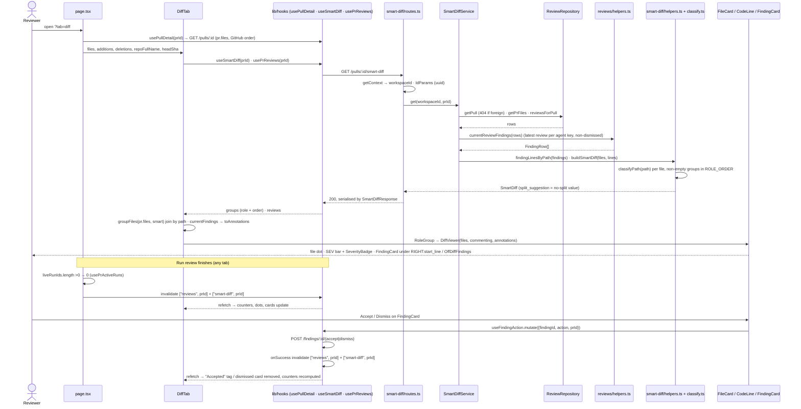
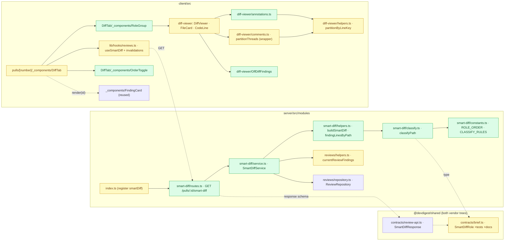
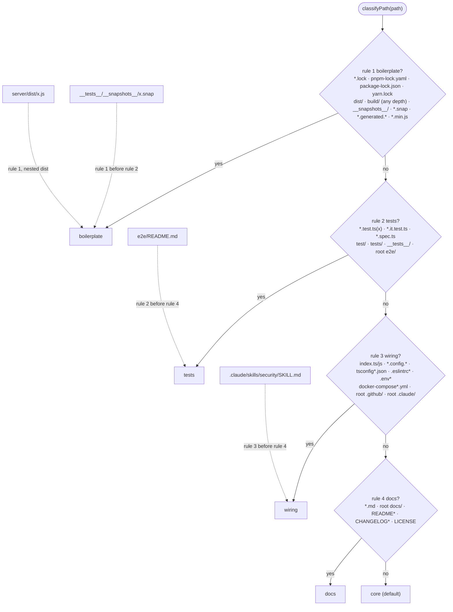
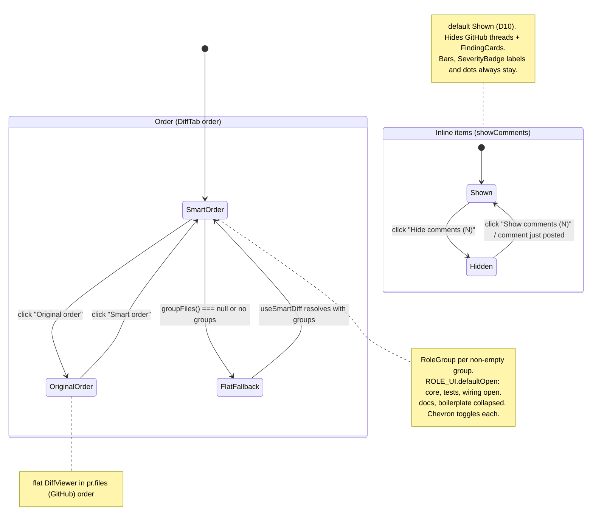

# 11 — Smart Diff: role-grouped "Files changed" with inline review findings

> Status: **approved (2026-09-30)**. Scope: `server/` + `client/` (+ the shared
> contract in both vendor trees; optional `e2e/` flow). EARS acceptance criteria in §8.
> Priorities: **P1** = must ship, **P2** = should ship, **P3** = polish. Every AC and
> every step carries its priority. Architecture-review suggestions AR-1..AR-3 are
> accepted and folded in (D5, D9, E3/E4).

## 1. Summary

The PR detail **Files changed** tab (`DiffTab` → `DiffViewer`) today renders a flat,
GitHub-ordered list of `FileCard`s under the header "Files changed · N files"
(`client/src/app/repos/[repoId]/pulls/[number]/_components/DiffTab/DiffTab.tsx:43-62`).
Smart Diff turns it into a **reviewer-ordered diff**: files are grouped by role, in the
order **core → tests → wiring → docs → boilerplate**. Each group has a sticky header
(chevron, coloured square, label, one-line description, red "● N" count of files with
findings, "N files"). `docs` and `boilerplate` start collapsed. A segmented toggle
**Smart order | Original order** under the "REVIEWER-ORDERED DIFF" label switches back to
the GitHub file order.

Review findings are drawn into the diff: a red dot on the file card header (beside the
existing comment counter), a coloured left bar and a severity label on the finding's line
(`RIGHT:${start_line}`), and the existing Agent-runs `FindingCard` inline under that line,
with working Accept/Dismiss. A finding whose line is not in the patch goes into a
"Findings outside this diff" block at the end of the file (the `partitionThreads`
unmatched path). The existing Show/Hide-comments toggle hides finding cards too.

Grouping comes from a new read-only route **`GET /pulls/:id/smart-diff`** that returns the
existing `SmartDiff` contract. The route calls **no model**, works before the first review
(`finding_lines: []`), and classifies paths with one pure, table-tested function whose
patterns and role order live in **one constants file**.

**No live LLM spend is needed to build or verify this feature.** Everything is
checkable on seeded data (`server/src/db/seed.ts:100-181`, PR #482 with 2 findings) or on
reviews already in the local DB.

**Out of scope:** `pseudocode_summary` (it stays in the contract but is never populated,
because that would need a model call); **PR split suggestions**: no threshold and no
split logic. `split_suggestion` is returned only as the contract-required no-split value
(D13) and is not rendered. Also out of scope: a `position` column on `pr_files`;
refactoring the inline findings-aggregation in `server/src/modules/pulls/routes.ts:161-205`
(the known `pulls/` Drizzle-in-route deviation; it may adopt the D5 selector later);
syncing pre-existing drift between the two vendor trees beyond `brief.ts`; persisting
the order toggle; anchoring LEFT-side (deleted-line) findings; a
`dependency-cruiser`/`arch:check` setup (none exists — verified
`ls server/.dependency-cruiser.cjs` → missing, no `arch:check` in `server/package.json`).

### How it works (diagrams)

**(a) Flow: open Files changed → grouped diff with findings; run finishes; Accept/Dismiss.**
The PR-detail hook is `usePullDetail` (`client/src/lib/hooks`, used at `page.tsx:37`).
It is the real name; there is no `usePullRequest`.



**(b) Structure: what is added (`:::new`) and touched, per package and ring.** Nodes
marked `:::changed` are existing files that gain a new symbol.



**(c) `classifyPath`: first match wins (`CLASSIFY_RULES` order), with the contested cases.**



**(d) DiffTab UI state: order toggle, group collapse defaults, show/hide inline items.**



## 2. Decisions

| # | Decision | Consequence |
|---|----------|-------------|
| D1 | **The classifier lives in the server, in a new `server/src/modules/smart-diff/` module**: `constants.ts` (ordered rules + `ROLE_ORDER`) and `classify.ts` (pure `classifyPath`). It is not in `@devdigest/shared` and not in `reviewer-core`. | Onion "most inward home that compiles" check: (a) `@devdigest/shared` contains only Zod contracts and port interfaces (`server/src/vendor/shared/{contracts,adapters.ts}`), and it exists as **two hand-copied trees** (T1). A function there means two copies of the patterns, which breaks the "ONE constants file" requirement and adds the drift the root `INSIGHTS.md` (2026-07-29) warns about. (b) `reviewer-core` is the review algorithm (diff → prompt → LLM → findings). Nothing in that algorithm uses file roles, and the client cannot import it (no alias, `client/tsconfig.json:22-28`). (c) The rule is pure and has no I/O, so inside the server module it sits in files that import only `@devdigest/shared` types. That is the domain-pure core of the module, with no Drizzle and no Fastify. Cost: the client cannot group before the route answers. It renders Original order while the route loads, so it never blocks. |
| D2 | **Thin module by decision (onion rule 7):** `smart-diff` has `routes.ts` + `service.ts` + pure `helpers.ts`/`classify.ts`, and **no repository of its own**. It reads PR, files and reviews through the existing `ReviewRepository` (`getPull`, `getPrFiles`, `reviewsForPull` — `server/src/modules/reviews/repository.ts:30,38,63`), as `IntentService` already does (`server/src/modules/intent/service.ts:7,46-49`). | No Drizzle in the new module at all. It owns no table and writes nothing. |
| D3 | **`SmartDiffRole` becomes `z.enum(['core','tests','wiring','docs','boilerplate'])`**, lowercase, in the declaration order above, **identically in both trees**. No other contract field changes. | This widens the enum and adds no required field, so no literal breaks (T6). The only consumers are `brief.ts` itself and `server/test/contracts.test.ts:120-131`. |
| D4 | **The route emits only non-empty groups, in `ROLE_ORDER`.** Within a group, files keep the `pr_files` row order. The client does **not** rely on that inner order (see D6). | A 3-file PR does not show 4 empty headers. The "five groups" AC applies when all five roles are present. |
| D5 | **One server selector for "current findings" (AR-1).** Add pure `currentReviewFindings(rows: { review: ReviewRow; findings: FindingRow[] }[]): FindingRow[]` to `server/src/modules/reviews/helpers.ts`. That file is already pure, with type-only imports (`helpers.ts:5-6`). The selector keeps only `kind === 'review'` rows, keeps the newest per agent key `review.agentId ?? '∅'` by comparing `createdAt` (it does not depend on input order), drops findings with `dismissedAt`, and de-dupes by `id`. `smart-diff/service.ts` calls it, and `smart-diff/helpers.ts` only turns the result into `finding_lines` (sorted, de-duped `startLine` per `file`). **There is no third copy of the rule.** The inline copy in `pulls/routes.ts:161-205` stays as it is (out of scope; it can adopt the selector later). **Parity with the client rule** (`client/src/lib/findings.ts:73-85`, checked first-hand): it has the same `kind === 'review'` filter, the same `'∅'` null-agent key (**no difference in the null-agent bucket**: every null-agent review collapses into one bucket and only the newest one counts, on the client, in `pulls/routes.ts:180` and here), the same dismissed drop, and the same id de-dupe (`pushUnique`, `findings.ts:37-42`). The only mechanical difference is that the client compares ISO `created_at` strings and the server compares `Date` values, which is equivalent. | The route's numbers reconcile with the PR-list chips and the client counters. A later `pulls` refactor has one selector to adopt. |
| D6 | **Client source of truth.** The route supplies **role + group order** only. Dots, counters, bars and cards come from `currentFindings(usePrReviews(prId).data)`, which is the same data the cards render, so they cannot disagree. Files come from `pr.files`, which holds the patches and the GitHub order. Group membership is joined by `path`. Inside a group, files are ordered by their index in `pr.files`. A `pr.files` path that is missing from the response falls into `core`. | One cache feeds every finding indicator. "Original order" is exactly `pr.files`. |
| D7 | **Dismissed findings disappear** from the diff (the `currentFindings` rule). Accepted findings stay, muted, with the existing "Accepted" tag. | This matches the Agent-runs list and the PR-list counts. Dismissing a finding decrements the counters. |
| D8 | **`diff-viewer` stays generic** (`client/src/components/` must not import from an `app/**/_components` folder: `frontend-ui-architecture`). It gains an optional `annotations` API `{items: {id,path,line,severity}[], show, render(id)}`. `DiffTab` passes `render = id => <FindingCard …/>`, reusing `_components/FindingCard` (a sibling of `DiffTab`) **unchanged**, with `defaultExpanded` and its standard header-click collapse (owner confirmed: no compact variant). | FindingCard is reused, not copied, and the component boundary holds. The old `DiffViewer files=… ` call in `client/src/test/smoke.test.tsx:28-44` keeps working because every new prop is optional. |
| D9 | **Unmatched findings reuse the `partitionThreads` path, through a generic helper in `helpers.ts` (AR-2).** Add pure `partitionByLineKey<T>(items, keyOf, renderedKeys)` to `client/src/components/diff-viewer/helpers.ts`, next to `parsePatch`, since that file holds the viewer's pure helpers (`helpers.ts:1`). `comments.ts` keeps `partitionThreads` (same signature and `matched`/`outdated` return names) as a one-line wrapper that imports the helper. `annotations.ts` imports it from `helpers.ts` (not from `comments.ts`), and findings use `keyOf = annotationKey` (`RIGHT:${a.line}`). | There is one partition algorithm for both comment threads and findings, and the annotation code does not depend on the comment module. |
| D10 | **One visibility toggle, default SHOWN (owner confirmed).** `DiffTab`'s existing `showComments` state also drives `annotations.show`. The button appears when `commentCount + findingCount > 0`, and its count is the sum. Bars, labels and dots always show. The toggle hides only the threads and cards. The default changes from hidden to **shown** (`DiffTab.tsx:21-22`). | P1 "finding appears under the line" holds without a click. GitHub comment threads are now also visible by default, which is an accepted behaviour change. |
| D11 | **The line colour and label come from `SEV`/`SeverityBadge`** (`client/src/vendor/ui/primitives/tokens.ts:6-14`, `Badge.tsx:52-88`). The bar is `inset 3px 0 0 ${SEV[sev].c}`. The label is `<SeverityBadge severity={sev} />` (icon + label, WCAG-safe). When a line has several findings, the most severe one sets the colour (`SEVERITY_ORDER`, `client/src/lib/findings.ts:13`). Red dots use `var(--crit)`. **No new palette.** | Group squares reuse existing tokens only: core `var(--accent)`, tests `var(--ok)`, wiring `var(--warn)`, docs `var(--info)`, boilerplate `var(--text-muted)` (`client/src/vendor/ui/styles.css`). |
| D12 | **"Counters update after Run review without reload"** is solved at page level. When the server-sourced `liveRunIds` (`page.tsx:45-49`) goes from non-empty to empty, the page invalidates `["reviews", prId]` and `["smart-diff", prId]`. Today only `FindingsTab`'s `onRunDone` refetches (`page.tsx:170-174`), and it is unmounted while the Diff tab is open. `useRunReview`, `useFindingAction`, `useDeleteRun` and `useDeleteReview` also invalidate `["smart-diff", prId]`. | This works whichever tab is open when the run finishes. |
| D13 | **No split logic (owner decision).** The contract makes `split_suggestion` a required object with required `too_big: boolean`, `total_lines: int` and `proposed_splits: ProposedSplit[]` (`brief.ts:129-136`). So `buildSmartDiff` returns the simplest valid value: `{ too_big: false, total_lines: Σ(additions + deletions), proposed_splits: [] }`. There is **no threshold constant**, no `SPLIT_TOO_BIG_LINES`, and `too_big` is never `true`. | The contract validates with no model call and no product rule to maintain. The value is not rendered. |
| D14 | **Glob semantics are literal and case-sensitive, except `dist/**` and `build/**`, which match at any depth (owner decision).** `dist/` and `build/` match as a path segment anywhere, so `server/dist/x.js` → boilerplate. Other patterns that start with `**/` (or are a bare `*.ext`, which is basename-based) also match at any depth. `e2e/**`, `docs/**`, `.github/**` and `.claude/**` stay **root-anchored**. Rules are hand-written `RegExp`s in `constants.ts`. **No new dependency** (no `minimatch`/`picomatch`). | Nested package build output is skimmed as boilerplate. A source folder named `build/` (e.g. `src/build/x.ts`) is also boilerplate. Recorded in §10. |
| D15 | **`e2e/README.md` → tests (owner decided).** Rule 2 (`e2e/**`) runs before rule 4 (`*.md`), and the owner keeps that. | It is a fixed row in the classifier test (B7). |

## 3. What already exists — do not rebuild

| Layer | Already there | File |
|-------|---------------|------|
| Contract | `SmartDiffRole`, `SmartDiffFile {path, pseudocode_summary?, additions, deletions, finding_lines[]}`, `SmartDiffGroup`, `ProposedSplit`, `SmartDiff {groups, split_suggestion}` — identical in both trees (`diff` → no output) | `server/src/vendor/shared/contracts/brief.ts:104-137`, `client/src/vendor/shared/contracts/brief.ts:104-137` |
| Contract | `SmartDiffResponse = SmartDiff` (no route used it until now) | `server/src/vendor/shared/contracts/review-api.ts:76-78` (+ client copy) |
| Contract | `SmartDiff` exported to the client | `client/src/lib/types.ts:35` |
| Contract test | `SmartDiff.parse` fixture | `server/test/contracts.test.ts:120-131` |
| i18n | `prReview.smartDiff` = `coreLabel, wiringLabel, boilerplateLabel, largeTitle, largeBody, filesCount, findingLines, groupedByRole` (unused in `src/` today) | `client/messages/en/prReview.json:53-62` |
| i18n | `shell.diffViewer.*` (FileCard/CodeLine copy) | `client/messages/en/shell.json:33` |
| DB | `pr_files` (`path, additions, deletions, patch`; no position column); `findings.start_line`, `dismissed_at`; `reviews.kind, agent_id, created_at` | `server/src/db/schema/pulls.ts:36-45`, `server/src/db/schema/reviews.ts:18-55` |
| Repo | `ReviewRepository.getPull(workspaceId, prId)` (workspace-scoped), `getPrFiles(prId)`, `reviewsForPull(prId)` (newest first) | `server/src/modules/reviews/repository.ts:30,38,63`; `repository/review.repo.ts:58-73` |
| Server helpers | pure row→DTO helpers, type-only imports (`FindingRow`, `PullRow`, `ReviewRow`); home of the new selector | `server/src/modules/reviews/helpers.ts:5-6,34,55`; test `server/test/reviews-helpers.test.ts` |
| Server rule | "current findings" aggregation (inline, Drizzle in route; not touched) | `server/src/modules/pulls/routes.ts:161-205` |
| Client rule | `currentFindings`, `pushUnique`, `SEVERITY_ORDER` | `client/src/lib/findings.ts:13,37-42,73-85` |
| Hooks | `usePullDetail` (page), `usePrReviews` (`["reviews", prId]`), `useFindingAction` (invalidates reviews), `useRunReview`, `usePrComments`, `useCreatePrComment` | `page.tsx:18,37`; `client/src/lib/hooks/reviews.ts:51-57,139-161,124-136,91-115` |
| UI | `FindingCard` (severity, title, category, file:line, rationale, suggested fix, Accept/Dismiss; collapsible; `defaultExpanded`) | `client/src/app/repos/[repoId]/pulls/[number]/_components/FindingCard/FindingCard.tsx:26-127` |
| UI | `keysForLine`, `partitionThreads`, `cs.thread`/`cs.outdatedWrap` styles; `OutdatedComments` | `client/src/components/diff-viewer/comments.ts:63-106,133-173`; `OutdatedComments/OutdatedComments.tsx` |
| UI | `FileCard` collapse + `AUTO_EXPAND_MAX_LINES=200` + comment counter; `parsePatch` (`oldNo/newNo`) in the pure-helpers file | `FileCard/FileCard.tsx:33-96`, `constants.ts:4`, `helpers.ts:1-38` |
| UI | `SEV` tokens, `SeverityBadge`, `SectionLabel`, `Button` (`active`, passes `aria-*` through `...rest`) | `client/src/vendor/ui/primitives/tokens.ts:6-14,24-35`, `Badge.tsx:52`, `SectionLabel.tsx`, `Button.tsx:10-21` |
| Seed | PR #482 (`files_count 9, +247 −38`), 4 `pr_files` **without patches**, 1 review, 2 findings (`src/config.ts:12` CRITICAL, `src/api/users.ts:45` WARNING) | `server/src/db/seed.ts:100-181` |
| e2e | Diff-tab flow on PR #482 | `e2e/specs/05-pr-diff.flow.json` |

**Not pre-staged (verified):** no `smart-diff` module (`ls server/src/modules/smart-diff` →
missing), no route, no `useSmartDiff` hook, no classifier or glob helper
(`rg -i "pnpm-lock|__snapshots__|minimatch|picomatch" server/src reviewer-core/src` → no
hits outside vendor), no segmented-control primitive (`rg -i segment client/src/vendor/ui`
→ only charts), no "REVIEWER-ORDERED" copy (`rg -i "reviewer.ordered" client` → none).
`git log -S SmartDiffRole` → only the initial snapshot `587c46a`.

### Code map — files this change touches

| File | Why it changes | Anchor |
|------|----------------|--------|
| `server/src/vendor/shared/contracts/brief.ts` | extend `SmartDiffRole` | `:105` |
| `client/src/vendor/shared/contracts/brief.ts` | same, identical | `:105` |
| `server/test/contracts.test.ts` | parse a `tests`/`docs` group | `:120-131` |
| `server/src/modules/reviews/helpers.ts` | add pure `currentReviewFindings` selector (AR-1) | `:5-6` (imports), append after `:55-80` |
| `server/test/reviews-helpers.test.ts` | selector tests | `:1-2` |
| `server/src/modules/smart-diff/constants.ts` NEW | `ROLE_ORDER`, `CLASSIFY_RULES` | — |
| `server/src/modules/smart-diff/classify.ts` NEW | pure `classifyPath` | — |
| `server/src/modules/smart-diff/helpers.ts` NEW | pure `findingLinesByPath`, `buildSmartDiff` | — |
| `server/src/modules/smart-diff/service.ts` NEW | `SmartDiffService.get` | pattern: `intent/service.ts:43-55` |
| `server/src/modules/smart-diff/routes.ts` NEW | `GET /pulls/:id/smart-diff` | pattern: `intent/routes.ts:14-25` |
| `server/src/modules/index.ts` | register module | `:12,27-39` |
| `server/test/smart-diff-classify.test.ts` NEW | table test path → role | — |
| `server/test/smart-diff-helpers.test.ts` NEW | grouping / finding_lines / no-split value | — |
| `server/test/smart-diff-service.test.ts` NEW | hermetic service (stub repo, LLM throws) | pattern: `server/test/intent-service.test.ts:37-50` |
| `server/test/smart-diff.it.test.ts` NEW | DB-backed route: 200 + contract, 404 foreign ws, 422 bad id | pattern: `server/test/intent.it.test.ts:53-140` |
| `client/src/lib/hooks/reviews.ts` | `useSmartDiff`; invalidate `["smart-diff", prId]` in 4 mutations | `:60-87,124-161` |
| `client/src/app/repos/[repoId]/pulls/[number]/page.tsx` | run-settled invalidation effect; pass new `DiffTab` props | `:45-49,178-185` |
| `client/messages/en/prReview.json` | new `smartDiff.*` keys; `coreLabel` → "Core logic" | `:53-62` |
| `client/messages/en/shell.json` | new `diffViewer.*` keys | `:33` |
| `client/src/components/diff-viewer/helpers.ts` | add generic `partitionByLineKey<T>` (AR-2) | `:1-38` |
| `client/src/components/diff-viewer/comments.ts` | `partitionThreads` becomes a wrapper over the helper | `:89-106` |
| `client/src/components/diff-viewer/annotations.ts` NEW | `DiffAnnotation`, `DiffAnnotationApi`, `annotationKey`, `topSeverity`; imports `partitionByLineKey` from `helpers.ts` | — |
| `client/src/components/diff-viewer/styles.ts` | bar/label/dot styles | file |
| `client/src/components/diff-viewer/CodeLine/CodeLine.tsx` | left bar, severity label, inline cards | `:12-83` |
| `client/src/components/diff-viewer/FileCard/FileCard.tsx` | dot, partition findings, unmatched block | `:33-96` |
| `client/src/components/diff-viewer/OffDiffFindings/{OffDiffFindings.tsx,index.ts}` NEW | "Findings outside this diff" block | pattern: `OutdatedComments/OutdatedComments.tsx` |
| `client/src/components/diff-viewer/DiffViewer/DiffViewer.tsx` | optional `annotations` prop pass-through | `:14-31` |
| `client/src/components/diff-viewer/index.ts` | export `DiffAnnotationApi` type | `:3-4` |
| `client/src/components/diff-viewer/helpers.test.ts` NEW | `partitionByLineKey` + `partitionThreads` wrapper parity | — |
| `client/src/components/diff-viewer/FileCard/FileCard.test.tsx` NEW | dot, bar, label, card under line, off-diff block, hide | — |
| `…/pulls/[number]/_components/DiffTab/DiffTab.tsx` | header, toggle, grouping, findings wiring | `:1-65` |
| `…/DiffTab/constants.ts` NEW | `ROLE_UI` (label/description keys, colour, defaultOpen) | — |
| `…/DiffTab/helpers.ts` NEW | `groupFiles`, `toAnnotations`, `filesWithFindings` | — |
| `…/DiffTab/styles.ts` NEW | header-row layout | — |
| `…/DiffTab/_components/RoleGroup/{RoleGroup.tsx,styles.ts,index.ts}` NEW | sticky group header + body | — |
| `…/DiffTab/_components/RoleGroup/RoleGroup.test.tsx` NEW | defaultOpen, `● N` vs "Review not run yet" (AR-3) | — |
| `…/DiffTab/_components/OrderToggle/{OrderToggle.tsx,index.ts}` NEW | segmented Smart/Original | — |
| `…/DiffTab/_components/OrderToggle/OrderToggle.test.tsx` NEW | `aria-pressed` (AR-3) | — |
| `…/DiffTab/helpers.test.ts` NEW | pure grouping | — |
| `…/DiffTab/DiffTab.test.tsx` NEW | RTL for the tab | pattern: `FindingsPanel/FindingsPanel.test.tsx:1-40` |
| `e2e/specs/08-smart-diff.flow.json` NEW (optional) | hermetic browser flow on seeded PR #482 | pattern: `e2e/specs/05-pr-diff.flow.json` |
| `specs/README.md` | add 11 to "Current specs" | `:11` |

(`…/` = `client/src/app/repos/[repoId]/pulls/[number]/_components/`.)

## 4. Data model

**No schema change and no migration.** The route reads `pr_files`, `reviews` and
`findings` as they are. `pr_files` has no position column (`schema/pulls.ts:36-45`), and
`getPrFiles` has no `ORDER BY` (`repository/pull.repo.ts:28-33`). That is why D6 takes
"Original order" from `pr.files` in the client and not from the route. T4 does not apply.

## 5. Contracts (`@devdigest/shared`)

One edit, made **byte-identically in both trees in the same step** (T1):

- `server/src/vendor/shared/contracts/brief.ts:105`
- `client/src/vendor/shared/contracts/brief.ts:105`

```ts
export const SmartDiffRole = z.enum(['core', 'tests', 'wiring', 'docs', 'boilerplate']);
```

Casing: **all lowercase** (T3). It persists nowhere, so Zod at the route's response
schema is the only guard. `SmartDiffResponse` (`review-api.ts:77`) is reused unchanged.
`split_suggestion` stays required in the contract, and D13 fills it with the no-split
value. Afterwards, `diff server/src/vendor/shared/contracts/brief.ts client/src/vendor/shared/contracts/brief.ts`
must print nothing.

JSON shape the route returns (snake_case, T2; there are no Drizzle columns involved):

```json
{ "groups": [ { "role": "core", "files": [ { "path": "src/config.ts", "additions": 4, "deletions": 0, "finding_lines": [12] } ] } ],
  "split_suggestion": { "too_big": false, "total_lines": 136, "proposed_splits": [] } }
```

`pseudocode_summary` is **omitted**. It is `nullish`, so omitting it validates.

## 6. Server

Module `server/src/modules/smart-diff/` plus one pure addition to
`server/src/modules/reviews/helpers.ts`. The ring of each file is stated so that a
boundary violation is visible on the page:

| File | Ring | Imports allowed | Must not import |
|------|------|-----------------|-----------------|
| `smart-diff/routes.ts` | Presentation | `fastify` types, `fastify-type-provider-zod`, `SmartDiffResponse`, `getContext`, `IdParams`, `./service` | `drizzle-orm`, `db/*`, `./classify` |
| `smart-diff/service.ts` | Application | `Container` type, `NotFoundError`, `ReviewRepository` (as `intent/service.ts:7` does), `currentReviewFindings` from `../reviews/helpers.js`, `./helpers` | `drizzle-orm`, `db/schema`, `fastify`, any adapter, `container.llm` |
| `smart-diff/helpers.ts` | Domain-pure (module core) | `@devdigest/shared` **types**, `./classify`, `./constants` | anything with I/O, `db/*` (it takes plain inputs) |
| `smart-diff/classify.ts` | Domain-pure | `@devdigest/shared` type `SmartDiffRole`, `./constants` | everything else |
| `smart-diff/constants.ts` | Domain-pure | `@devdigest/shared` type only | everything else |
| `reviews/helpers.ts` (+ selector) | Domain-pure helpers of `reviews` | row **types** only (already `import type`, `:5-6`) | `drizzle-orm`, `db/client`, any value import from `db/schema` |

**`reviews/helpers.ts` → `currentReviewFindings`** (AR-1, D5):
`export function currentReviewFindings(rows: { review: ReviewRow; findings: FindingRow[] }[]): FindingRow[]`.
- keep rows with `review.kind === 'review'`;
- per key `review.agentId ?? '∅'`, keep the row with the greatest `review.createdAt`
  (compare `getTime()`; do not depend on the newest-first order of `reviewsForPull`);
- collect those rows' findings, skip `dismissedAt != null`, and de-dupe by `id`.
This is the server twin of the client `currentFindings` (`client/src/lib/findings.ts:73-85`).
A doc comment names both that twin and `pulls/routes.ts:161-205` as the rule's other
sites.

**`constants.ts`** holds the single source for patterns and order:
- `ROLE_ORDER: readonly SmartDiffRole[] = ['core','tests','wiring','docs','boilerplate']`
- `CLASSIFY_RULES: readonly { role: SmartDiffRole; patterns: readonly RegExp[] }[]` in
  **first-match-wins** order:
  1. **boilerplate** — basename `*.lock`, `pnpm-lock.yaml`, `package-lock.json`,
     `yarn.lock`; `dist/` and `build/` as a path segment **at any depth** (D14,
     e.g. `/(^|\/)dist\//`); any-depth `__snapshots__/` segment; basename `*.snap`,
     `*.generated.*`, `*.min.js`
  2. **tests** — basename `*.test.ts`, `*.test.tsx`, `*.it.test.ts`, `*.spec.ts`;
     any-depth segment `test/`, `tests/`, `__tests__/`; root `e2e/**`
  3. **wiring** — basename `index.ts` / `index.js`, `*.config.*`, `tsconfig*.json`,
     `.eslintrc*`, `.env*`, `docker-compose*.yml`; root `.github/**`, `.claude/**`
  4. **docs** — any-depth `*.md`; root `docs/**`; basename `README*`, `CHANGELOG*`,
     `LICENSE`
  5. **core** — fallback. It has no pattern: it is `classifyPath`'s default.

Each regexp carries a trailing comment naming the glob it encodes, so a reviewer can
diff the file against this list. There is **no split threshold constant** (D13).

**`classify.ts`**: `export function classifyPath(path: string): SmartDiffRole`. It
normalises `\` to `/`, strips a leading `./`, walks `CLASSIFY_RULES`, and returns the
first role whose pattern tests true, or `'core'`.

**`smart-diff/helpers.ts`** (plain inputs; no rule about which findings are current):
- `findingLinesByPath(findings: { file: string; startLine: number }[]): Map<string, number[]>`
  returns sorted unique lines per file.
- `buildSmartDiff(files: { path: string; additions: number; deletions: number }[], lines: Map<string, number[]>): SmartDiff`
  groups by `classifyPath`, emits non-empty groups in `ROLE_ORDER` (D4), and sets
  `finding_lines: lines.get(path) ?? []`. It returns
  `split_suggestion: { too_big: false, total_lines: Σ(additions + deletions), proposed_splits: [] }` (D13).

**`service.ts`**: `class SmartDiffService { constructor(container: Container, reviews: ReviewRepository = new ReviewRepository(container.db)) }`
with `async get(workspaceId, prId): Promise<SmartDiff>`:
`getPull(workspaceId, prId)` → `NotFoundError('Pull request not found')` if missing (this
is the tenancy check), then `getPrFiles(prId)` and `reviewsForPull(prId)`. Then it runs
`currentReviewFindings(rows)` → `findingLinesByPath(...)` → `buildSmartDiff(files, lines)`.
It makes **no call to `container.llm`, `container.github`, or `loadDiff`.**

**`routes.ts`**: `GET /pulls/:id/smart-diff`:
- **auth / tenancy (T5):** `getContext(app.container, req)` → `workspaceId`
  (`server/src/modules/_shared/context.ts:14-23`). A PR in another workspace gives
  **404** through `getPull`.
- **validation:** `schema: { params: IdParams, response: { 200: SmartDiffResponse } }`.
  `IdParams` requires a uuid (`_shared/schemas.ts:11`), so a bad id is rejected before
  the handler. The response is serialised through the contract.
- read-only, so no body and no per-route rate limit (same as `GET /pulls/:id/intent`).

**`modules/index.ts`**: `import smartDiff from './smart-diff/routes.js';` + entry `smartDiff`.

## 7. Client

**Data** (`client/src/lib/hooks/reviews.ts`):
- `useSmartDiff(prId)` → `useQuery({ queryKey: ["smart-diff", prId], queryFn: () => api.get<SmartDiffResponse>(\`/pulls/${prId}/smart-diff\`), enabled: !!prId })`.
- Add `qc.invalidateQueries({ queryKey: ["smart-diff", prId] })` next to the existing
  `["reviews", prId]` invalidations in `useDeleteRun` (`:66-69`), `useDeleteReview`
  (`:85`), `useRunReview` (`:132-134`) and `useFindingAction` (`:157-159`, only when
  `prId` is set).

**Page** (`page.tsx`):
- Add a `React.useRef` of the previous `liveRunIds.length` and a `useEffect`. When it goes
  from `>0` to `0` and `prId` is set, invalidate `["reviews", prId]` and
  `["smart-diff", prId]` (D12).
- Pass the new `DiffTab` props: `additions={pr.additions}`, `deletions={pr.deletions}`,
  `repoFullName={repoFullName}`, `headSha={pr.head_sha}`.

**Generic diff-viewer** (`client/src/components/diff-viewer/`, `frontend-ui-architecture`:
shared component, no import from `app/**`):
- `helpers.ts` (AR-2, D9): add pure
  `partitionByLineKey<T>(items: T[], keyOf: (t: T) => string | null, rendered: Set<string>) → { matched: Map<string, T[]>; unmatched: T[] }`.
  A null key, or a key that is not in `rendered`, goes to `unmatched`. Input order is
  preserved inside each bucket.
- `comments.ts`: `partitionThreads` keeps its signature and return names
  (`matched`/`outdated`). Its body becomes a call to `partitionByLineKey(threads, th => lineKey(th.side, th.line), renderedKeys)`,
  imported from `./helpers`, with `unmatched` renamed to `outdated`.
- `annotations.ts` NEW: `DiffAnnotation { id: string; path: string; line: number; severity: Severity }`
  (`Severity` from `@devdigest/ui`); `DiffAnnotationApi { items: DiffAnnotation[]; show: boolean; render: (id: string) => React.ReactNode }`;
  `annotationKey(a) = \`RIGHT:${a.line}\``; `topSeverity(list)` via `SEVERITY_ORDER`;
  `partitionAnnotations(items, rendered) = partitionByLineKey(items, annotationKey, rendered)`,
  imported from `./helpers` (**not** from `./comments`).
- `CodeLine.tsx`: new optional props `annotations?: DiffAnnotation[]`,
  `annotationApi?: DiffAnnotationApi`. When `annotations` is non-empty: the row gets a
  left bar `boxShadow: inset 3px 0 0 ${SEV[top].c}` and a right-aligned
  `<SeverityBadge severity={top} />`. When `annotationApi.show` is true, each
  annotation's `annotationApi.render(a.id)` is drawn below the line inside `cs.thread`,
  before the GitHub threads.
- `FileCard.tsx`: new optional prop `annotations?: DiffAnnotationApi`. Filter by
  `file.path`, then `partitionAnnotations(items, renderedKeys)`, reusing the
  `renderedKeys` already built at `:45-47`. In the header, render a red dot
  `<span role="img" aria-label={t("diffViewer.hasFindings", {count})}>` in
  `var(--crit)` **before** the comment counter (`:67-74`), same inline-flex pattern.
  Pass the matched annotations to `CodeLine` through a `annotationsForLine` helper that
  mirrors `threadsForLine`. When `show` is true, render `<OffDiffFindings>` for the
  unmatched ones after `OutdatedComments`. The file's auto-expand rule is unchanged.
- `OffDiffFindings/` NEW: the same layout as `OutdatedComments` (`cs.outdatedWrap`,
  `cs.outdatedTitle`), title `t("diffViewer.findingsOutsideDiff")`, and each item as
  `render(id)`.
- `DiffViewer.tsx`: new optional `annotations?: DiffAnnotationApi`, passed to each
  `FileCard`. `index.ts` exports `type DiffAnnotationApi`.

**DiffTab** (`…/DiffTab/`, feature-folder naming per `client/AGENTS.md`):
- `constants.ts` NEW: `ROLE_UI: Record<SmartDiffRole, { labelKey; descriptionKey; color; defaultOpen }>`.
  core/tests/wiring default open. **docs and boilerplate `defaultOpen: false`**. Colours
  are in D11. `Record<SmartDiffRole, …>` makes `tsc` fail if the enum grows without UI.
- `helpers.ts` NEW (pure):
  `groupFiles(files: PrFile[], smart: SmartDiff | undefined): { role: SmartDiffRole; files: PrFile[] }[] | null`
  (`null` while `smart` is undefined; D6 join and ordering; unknown path → `core`);
  `toAnnotations(findings: FindingRecord[]): DiffAnnotation[]`;
  `filesWithFindings(files: PrFile[], findings: FindingRecord[]): number`.
- `_components/OrderToggle/` NEW: `<div role="group" aria-label={t("smartDiff.orderLabel")}>`
  holding two `Button size="sm"`s, each with `active` + `aria-pressed`, labelled
  "Smart order" and "Original order". Props `{ value: "smart" | "original"; onChange }`.
  Colocated `OrderToggle.test.tsx` (AR-3).
- `_components/RoleGroup/` NEW: props `{ role, files, findingFiles: number | null, commenting, annotations }`.
  Header `<button aria-expanded>`, **`position: sticky; top: 0; z-index: 2; background: var(--bg-primary)`**
  (P3). Header contents: chevron (`chevronFor`), a 10×10 square in `ROLE_UI[role].color`,
  bold label, muted description. On the right, either `● N` in `var(--crit)` (when
  `findingFiles > 0`) or the muted `t("smartDiff.reviewNotRun")` (when
  `findingFiles === null`, P3), then `t("smartDiff.filesCount", {count})`. Open state
  starts at `ROLE_UI[role].defaultOpen`. The body is `<DiffViewer files commenting annotations />`.
  Colocated `RoleGroup.test.tsx` (AR-3).
- `DiffTab.tsx` (rewrite of `:18-64`): new props `additions`, `deletions`,
  `repoFullName`, `headSha`. It uses `usePrComments`, `useCreatePrComment` (existing),
  `usePrReviews`, `useSmartDiff` and `useFindingAction`. It computes
  `findings = currentFindings(reviews ?? [])` and
  `reviewRan = (reviews ?? []).some(r => r.kind === "review")`, and holds
  `order: "smart" | "original"` (default `"smart"`) and `showComments` (default
  **true**, D10). Layout:
  - `SectionLabel icon="Code"` with `t("smartDiff.title")` ("Reviewer-ordered diff",
    uppercased by `SectionLabel`).
  - Row below: on the left `t("smartDiff.summary", {files: filesCount, additions, deletions})`;
    on the right the Show/Hide button (i18n, count = comments + findings, shown when > 0)
    followed by `OrderToggle`.
  - Body: when `order === "original"`, `groupFiles(...) === null`, or `groupFiles`
    returns no groups, a flat `<DiffViewer files={files} …/>`. Otherwise a `RoleGroup`
    per group.
  - `annotations = { items: toAnnotations(findings), show: showComments, render: id => <FindingCard f={byId.get(id)!} defaultExpanded pending={action.isPending} repoFullName={repoFullName} headSha={headSha} onAction={act => action.mutate({ findingId: id, action: act, prId })} /> }`
    (`prId` non-null guard as in `FindingsPanel.tsx:85`).

**i18n** (`next-intl`, no hardcoded strings; P3 covers the existing hardcoded DiffTab strings too):
- `prReview.json` → `smartDiff`: change `coreLabel` to `"Core logic"`. Add `testsLabel`
  "Tests", `docsLabel` "Docs", `coreDescription` "The substance of the change — review
  closely", `testsDescription` "Proves the change works — check what is covered",
  `wiringDescription` "Hooks the core into the app", `docsDescription` "Explains the
  change — read for context", `boilerplateDescription` "Generated / mechanical — skim",
  `title` "Reviewer-ordered diff", `summary` "{files} files · +{additions} −{deletions}",
  `smartOrder` "Smart order", `originalOrder` "Original order", `orderLabel` "Diff
  order", `reviewNotRun` "Review not run yet", `filesWithFindings` "{count} files with
  findings", `showComments` "Show comments ({count})", `hideComments` "Hide comments
  ({count})". Keep `filesCount`. The existing `largeTitle`/`largeBody` stay unused
  (no split UI).
- `shell.json` → `diffViewer`: `hasFindings` "{count} findings in this file",
  `findingsOutsideDiff` "Findings outside this diff".

## 8. Acceptance criteria (EARS)

- **AC-1 (P1)** When the Files changed tab opens in Smart order for a PR whose files
  cover all five roles, the system shall render five group headers in the order Core
  logic, Tests, Wiring, Docs, Boilerplate. Each header shall show a coloured square, the
  label, the role description and "N files". Roles with no files shall not render.
- **AC-2 (P1)** Where the PR contains `pnpm-lock.yaml` (or any other rule-1 file,
  including nested `dist/`/`build/` output such as `server/dist/x.js`), the system shall
  list it under Boilerplate. The Docs and Boilerplate groups shall start collapsed and
  the others expanded.
- **AC-3 (P1)** When a review run for the PR finishes, the system shall show, on each
  group header, a red dot plus the number of files in that group that have at least one
  current (non-dismissed, latest-per-agent) finding.
- **AC-4 (P1)** Where a file has at least one current finding, the system shall show a
  red dot with an accessible name in that file card's header, before the comment
  counter.
- **AC-5 (P1)** Where a finding's `start_line` equals the new-side line number of a
  rendered add/context line in that file, the system shall render the finding card
  directly under that line, expanded, showing severity, title and rationale (and the
  suggested fix when present).
- **AC-6 (P1)** When the user selects "Original order", the system shall render the
  files ungrouped in the `pr.files` order. When "Smart order" is selected again, the
  groups shall return.
- **AC-7 (P2)** The classifier's patterns and role order shall live only in
  `server/src/modules/smart-diff/constants.ts`. A table-driven test shall map at least
  `__tests__/__snapshots__/x.snap` → boilerplate, `.claude/skills/security/SKILL.md` →
  wiring, `e2e/README.md` → tests and `server/dist/x.js` → boilerplate, plus one path
  per rule.
- **AC-8 (P2)** When a client calls `GET /pulls/:id/smart-diff` for a PR in its
  workspace, the system shall return 200 with a body that `SmartDiffResponse.parse`
  accepts, with `split_suggestion.too_big === false` and `proposed_splits` empty. The
  response shall be 404 for another workspace's PR and 4xx validation for a non-uuid
  id. `SmartDiffRole` shall be identical in both vendor trees.
- **AC-9 (P2)** While a PR has no reviews, the route shall still return grouped files
  with `finding_lines: []` everywhere. The route shall not invoke any LLM provider.
  Its `finding_lines` shall come from the single `currentReviewFindings` selector.
- **AC-10 (P2)** Where a rendered line carries a finding, the system shall draw a left
  bar in the `SEV` colour of the most severe finding and show that severity's label at
  the right of the line.
- **AC-11 (P2)** When the user clicks Accept or Dismiss on an inline finding card, the
  system shall call `POST /findings/:id/(accept|dismiss)` through `useFindingAction`.
  After the refetch, an accepted card shall show "Accepted", and a dismissed finding
  shall disappear, with the dot and counters recomputed.
- **AC-12 (P2)** Where a finding's line is not rendered in its file's patch (including a
  file with no patch), the system shall list its card in a "Findings outside this diff"
  block at the end of that file.
- **AC-13 (P2)** While the tab is first shown, inline finding cards and GitHub threads
  shall be visible. When the user clicks Hide comments, the system shall hide both. Bars,
  labels and dots shall remain.
- **AC-14 (P2, process)** The PR description shall list the subagents used and what
  plan-verifier checked.
- **AC-15 (P3)** While the user scrolls inside an expanded group, that group's header
  shall stay pinned to the top of the scroll area.
- **AC-16 (P3)** When the user clicks an inline finding card's header, the card shall
  collapse to FindingCard's standard collapsed header, and expand again on a second
  click.
- **AC-17 (P3)** While the PR has no `kind='review'` review, group headers shall show
  "Review not run yet" in place of the finding counters.
- **AC-18 (P3)** When a review run finishes while the Files changed tab is open, the
  counters, dots and cards shall update without a page reload.
- **AC-19 (P3)** All new and touched copy in the Files changed tab shall come from
  `messages/en/*.json`.

## 9. Implementation plan

Package managers (T9): `server/` and `client/` are **pnpm** packages, but **no install is
needed** (no new dependency). `e2e/` is **npm**. Never run `pnpm install`/`npm install`
in the wrong package, and use the direct binaries (§11).

### Phase A — Contract (ends typecheck-clean in both packages)
| # | Step | Files | Skill | AC |
|---|------|-------|-------|-----|
| A1 | Change `SmartDiffRole` to `z.enum(['core','tests','wiring','docs','boilerplate'])` in **both** files, byte-identical; confirm with `diff` | `server/src/vendor/shared/contracts/brief.ts`, `client/src/vendor/shared/contracts/brief.ts` | `zod` | AC-8 |
| A2 | In the SmartDiff contract test, add a second group `{role:'tests', files:[…]}` and assert it parses; add an `expect(() => SmartDiffRole.parse('Core')).toThrow()` casing guard | `server/test/contracts.test.ts` | `zod` | AC-8 |

### Phase B — Server module (ends typecheck-clean + hermetic tests green)
| # | Step | Files | Skill | AC |
|---|------|-------|-------|-----|
| B0 | Add pure `currentReviewFindings(rows)` (D5: `kind==='review'`, newest `createdAt` per `agentId ?? '∅'`, drop dismissed, de-dupe by id) with a doc comment naming its twins; type-only imports stay | `server/src/modules/reviews/helpers.ts` | `onion-architecture`, `typescript-expert` | AC-3, AC-9 |
| B0t | Selector tests: an older review of the same agent is ignored even when passed first (order independence); two null-agent reviews → only the newest counts (`'∅'` bucket, client parity); a `summary` review is ignored; dismissed findings are dropped; different agents are additive | `server/test/reviews-helpers.test.ts` | `typescript-expert` | AC-3, AC-9 |
| B1 | Create `ROLE_ORDER` and `CLASSIFY_RULES` (5 rules, D14 semantics incl. any-depth `dist/`/`build/`, one comment per glob). No split constant | `server/src/modules/smart-diff/constants.ts` NEW | `onion-architecture`, `typescript-expert` | AC-7 |
| B2 | Implement pure `classifyPath(path)` (normalise, first match, default `'core'`); import only constants + the `SmartDiffRole` type | `server/src/modules/smart-diff/classify.ts` NEW | `onion-architecture` | AC-1, AC-2, AC-7 |
| B3 | Implement pure `findingLinesByPath(...)` and `buildSmartDiff(...)` (D4, plus the D13 no-split value) on plain inputs. It must not re-implement the current-findings rule | `server/src/modules/smart-diff/helpers.ts` NEW | `onion-architecture`, `typescript-expert` | AC-8, AC-9 |
| B4 | Implement `SmartDiffService.get` (getPull → 404, getPrFiles, reviewsForPull → `currentReviewFindings` → `findingLinesByPath` → `buildSmartDiff`); inject `ReviewRepository` through the constructor; no LLM or GitHub | `server/src/modules/smart-diff/service.ts` NEW | `onion-architecture` | AC-8, AC-9 |
| B5 | Add `GET /pulls/:id/smart-diff` with `getContext` + `{ params: IdParams, response: { 200: SmartDiffResponse } }` | `server/src/modules/smart-diff/routes.ts` NEW | `fastify-best-practices`, `zod` | AC-8 |
| B6 | Register `smartDiff` in the module map | `server/src/modules/index.ts` | `fastify-best-practices` | AC-8 |
| B7 | Table-driven `it.each` test of path → role. Rows include the contested cases `__tests__/__snapshots__/x.snap`→boilerplate, `.claude/skills/security/SKILL.md`→wiring, `e2e/README.md`→tests (decided, D15), and **nested dist/build: `server/dist/x.js`→boilerplate, `client/build/static/a.js`→boilerplate**. Also `pnpm-lock.yaml`, `yarn.lock`, `x/Cargo.lock`, `dist/a.js`, `a.min.js`, `a.generated.ts`, `src/a.test.tsx`, `src/a.it.test.ts`, `src/a.spec.ts`, `server/test/x.ts`, `a/__tests__/b.ts`, `src/index.ts`, `vite.config.ts`, `tsconfig.base.json`, `.eslintrc.json`, `.env.example`, `docker-compose.dev.yml`, `.github/workflows/x.yml`, `docs/x.txt`, `server/README.md`, `CHANGELOG.md`, `LICENSE`, `src/app.ts`→core, `README.MD` (case) | `server/test/smart-diff-classify.test.ts` NEW | `typescript-expert` | AC-7 |
| B8 | Test `buildSmartDiff`: group order, empty groups omitted, lock → boilerplate, `split_suggestion` equals `{too_big:false, total_lines: Σ, proposed_splits: []}`. Test `findingLinesByPath`: lines sorted and de-duped per file. Validate the output with `SmartDiffResponse.parse` | `server/test/smart-diff-helpers.test.ts` NEW | `zod` | AC-8, AC-9 |
| B9 | Hermetic service test: stub `ReviewRepository` (cast), `container = { db: {}, llm: () => { throw new Error('no LLM') }, github: () => { throw … } }`. Assert: zero reviews → `finding_lines: []`; a missing PR → `NotFoundError`; no throw from `llm`; with two reviews by one agent, only the newest review's lines appear (selector wired in) | `server/test/smart-diff-service.test.ts` NEW | `onion-architecture` | AC-9 |
| B10 | DB-backed route test (`startPg`, `seed`, `buildApp({ db, overrides: { llm: { openai: MockLLMProvider, openrouter: … } } })`). Insert a PR with files `src/a.ts`, `pnpm-lock.yaml`, `README.md`, `src/a.test.ts`, then assert: 200 and `SmartDiffResponse.parse(body)`; order core, tests, docs, boilerplate; after inserting a review + finding at line 3, `finding_lines: [3]`; a foreign workspace gives 404; `/pulls/not-a-uuid/smart-diff` gives a validation error | `server/test/smart-diff.it.test.ts` NEW | `fastify-best-practices`, `drizzle-orm-patterns` (fixture inserts only) | AC-8, AC-9 |

### Phase C — Client data + copy (ends typecheck-clean)
| # | Step | Files | Skill | AC |
|---|------|-------|-------|-----|
| C1 | Add `useSmartDiff(prId)`. Add `["smart-diff", prId]` invalidation to `useDeleteRun`, `useDeleteReview`, `useRunReview`, `useFindingAction` | `client/src/lib/hooks/reviews.ts` | `react-best-practices` | AC-11, AC-18 |
| C2 | Add the run-settled effect (previous-length ref; `>0 → 0` invalidates `["reviews", prId]` + `["smart-diff", prId]`) | `client/src/app/repos/[repoId]/pulls/[number]/page.tsx` | `react-best-practices` | AC-3, AC-18 |
| C3 | Add the `smartDiff.*` keys from §7 and change `coreLabel` to "Core logic" | `client/messages/en/prReview.json` | `next-best-practices` | AC-19 |
| C4 | Add `diffViewer.hasFindings`, `diffViewer.findingsOutsideDiff` | `client/messages/en/shell.json` | `next-best-practices` | AC-19 |

### Phase D — Generic diff-viewer annotations (ends typecheck-clean + client tests green)
| # | Step | Files | Skill | AC |
|---|------|-------|-------|-----|
| D1 | Add generic `partitionByLineKey<T>` to the pure-helpers file (AR-2) | `client/src/components/diff-viewer/helpers.ts` | `typescript-expert`, `frontend-ui-architecture` | AC-12 |
| D1b | Make `partitionThreads` a wrapper over `partitionByLineKey` (same signature; `unmatched` → `outdated`) | `client/src/components/diff-viewer/comments.ts` | `typescript-expert` | AC-12 |
| D2 | Create `DiffAnnotation`, `DiffAnnotationApi`, `annotationKey`, `topSeverity`, `partitionAnnotations` (imports `partitionByLineKey` from `./helpers`) | `client/src/components/diff-viewer/annotations.ts` NEW | `frontend-ui-architecture` | AC-5, AC-10, AC-12 |
| D3 | Add `findingBar(color)`, `lineSevLabel`, `findingDot` style entries (tokens only) | `client/src/components/diff-viewer/styles.ts` | `frontend-ui-architecture` | AC-4, AC-10 |
| D4 | CodeLine: optional `annotations`/`annotationApi`; left bar + right `SeverityBadge`; render cards under the line when `show` | `client/src/components/diff-viewer/CodeLine/CodeLine.tsx` | `react-best-practices` | AC-5, AC-10, AC-13 |
| D5 | Create the off-diff block (title from `shell.diffViewer.findingsOutsideDiff`) + barrel | `client/src/components/diff-viewer/OffDiffFindings/OffDiffFindings.tsx` NEW, `…/OffDiffFindings/index.ts` NEW | `frontend-ui-architecture` | AC-12 |
| D6 | FileCard: optional `annotations`; per-file `partitionAnnotations`; header dot before the comment counter; `annotationsForLine`; `OffDiffFindings` when `show` | `client/src/components/diff-viewer/FileCard/FileCard.tsx` | `react-best-practices` | AC-4, AC-5, AC-12, AC-13 |
| D7 | DiffViewer: optional `annotations` pass-through; export `type DiffAnnotationApi` from the barrel | `client/src/components/diff-viewer/DiffViewer/DiffViewer.tsx`, `client/src/components/diff-viewer/index.ts` | `frontend-ui-architecture` | AC-5 |
| D8 | Unit test `partitionByLineKey` (matched vs unmatched, null key → unmatched, order preserved) and `partitionThreads` parity (a thread with `line: null` → `outdated`) | `client/src/components/diff-viewer/helpers.test.ts` NEW | `react-testing-library` | AC-12 |
| D9 | RTL FileCard test with patch `@@ -1,2 +1,3 @@` and annotations at line 2 (in patch) and line 40 (not in patch), `render = id => <div>card {id}</div>`. Assert: a dot with an accessible name; the card for line 2 after that line's text; the severity label "Critical"; the line-40 card under "Findings outside this diff"; `show:false` hides both cards and keeps the dot | `client/src/components/diff-viewer/FileCard/FileCard.test.tsx` NEW | `react-testing-library` | AC-4, AC-5, AC-10, AC-12, AC-13 |

### Phase E — DiffTab: groups, toggle, findings (ends typecheck-clean + client tests green)
| # | Step | Files | Skill | AC |
|---|------|-------|-------|-----|
| E1 | Create `ROLE_UI: Record<SmartDiffRole, …>` (keys, token colours, `defaultOpen` false for docs/boilerplate) | `…/DiffTab/constants.ts` NEW | `frontend-ui-architecture` | AC-1, AC-2 |
| E2 | Create pure `groupFiles`, `toAnnotations`, `filesWithFindings` | `…/DiffTab/helpers.ts` NEW | `typescript-expert` | AC-1, AC-3, AC-6 |
| E3 | Create `OrderToggle` (role=group, 2 × `Button` `active`+`aria-pressed`, i18n labels) + barrel. **Colocated RTL test (AR-3):** with `value="smart"`, "Smart order" has `aria-pressed="true"` and "Original order" has `"false"`; clicking "Original order" calls `onChange("original")`; the group has its accessible name | `…/DiffTab/_components/OrderToggle/OrderToggle.tsx` NEW, `…/OrderToggle/index.ts` NEW, `…/OrderToggle/OrderToggle.test.tsx` NEW | `react-best-practices`, `react-testing-library` | AC-6 |
| E4 | Create `RoleGroup` (sticky header **P3**, square, label, description, `● N` / "Review not run yet" **P3**, "N files", collapsible body = `DiffViewer`) + `styles.ts` + barrel. **Colocated RTL test (AR-3):** `role="docs"` and `"boilerplate"` render `aria-expanded="false"` with no file path visible, and `"core"` renders `"true"`; `findingFiles={2}` shows `● 2`; `findingFiles={0}` shows no dot and no "Review not run yet"; `findingFiles={null}` shows "Review not run yet" and no dot; a header click toggles `aria-expanded` | `…/DiffTab/_components/RoleGroup/RoleGroup.tsx` NEW, `…/RoleGroup/styles.ts` NEW, `…/RoleGroup/index.ts` NEW, `…/RoleGroup/RoleGroup.test.tsx` NEW | `react-best-practices`, `frontend-ui-architecture`, `react-testing-library` | AC-1, AC-2, AC-3, AC-15, AC-17 |
| E5 | Rewrite `DiffTab`: new props; hooks; `currentFindings`; header row (title, summary, Show/Hide i18n, `OrderToggle`); grouped vs flat body (flat also when there are no groups); `annotations.render` → `FindingCard defaultExpanded` + `useFindingAction`; `showComments` default `true` | `…/DiffTab/DiffTab.tsx`, `…/DiffTab/styles.ts` NEW | `react-best-practices`, `next-best-practices` | AC-1…AC-6, AC-11, AC-13, AC-16, AC-19 |
| E6 | Pass `additions`, `deletions`, `repoFullName`, `headSha` to `DiffTab` | `client/src/app/repos/[repoId]/pulls/[number]/page.tsx` | `react-best-practices` | AC-1 |
| E7 | Unit test `groupFiles` (null while loading, role order from response, inner order = `pr.files` index, unknown path → core), `filesWithFindings` | `…/DiffTab/helpers.test.ts` NEW | `react-testing-library` | AC-1, AC-3, AC-6 |
| E8 | RTL DiffTab test: `vi.mock("@/lib/hooks/reviews")` returning `usePrComments`, `useCreatePrComment`, `usePrReviews`, `useSmartDiff`, `useFindingAction` (spy `mutate`); `NextIntlClientProvider` with `prReview` + `shell` messages. Cases: (a) headers in order and "Core logic" present, Boilerplate/Docs `aria-expanded="false"`; (b) the group's `● 1` and the file dot; (c) the finding title + rationale under the line, **visible without any click** (default shown); (d) clicking Accept calls `mutate({findingId, action:'accept', prId})`; (e) clicking "Original order" → no group headers, file paths in `pr.files` order; (f) clicking Hide comments → finding title gone; (g) reviews `[]` → "Review not run yet"; (h) clicking the card header hides the rationale (standard collapse) | `…/DiffTab/DiffTab.test.tsx` NEW | `react-testing-library` | AC-1…AC-6, AC-11, AC-13, AC-16, AC-17 |

### Phase F — Optional e2e + docs index (implementer)
| # | Step | Files | Skill | AC |
|---|------|-------|-------|-----|
| F1 | (Optional, needs Docker, so CI only on this machine) New flow on seeded PR #482: open Files changed; wait for text "Reviewer-ordered diff" (case as rendered), "Core logic", "Findings outside this diff" (the seeded files have no patch); click the "Original order" button; confirm "src/config.ts" is still visible. No model call | `e2e/specs/08-smart-diff.flow.json` NEW | — | AC-1, AC-6, AC-12 |
| F2 | Add `11-smart-diff.md` to the "Current specs" line | `specs/README.md` | — | — |
| F3 | Record non-obvious learnings (e.g. D5 selector and its twins, D6/D12, glob anchoring) | the touched module's `INSIGHTS.md` | `engineering-insights` | — |

### Phase G — Ship (top-level session runs this, not the implementer)
| # | Step | AC |
|---|------|-----|
| G1 | Top-level session runs `plan-verifier` / architecture and security reviewers on the diff, then `pr-self-review` as the PR gate | AC-14 |
| G2 | Open the PR. Its description lists the subagents used (planner, implementer, plan-verifier, reviewers) and what plan-verifier checked (AC coverage, both vendor trees identical, no Drizzle in `smart-diff/`, no LLM call, a single current-findings selector on the server) | AC-14 |
| G3 | Record the demo video (seeded PR #482 or a real reviewed PR; no live LLM spend needed) | — |

## 10. Risks & gotchas

- **T1 two vendor trees**: A1 edits both `brief.ts` files in one step, and V3 `diff`s
  them. Nothing else in `vendor/shared` changes.
- **T2 casing**: every field is snake_case (`finding_lines`, `split_suggestion`,
  `total_lines`). The only camelCase→snake mapping is in the server: the selector works
  on `FindingRow` (`startLine`, `dismissedAt`, `agentId`, `createdAt`), and
  `findingLinesByPath` produces `finding_lines`.
- **T3 enum casing**: `SmartDiffRole` is all lowercase. `Severity` stays UPPERCASE
  (`CRITICAL|WARNING|SUGGESTION`), and the client uses it as the `SEV` key. There is no
  `BLOCKER` value: "blocker" in the prototype means `CRITICAL`.
- **T4 migrations**: none (§4).
- **T5 route**: auth = `getContext`. authz = workspace scope through
  `ReviewRepository.getPull(workspaceId, prId)` → 404. Validation = `IdParams` (uuid)
  and the response schema `SmartDiffResponse`. Read-only.
- **T6 required fields**: none added. Widening the enum does not break any literal.
  `split_suggestion` is still required by the contract, so do not drop it from the
  response. Return the D13 no-split value instead.
- **T9 package managers**: no installs. §11 uses direct binaries only.
- **The current-findings rule still exists in three places** (client
  `currentFindings`, server `currentReviewFindings`, and the inline copy in
  `pulls/routes.ts:161-205`). AR-1 stops a fourth copy and gives `pulls` one selector
  to adopt later. The B0t parity rows (the `'∅'` bucket, order independence) are what
  keep them aligned. Any future change to the rule must touch all three.
- **`reviews/helpers.ts` must stay pure.** Adding the selector must not bring in a
  value import from `db/schema` or `drizzle-orm`. Its existing imports are type-only
  (`:5-6`). V9 checks this.
- **The route reads persisted `pr_files`.** `GET /pulls/:id` rewrites them (delete +
  insert) on every GitHub refresh (`pulls/routes.ts:258-270`). The tab mounts only after
  the detail query resolves, and D6 makes the client tolerate missing paths (they fall
  into `core`). `server/INSIGHTS.md` (2026-09-23) records PRs with **0 `pr_files` rows**.
  Then the route returns `groups: []`, and the client falls back to the flat list (E5),
  so the tab is never empty.
- **Default Show/Hide state is "shown"** (D10, owner confirmed). GitHub comment threads
  are now visible by default. Tests E8(c) and E8(f) pin both states.
- **Severity label text comes from the vendored `SEV[*].label`** (English,
  `tokens.ts:10-13`), not from i18n. This is the same as `FindingCard` today. AC-19 is
  scoped to copy in `messages/`, so the vendored strings are accepted.
- **Sticky header**: the scroll container is `<main style={{overflow:"auto"}}>`
  (`client/src/vendor/ui/shell/AppFrame.tsx:29`), so `top: 0` pins to it. No ancestor
  of `RoleGroup` may set `overflow: hidden`. `s.fileCard` should be checked if the
  sticky header fails to pin.
- **`dist/` / `build/` at any depth (D14)**: nested package output such as
  `server/dist/x.js` becomes boilerplate, as intended. The side effect is that any
  source folder literally named `build/` or `dist/` is also skimmed as boilerplate.
  The regex must match a **segment** (`(^|/)dist/`), not a substring, so that
  `src/distance.ts` stays core. Add that as a negative row in B7 if convenient.
- **A finding at a `start_line` on a deleted-only line**: RIGHT-side keys only, so it
  goes to the off-diff block (AC-12). This is correct, not a bug.
- **Findings for paths not in `pr.files`** are not shown in the diff (they stay in
  Agent runs). The file dot and group counters count only rendered files.
- **Onion**: `smart-diff/` must contain **no** `drizzle-orm` or `db/schema` import, and
  `service.ts` must not touch `container.llm`. V9 greps for both. No `arch:check` exists
  to catch this (rule 4 of the planner).
- **Security**: a new read-only endpoint, workspace-scoped. Paths render as text. Finding
  rationale/suggestion go through the existing `Markdown` primitive in `FindingCard`,
  which is the same sink as the Agent-runs tab, so there is no new trust boundary.

## 11. Verification

Local environment: **this machine has no Docker** (the owner's memory note
`local-boot-no-docker`). Native Homebrew **Postgres 17** on `localhost:5432` serves the
`devdigest` DB. Boot without `scripts/dev.sh`:
1. `cd server && ./node_modules/.bin/tsx src/db/migrate.ts` (idempotent. There is no new
   migration, but run it anyway in case the chain is behind.)
2. `cd server && ./node_modules/.bin/tsx watch src/server.ts` → API `:3001`
3. `cd client && ./node_modules/.bin/next dev -p 3000` → web `:3000`

Do **not** reseed the owner's DB. It holds real work. Use a PR that already has reviews,
or seeded PR #482 if present. **No live LLM spend is needed**: never click "Run review"
to verify. AC-18 is covered by the RTL/effect logic and, optionally, by one run the
owner chooses to make.

| # | Command | Expected |
|---|---------|----------|
| V1 | `cd server && ./node_modules/.bin/tsc --noEmit` | clean |
| V2 | `cd client && ./node_modules/.bin/tsc --noEmit` | clean |
| V3 | `diff server/src/vendor/shared/contracts/brief.ts client/src/vendor/shared/contracts/brief.ts` | no output |
| V4 | `cd server && ./node_modules/.bin/vitest run --exclude '**/*.it.test.ts'` | green, incl. `reviews-helpers`, `smart-diff-classify`, `smart-diff-helpers`, `smart-diff-service`, `contracts` |
| V5 | `cd server && TEST_DATABASE_URL=postgres://…@localhost:5432/<throwaway_db> ./node_modules/.bin/vitest run .it.test --no-file-parallelism` | green incl. `smart-diff.it.test.ts`. Use a **throwaway** database (the fixture migrates it), never `devdigest`. Without the env var the file self-skips (no Docker) |
| V6 | `cd client && ./node_modules/.bin/vitest run` | green incl. `diff-viewer/helpers.test.ts`, `FileCard.test.tsx`, `RoleGroup.test.tsx`, `OrderToggle.test.tsx`, `DiffTab/helpers.test.ts`, `DiffTab.test.tsx`, `smoke.test.tsx` (unchanged `DiffViewer files=` call) |
| V7 | `curl -s localhost:3001/pulls/<prId>/smart-diff` | JSON with `groups[].role` in ROLE_ORDER and `split_suggestion.too_big: false`, `proposed_splits: []`. The server log shows no LLM call |
| V8 | `curl -s -o /dev/null -w '%{http_code}' localhost:3001/pulls/not-a-uuid/smart-diff` | a 4xx validation status (same envelope as other `IdParams` routes) |
| V9 | `rg -n "drizzle-orm\|db/schema\|container\.llm\|\.llm\(" server/src/modules/smart-diff` and `rg -n "from 'drizzle-orm'\|^import \* as t\|^import \{[^}]*\} from '../../db/schema" server/src/modules/reviews/helpers.ts` | no matches in both |
| V10 | `rg -n "SPLIT_TOO_BIG\|too_big: true" server/src/modules/smart-diff` | no matches (D13) |
| V11 | `rg -n "'∅'" server/src/modules/smart-diff` | no matches: the rule lives only in `reviews/helpers.ts` (AR-1) |
| V12 | `rg -n "partitionByLineKey" client/src/components/diff-viewer` | defined only in `helpers.ts`; imported by `comments.ts` and `annotations.ts` (AR-2) |
| V13 | (CI / Docker only) `cd e2e && npm run e2e:hermetic` | all flows incl. `08-smart-diff` pass |

**Per-AC manual check** at `http://localhost:3000/repos/<repoId>/pulls/<n>?tab=diff`:
- AC-1/2: group order and labels. A lock file sits under Boilerplate. Docs and
  Boilerplate are collapsed.
- AC-3/4/10: on a PR with an existing review, check the `● N` on the group, the file
  dot, and the coloured bar + severity label on the finding line.
- AC-5/11/16: the card sits under the line with no click needed. Accept shows
  "Accepted". Dismiss removes it and counters drop. Clicking the header collapses the
  card.
- AC-6: Original order shows the flat list, in the GitHub order.
- AC-12: on seeded PR #482 (no patches), both findings appear under "Findings outside
  this diff".
- AC-13: cards are visible on first load. Hide comments hides them. Bars and dots
  remain.
- AC-15: scroll a long group and the header stays pinned.
- AC-17: on a never-reviewed PR, the header shows "Review not run yet".
- AC-19: `rg -n '"[A-Z][a-z]+ [a-z]' client/src/app/repos/\[repoId\]/pulls/\[number\]/_components/DiffTab`
  finds no user-facing literals.

**End-to-end**: boot as above, open a PR that already has a review, switch to Files
changed, check that the grouped view, dots, inline cards and the Original-order toggle
work, then Accept one finding and confirm the Agent-runs tab reflects the same state.

## 12. Open questions

None open. The owner answered every question from the first draft and accepted the
architecture review (2026-09-30).

### Resolved
- **`e2e/README.md` → tests**: kept as the rules specify (rule 2 `e2e/**` before rule 4
  `*.md`). **Decided**, D15, test row in B7.
- **Default visibility of inline comments/findings**: **shown** by default. D10 is
  confirmed. This also shows GitHub threads by default.
- **Copy for the tests/docs descriptions** ("Proves the change works — check what is
  covered", "Explains the change — read for context"): **approved** as written in §7.
- **Split suggestion**: **no split**. `SPLIT_TOO_BIG_LINES` and the threshold logic are
  dropped. `split_suggestion` is still required by the contract (`brief.ts:129-136`), so
  the route returns `{ too_big: false, total_lines: Σ, proposed_splits: [] }` (D13).
- **One-line collapsed finding**: keep FindingCard's **standard collapse**, with no
  compact variant (D8, AC-16).
- **`dist/**` / `build/**` depth**: they match **at any depth**, so
  `server/dist/x.js` → boilerplate (D14, AC-2, AC-7, B7 row).
- **AR-1 (accepted)**: one server selector, `currentReviewFindings`, in
  `reviews/helpers.ts`, called by `smart-diff/service.ts`. `pulls/routes.ts` is left
  as it is. There is no null-agent bucket difference from the client rule (D5, B0/B0t,
  V11).
- **AR-2 (accepted)**: `partitionByLineKey<T>` lives in `diff-viewer/helpers.ts`,
  `partitionThreads` becomes a wrapper, and `annotations.ts` imports from `helpers.ts`
  (D9, D1/D1b/D2, V12).
- **AR-3 (accepted)**: colocated `RoleGroup.test.tsx` (defaultOpen, `● N` vs "Review not
  run yet") and `OrderToggle.test.tsx` (`aria-pressed`) (E3/E4).

## 13. Addendum (2026-10-04) — owner review on PR #184

Owner-requested changes after hands-on testing. They override the earlier decisions where they conflict.

| # | Change | Overrides |
|---|--------|-----------|
| R1 | **All five groups are always rendered**, in role order, even when empty ("0 files", chevron disabled, not expandable). The route returns all five groups; the client also fills any missing role, so it does not rely on the route alone. | D4 (non-empty groups only) |
| R2 | **Every group starts collapsed** on opening Files changed. The owner opens the group they need by hand. | AC-2 defaults (core/tests/wiring open) |
| R3 | **"Collapse / expand all files" button in each group header** (a chevrons-up-down icon button on the right, after "N files", as in the prototype). One click collapses every FileCard in that group to its header row, so only file names show; another click expands them all. Per-file toggling keeps working. | — |
| R4 | **Line severity label uses the brief's words**: `CRITICAL` → `blocker`, `WARNING` → `warning`, `SUGGESTION` → `suggestion` (lowercase). The colour and icon still come from `SEV`; the words come from i18n `shell.diffViewer.severity.*` (shared viewer copy, not the feature namespace — architecture review AR-1). | AC-10 label text (`SEV[*].label`) |
| R5 | **The group counter stays "files with findings"** (per the brief: two files with five findings show `● 2`). It gets a tooltip / aria-label "N files with findings · M findings", so it can't be confused with the Agent-runs finding total. | — |

New ACs:
- **AC-20 (P1)** When Files changed opens, the system shall show all five groups in order (an empty group shows "0 files" and cannot be expanded), all collapsed.
- **AC-21 (P2)** When the owner clicks a group's collapse-all button, the system shall collapse every file in that group to its header; a second click expands them all.
- **AC-22 (P2)** Where a line carries a finding, the system shall label it `blocker` / `warning` / `suggestion`, coloured from `SEV`.
- **AC-23 (P3)** The group's `● N` shall expose "N files with findings · M findings" as its tooltip and accessible name.

Post-review notes (2026-10-04):
- `PrDetailHeader.tsx` is also touched: it publishes `--pr-sticky-offset` (ResizeObserver) so the sticky group header (AC-15) pins below the page header.
- AC-1 "roles with no files shall not render", AC-2 collapse defaults and AC-10 label text are superseded by R1, R2 and R4 above.
- The classifier lives in `server/src/modules/smart-diff/classify.ts` and has no HTTP dependency, so it can be reused from `server/` as a pre-prompt filter (L08). If that consumer ends up in `reviewer-core`, the classifier must move inward first (onion rule 1).
