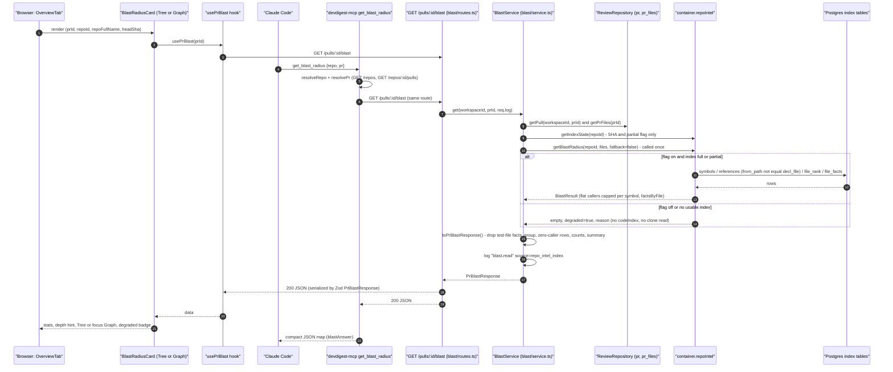
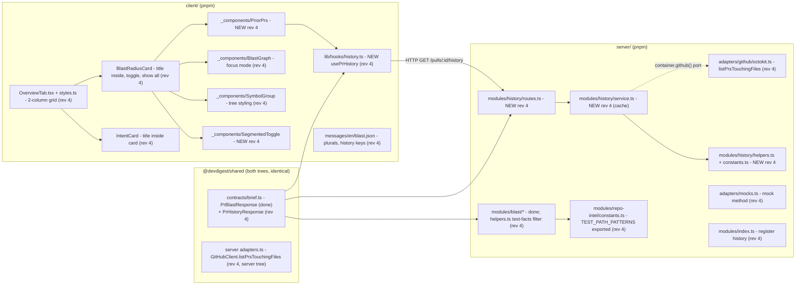

# 12 — Blast Radius (PR page block + `get_blast_radius` MCP tool)

> Status: **rev 4** (2026-10-09). Phases A–G are **DONE** (in the working tree). Phases I–L (rev 4) are planned.
> Scope: `server/` (`blast` + new `history` module, `repo-intel` facade option and SQL filter, a GitHub port method), `client/` (Overview two-column layout, Blast card visual parity, Prior PRs), `mcp/` (done). No DB schema change, no `reviewer-core` change.
> EARS acceptance criteria in §8. Each one is tagged **P1** (blocking), **P2** (mentor comments) or **P3** (nice to have).
>
> **Changelog**
> - **rev 4:** Oleh's approved visual-parity plan (`~/.claude/plans/abstract-hopping-trinket.md`), based on 10 mismatches found live on PR #5 against the reference screenshots. Adds the test-file facts filter, the two-column Intent | Blast layout, a segmented toggle, tree styling, a graph focus mode and the cron plural. **Prior PRs is now in scope** (`GET /pulls/:id/history`, a GitHub port method, an in-memory cache). New D24–D35, AC-26–AC-41, phases I–L, history sequence diagram (§1.3).
> - **rev 3:** architecture review (index-only facade option, SQL self-file filter, reason wording, direct hook imports) and coverage audit (`facts_by_file`, graph rules, route-validation test, zero-caller rows, ICU plural).
> - **rev 2:** Oleh's answers Q1/Q2/Q4; defaults for Q3/Q5/Q6.
> - **rev 1:** first draft.

## 1. Summary

A reviewer sees the diff, but not what else in the repo the change can break. Blast Radius shows, for a PR:
(a) the symbols declared in the changed files;
(b) who calls each of those symbols, as `file:line`;
(c) the HTTP endpoints and cron/jobs declared in those caller files.

The data comes from what `repo-intel` **already indexed** (`symbols`, `references`, `file_rank`, `file_facts`). The blast feature re-analyzes nothing and calls no LLM. It is served in two places:
1. a **"Blast radius" card** on the PR Overview tab, in Tree and Graph views;
2. the `devdigest-mcp` tool **`get_blast_radius`**, which calls the same route.

Rev 4 adds two things:
- **visual parity** with Oleh's reference screenshots. Intent and Blast sit side by side, the toggle is segmented, symbol rows look like a tree, the graph shows one symbol at a time with curved edges, and endpoint chips are capped;
- a **"Prior PRs touching these files"** footer. It is served by a separate `GET /pulls/:id/history` that reads GitHub through a new port method, so the blast route stays index-only (P2).

**Research findings** (F1–F10 rev 1–3; F11–F14 rev 4):

| # | Finding | Evidence | Where handled |
|---|---------|----------|---------------|
| F1 | The facade capped callers at 20 overall | `server/src/modules/repo-intel/service.ts:386` (before B2) | D6 — done |
| F2 | The index path did not drop same-file references | `server/src/modules/repo-intel/repository.ts:503-531` | D7 — done |
| F3 | The facade never reported `flag_off`/`index_partial`; a degraded row without a stamped reason → `index_failed` | `service.ts:189-225`, `repository.ts:215-231` | D4 — done |
| F4 | The ripgrep fallback re-reads clone files | `service.ts:233-290` | D4 — done |
| F5 | `BFS_DEPTH` is not used by blast (one hop) | `constants.ts:51`, `service.ts:669-694` | D18 |
| F6 | `REPO_INTEL_ENABLED=false` was set locally | `server/.env:21` | D16 — done (G1) |
| F7 | `pr_files` is filled only by `GET /pulls/:id` | `server/src/modules/pulls/routes.ts:261-271` | D5 — done |
| F8 | Caller lines refer to the indexed commit | `pipeline/full.ts:97` | D9 — done |
| F9 | The brief's demo files had no endpoints one hop away | `rg` importers | D15 |
| F10 | Resync is incremental and does not reset a hand-edited status | `pipeline/incremental.ts:78-97` | §11.2 |
| **F11** | On PR #5, `facts_by_file` for **test files** carried `app.inject` URLs (`GET /agents/${agentId}/versions/99`) as endpoints. `extractEndpoints` matches any `app.get(...)` line (`server/src/adapters/codeindex/extract.ts:182-195`), and tests call `app.inject`-style helpers. The mapper uses every caller file's facts (`server/src/modules/blast/helpers.ts:61-74`) | live PR #5; `blast/helpers.ts:61` | D24 |
| **F12** | The test-path list already exists but is private: `TEST_PATH_PATTERNS` (`.test.`, `.spec.`, `__tests__/`, `/test/`, `/tests/`) | `server/src/modules/repo-intel/service.ts:738-744` | D24: move it to `constants.ts` and export it |
| **F13** | Octokit 4.1.4 ships `@octokit/plugin-rest-endpoint-methods` 14.0.0, which has `repos.listCommits` (`GET /repos/{owner}/{repo}/commits`, with `path`) and `repos.listPullRequestsAssociatedWithCommit` | `server/package.json:34`, `server/node_modules/.pnpm/@octokit+plugin-rest-endpoint-methods@14.0.0…/dist-src/generated/endpoints.js` | D29 |
| **F14** | `PrHistory` / `PrHistoryItem` exist in both trees, but there is no way to say "unavailable" (no token / GitHub error). `container.github()` throws `ConfigError` (500) without a token | `brief.ts:88-102`; `server/src/platform/container.ts:164-170`; `server/src/platform/errors.ts:37-41` | D30: a `PrHistoryResponse` wrapper in both trees |

**Out of scope:** transitive callers (D18); indexer changes beyond the SQL filter; an LLM summary; e2e flows; polling after resync; schema changes; a graph library; changing `extractEndpoints` itself (D24 filters at read time); notes text for prior PRs (`notes: ""`).

### 1.1 Diagram — blast data flow (UI and MCP)



### 1.2 Diagram — structure: files per package (rev 4 changes marked)



### 1.3 Diagram — Prior PRs flow (rev 4)

```mermaid
sequenceDiagram
    autonumber
    participant PP as "PriorPrs footer"
    participant HK as "usePrHistory hook"
    participant HR as "GET /pulls/:id/history"
    participant HS as "HistoryService"
    participant RR as "ReviewRepository"
    participant C as "in-memory cache (prId, headSha)"
    participant GH as "container.github() port"
    participant API as "GitHub REST"

    PP->>HK: mount (collapsed), enabled after blast loads
    HK->>HR: GET /pulls/:id/history
    HR->>HS: get(workspaceId, prId, req.log)
    HS->>RR: getPull + getPrFiles
    HS->>C: lookup prId:headSha
    alt cache hit
        C-->>HS: PrHistoryResponse
    else cache miss
        HS->>GH: github()
        alt no token
            GH-->>HS: ConfigError
            HS-->>HR: available=false, reason=no_token
        else token
            HS->>GH: listPrsTouchingFiles(repo, files up to 10, excludeNumber, limits)
            GH->>API: repos.listCommits path=file per_page=20 (per file)
            GH->>API: repos.listPullRequestsAssociatedWithCommit (per sha, up to 30)
            API-->>GH: commits and PRs
            GH-->>HS: candidates (number, title, merged_at, author, path)
            HS->>HS: toPrHistory() - merged only, drop current, overlap, sort, top 5
            HS->>C: store
        end
    end
    HS-->>HR: PrHistoryResponse
    HR-->>HK: 200 JSON
    HK-->>PP: count badge; list on expand
```

## 2. Decisions

| # | Decision | Consequence |
|---|----------|-------------|
| D1 | **Scope:** all P1 and P2 criteria, plus P3: collapsible rows, crons separate, rank sort, resync, i18n, Tree/Graph. **Rev 4:** visual parity (D25–D28, D31–D35) and **Prior PRs** (D29–D30) | Phases A–G done; I–L planned; H (review) runs after L |
| D2 | **`blast/` module**: `routes.ts`, `service.ts`, `helpers.ts`, with no repository | Done |
| D3 | **No LLM** in blast or history | — |
| D4 | **Index-only facade** `getBlastRadius(…, { fallback: false })`; reasons `flag_off` / stamped-or-`index_failed` / `no_data` (no row) / `index_partial` | Done |
| D5 | Changed files from `pr_files`, else `container.git.diff`; logged as `changed_files_source` | Done |
| D6 | Per-symbol cap `MAX_CALLERS_PER_SYMBOL` (`constants.ts:30`) in the facade and the mapper | Done |
| D7 | Self-file exclusion in SQL (`ne(fromPath, declFile)`), plus a mapper guard | Done |
| D8 | Scope hint "Direct callers (depth 1) · max N per symbol" from response fields | Done; restyled in rev 4 (D35) |
| D9 | Links pinned to `index_sha ?? headSha` | Done |
| D10 | `PrBlastResponse = BlastRadius.extend({ counts, degraded, reason, index_sha, max_callers_per_symbol, facts_by_file })` in both trees | Done |
| D11 | Grouping key = symbol name | Done |
| D12 | Resync = mutate + toast + invalidate; no polling | Done |
| D13 | MCP tool is a thin handler over the same route; texts in §7.3 | Done. Rev 4: MCP code unchanged; its answer loses test-file endpoints automatically (D24) |
| D14 | The server orders data (rank desc; zero-caller rows last) | Done |
| D15 | Demo PR: a JSDoc edit to `server/src/modules/_shared/context.ts` on `OlegDEma/dev-digest` | Opening the demo PRs on GitHub waits for Oleh's separate "yes" (Q8) |
| D16 | `REPO_INTEL_ENABLED=true` permanently | Done |
| D17 | Graph view in scope. **Rev 4: Prior PRs moves into scope** (D29) | — |
| D18 | Depth = one hop (default, Oleh may override) | — |
| D19 | MCP callers as compact strings (default) | Done |
| D20 | Spec 11 supersession notes (default) | Done |
| D21 | Client test harness: `QueryClientProvider` + `NextIntlClientProvider` + mocks of `lib/hooks/*` and `lib/toast` | Reused for rev 4 tests |
| D22 | Every changed symbol gets a row (zero-caller rows last) | Done |
| D23 | Exact per-file facts (`facts_by_file`) drive the graph edges | Done; rev 4 keeps it in focus mode |
| **D24** | **Test-file facts are dropped in the blast mapper.** Move `TEST_PATH_PATTERNS` from `repo-intel/service.ts:738-744` to `repo-intel/constants.ts` (exported; `service.ts` imports it back, behaviour unchanged). Add a pure `isTestPath(path)` in `blast/helpers.ts` that matches any pattern in the lower-cased path. In `toPrBlastResponse`, `factsOf(file)` returns `{ endpoints: [], crons: [] }` when `isTestPath(file)`. **Callers from test files stay** (they are real callers); only their endpoints/crons go. `facts_by_file` for a test file is therefore empty. `counts.endpoints`/`crons` shrink accordingly | Fixes F11 (`GET /agents/${agentId}/versions/99` disappears). MCP output follows automatically. MCP tests use FakeApi fixtures, not the mapper, so no MCP test change is expected (verified in I3) |
| **D25** | **Two-column Intent \| Blast layout.** `OverviewTab` wraps `IntentCard` and `BlastRadiusCard` in a grid `div` with `gridTemplateColumns: "repeat(auto-fit, minmax(min(100%, 460px), 1fr))"`, `gap: 16`, `alignItems: "start"`. Description stays full width below. **Breakpoint note:** inline styles cannot hold media queries, so `auto-fit` picks the column count from the available width. Content width is the page's `maxWidth: 1080` minus padding (`page.tsx:144`), which gives two columns at ≈1440px and one column below ≈1000px viewport. Oleh's "≥1100px" is checked live (L-step), not hard-coded | Matches screenshot #1 with no CSS file and no `window` listener |
| **D26** | **Card title inside the card, for both cards.** Move the `SectionLabel` (`Sparkles` "Intent" in `IntentCard.tsx:28,36,48,63`; `Workflow` "Blast radius" in `BlastRadiusCard.tsx:32`) **into** the bordered card container as its first row, in every state (loading, error, empty, data). IntentCard's loading and error states get the same card wrapper | Screenshot #1. `IntentCard.test.tsx` queries by text, so it stays valid (verified in J-steps) |
| **D27** | **Local `SegmentedToggle`** in `BlastRadiusCard/_components/SegmentedToggle/`. A `div role="group" aria-label` holds a shared track (`background: var(--bg-hover)`, `border: 1px solid var(--border)`, `borderRadius: 6`, `padding: 2`) and one `<button aria-pressed>` per option. The active button gets `background: var(--bg-primary)`, `color: var(--text-primary)`, `fontWeight: 600`; inactive ones are transparent with `--text-secondary`. Props: `options: {value, label}[]`, `value`, `onChange`, `ariaLabel`. The vendor UI is not touched | Screenshot #2. The existing `aria-pressed` tests keep working |
| **D28** | **Symbol rows look like a tree** (`SymbolGroup`). No per-group border. Header row: `background: var(--bg-hover)` (the card itself is `--bg-elevated`, so a header painted `--bg-elevated` would not stand out — **deviation from the plan's token**, to be confirmed live), `borderRadius: 6`, chevron, `Icon.Code` coloured `var(--accent)`, bold mono `symbol()`, and `callerCount` right-aligned. Body: a left guide line (`borderLeft: 1px solid var(--border)`, `marginLeft: 14`, `paddingLeft: 10`); each caller row is `Icon.CornerDownRight` + a mono link `file:line` in `--text-secondary`. **The caller function name moves to `title`** (tooltip) on the row; the right-aligned name is removed. **Only the first symbol starts open.** The card renders the first **10** rows and then a `Button` `t("showAll", { count })` that reveals the rest. Endpoint and cron chips: at most **6** each, then a `Button` "+N more" (`t("chipsMore", { count })`) that expands the chips of that row | Screenshots #4–#7; PR #5's 115-row wall becomes 10 rows |
| **D29** | **Prior PRs via a new GitHub port method.** `GitHubClient.listPrsTouchingFiles(repo, files, excludeNumber, limits): Promise<PrTouchingFile[]>`, declared in `server/src/vendor/shared/adapters.ts:145-171`. `PrTouchingFile = { number, title, merged_at: string \| null, author, path }` (one row per path → PR association). The adapter (`adapters/github/octokit.ts`) does I/O only, wrapped in `withTimeout`: for each of the first `limits.maxFiles` paths it calls `rest.repos.listCommits({ owner, repo, path, per_page: limits.perFileCommits })`; it collects unique SHAs up to `limits.maxCommits`; for each SHA it calls `rest.repos.listPullRequestsAssociatedWithCommit({ owner, repo, commit_sha })`; it emits rows, skipping `excludeNumber`. **Policy lives in a pure `history/helpers.ts` `toPrHistory(rows, excludeNumber, max)`**: merged only (`merged_at != null`), drop the current PR, aggregate `files_overlap` per PR (sorted unique paths), sort by `merged_at` desc, keep ≤ `max`, `notes: ""`. Limits come from `history/constants.ts`: `MAX_FILES = 10`, `PER_FILE_COMMITS = 20`, `MAX_COMMITS = 30`, `MAX_PRIOR_PRS = 5`. `MockGitHubClient` gets an `opts.prsTouchingFiles` list (default `[]`) | Onion: I/O behind a port; policy in pure code; tests mock the port. A worst case is about 40 GitHub calls per uncached PR (D31) |
| **D30** | **`PrHistoryResponse` contract (deliberate, additive, both trees):** `PrHistory.extend({ available: z.boolean(), reason: PrHistoryUnavailableReason.nullable() })` with `PrHistoryUnavailableReason = z.enum(['no_token', 'github_error'])` (lowercase snake_case). The route returns **200** with `available: false` when there is no token or GitHub fails, so the card never breaks. `PrHistory` itself is unchanged (`PrBrief` composes it) | F14. Same pattern as D10 |
| **D31** | **`history/` module** (`routes.ts`, `service.ts`, `helpers.ts`, `constants.ts`; no repository, like `blast/`). `GET /pulls/:id/history` with `params: IdParams`, `response: { 200: PrHistoryResponse }`, `config: { rateLimit: { max: 30, timeWindow: '1 minute' } }` (it calls GitHub; precedent `intent/routes.ts:28-31`). The service creates `ReviewRepository` the same way `BlastService` does. It picks changed files from `pr_files`, sorted by `additions + deletions` desc, then path. **In-memory cache** in the service instance (one per app, created in the route plugin): a `Map` keyed by `` `${prId}:${pull.headSha}` ``, TTL 15 min, at most 200 entries (oldest evicted). **Only `available: true` results are cached.** `ConfigError` from `container.github()` → `{ history: [], available: false, reason: 'no_token' }`; any other error → `reason: 'github_error'` plus `logger.warn({ pr_id, err: message }, 'history.unavailable')`. One `logger.info({ pr_id, files, prs, cached, ms }, 'history.read')` per request | It does not touch the blast route, so blast stays index-only (P2) |
| **D32** | **Fetch timing:** `usePrHistory(prId, { enabled })` runs once the blast query has succeeded (it reuses its `enabled` gate), with `staleTime: 5 * 60_000`. The footer shows the **count badge** while collapsed; the **list renders only on expand**. This is one request: the "light first request" from Oleh's plan is the same cached GET, because GitHub cannot return a count without the same calls | Q7 asks whether to defer the request until the first expand instead (no badge until then) |
| **D33** | **`PriorPrs` footer** in `BlastRadiusCard/_components/PriorPrs/`. Collapsed: a `<button aria-expanded>` row with `Icon.History`, `t("history.title")`, a count `Badge`, and a chevron. Expanded: `#N title` (a link to `githubPrUrl(repoFullName, n)`, `client/src/lib/github-urls.ts:16`), `· author · date` (`merged_at` formatted with the existing helper in `client/src/lib/format.ts` if it has one, else `toLocaleDateString`), and `t("history.overlap", { count: files_overlap.length })` with the file list in `title`. States: loading → a small `Skeleton`; `available: false` → muted `t("history.unavailable")`; empty → `t("history.empty")`; query error → the same `unavailable` text (the card never shows an error state for history) | Screenshot #9 |
| **D34** | **Graph focus mode** (`BlastGraph`): one symbol at a time. A native `<select aria-label={t("graph.symbolSelect")}>` lists the symbols that have callers, in server (rank) order; it **defaults to the first** (top rank, D14). `layoutGraph(group, factsByFile, { cap, maxFactNodes })` now takes **one** group. Columns: symbol → callers → endpoints/crons. A caller label is the **function name** (`c.name`), falling back to `basename:line` when the name is empty or equals the file basename (the facade's no-enclosing-symbol fallback). The full `file:line name` goes in `<title>`, and caller nodes are still deduped by `file:line`. Edges are **cubic Béziers**: `M x1,y1 C x1+dx,y1 x2-dx,y2 x2,y2` with `dx = (x2-x1)/2` (`<path fill="none">`). Node styles use `fill: var(--bg-elevated)`; stroke `var(--accent)` for symbol and endpoint nodes, `var(--border)` for callers, `var(--warn)` for crons; caller text `var(--text-secondary)`. Legend: coloured dots (`borderRadius: "50%"`, same colours) + labels. The rev-3 rules (per-file edges, `MAX_FACT_NODES` + "+N more", barycenter, `viewBox` scroll, `role="group"`, link `aria-label`, focus ring) stay | Screenshot #8; PR #5's 115-symbol fan becomes readable |
| **D35** | **Small copy changes.** `stat.*` labels become ICU plurals called with `{ count }` (`"crons": "{count, plural, one {cron} other {crons}}"`, and likewise symbols/callers/endpoints). The depth hint stays (it covers the P2 limits item) but is smaller and greyer (`fontSize: 11`, `color: var(--text-muted)`) | Screenshots #3 and #10 |

## 3. What already exists — do not rebuild

Rev 1–3 rows (all still valid) are condensed. Everything they listed now exists in the working tree; see the code map.

| Layer | Already there | File |
|-------|---------------|------|
| Blast route/service/mapper | done (A–G) | `server/src/modules/blast/{routes,service,helpers}.ts` (`helpers.ts:41-121`, `factsOf` at `:61`) |
| Test-path patterns | `TEST_PATH_PATTERNS`, private | `server/src/modules/repo-intel/service.ts:738-744`, used by `isJunkPath` `:763-769` |
| GitHub port + adapter + mock | `GitHubClient` (no history method); `OctokitGitHubClient` with `withTimeout`; `MockGitHubClient(opts)` | `server/src/vendor/shared/adapters.ts:145-171`; `server/src/adapters/github/octokit.ts:29-390`; `server/src/adapters/mocks.ts:122-140` |
| GitHub access | `container.github()` → `ConfigError` without a token; `overrides.github` for tests | `server/src/platform/container.ts:164-170`, `:43-51` |
| Octokit endpoints | `repos.listCommits`, `repos.listPullRequestsAssociatedWithCommit` (plugin 14.0.0) | F13 |
| History contract | `PrHistoryItem`, `PrHistory` (both trees) | `server/src/vendor/shared/contracts/brief.ts:88-102`; client copy, same lines |
| i18n | `brief.json` `block.history`, `noHistory`, `overlap`; `blast.json` (rev 3 keys) | `client/messages/en/brief.json:2-11`, `client/messages/en/blast.json` |
| Links | `githubPrUrl`, `githubBlobUrl` | `client/src/lib/github-urls.ts:16-37` |
| UI kit | `Icon.History`, `Code`, `CornerDownRight`; tokens `--bg-hover`, `--bg-primary`, `--bg-elevated`, `--border`, `--accent`, `--accent-bg`, `--warn`, `--text-primary/secondary/muted` | `client/src/vendor/ui/icons.tsx:10`, `client/src/vendor/ui/styles.css` |
| Current card | `SectionLabel` outside the card; two `Button`s as the toggle; the first 3 groups open | `.../BlastRadiusCard/BlastRadiusCard.tsx:32,80-89,116` |
| Current rows | bordered groups; right-aligned caller name; all chips | `.../SymbolGroup/SymbolGroup.tsx:41-80` |
| Current graph | all groups stacked; straight lines; caller label `basename:line` | `.../BlastGraph/helpers.ts:60-110`, `BlastGraph.tsx` |
| Intent card | `SectionLabel` outside the card in 4 states | `.../IntentCard/IntentCard.tsx:28,36,48,63` |
| Overview | single column | `.../OverviewTab/OverviewTab.tsx:18-31` |

Nothing for history is pre-staged beyond the contract and the i18n strings (verified with `rg -n "history" server/src/modules client/src/lib/hooks --glob '!server/clones/**'`: no module, no hook).

### Code map — files rev 4 touches

| File | Why it changes | Anchor |
|------|----------------|--------|
| `server/src/modules/repo-intel/constants.ts` | export `TEST_PATH_PATTERNS` (moved) | after `:51` |
| `server/src/modules/repo-intel/service.ts` | import `TEST_PATH_PATTERNS` instead of declaring it | `:738-744` |
| `server/src/modules/blast/helpers.ts` | `isTestPath`; `factsOf` returns empty facts for test files | `:61` |
| `server/test/blast-helpers.test.ts` | test-file facts dropped, callers kept, counts | existing file |
| `server/src/vendor/shared/contracts/brief.ts`, `client/src/vendor/shared/contracts/brief.ts` | `PrHistoryUnavailableReason`, `PrHistoryResponse` | after `:102` |
| `server/test/contracts.test.ts` | `PrHistoryResponse` case | existing file |
| `server/src/vendor/shared/adapters.ts` | `PrTouchingFile`, `HistoryLimits`, `listPrsTouchingFiles` on `GitHubClient` | `:145-171` |
| `server/src/adapters/github/octokit.ts` | implement `listPrsTouchingFiles` | before `:390` |
| `server/src/adapters/mocks.ts` | `MockGitHubOptions.prsTouchingFiles` + method | `:122-140` |
| `server/src/modules/history/{constants,helpers,service,routes}.ts` | NEW | — |
| `server/src/modules/index.ts` | register `history` | after `blast` |
| `server/test/history-helpers.test.ts`, `history-service.test.ts`, `history-routes.test.ts` | NEW | patterns `blast-*.test.ts` |
| `client/src/lib/hooks/history.ts`, `client/src/lib/hooks/index.ts` | NEW `usePrHistory` + barrel | — |
| `client/messages/en/blast.json` | plural `stat.*`, `showAll`, `chipsMore`, `graph.symbolSelect`, `history.*` | existing file |
| `.../OverviewTab/OverviewTab.tsx`, `styles.ts` | grid | `OverviewTab.tsx:18-31` |
| `.../IntentCard/IntentCard.tsx`, `styles.ts` | title inside the card | `:28,36,48,63` |
| `.../BlastRadiusCard/BlastRadiusCard.tsx`, `styles.ts`, `BlastRadiusCard.test.tsx` | title inside, `SegmentedToggle`, show-all, only first open, plural stats, hint style, `PriorPrs` | `:32,70-91,109-128` |
| `.../BlastRadiusCard/_components/SegmentedToggle/*` | NEW | — |
| `.../BlastRadiusCard/_components/SymbolGroup/*` | tree styling, tooltip, chip cap | `SymbolGroup.tsx:19-83` |
| `.../BlastRadiusCard/_components/BlastGraph/*` | focus mode, Béziers, colours, legend dots | `helpers.ts:60`, `BlastGraph.tsx`, `styles.ts:16-48` |
| `.../BlastRadiusCard/_components/PriorPrs/*` | NEW | — |
| `server/README.md`, `client/README.md` | `/pulls/:id/history` | `server/README.md:78-80`, `client/README.md:34` |

## 4. Data model

**No schema change** in any revision. History is fetched live from GitHub and cached in process memory.

## 5. Contracts (`@devdigest/shared`)

**Done (rev 3):** `BlastDegradedReason`, `BlastCounts`, `BlastFileFacts`, `PrBlastResponse` in both trees (`brief.ts`, after `BlastRadius`).

**Rev 4, deliberate and additive** (D30). Append after `export type PrHistory …` (`brief.ts:102`) in **both** `server/src/vendor/shared/contracts/brief.ts` and `client/src/vendor/shared/contracts/brief.ts`, byte-identical:

```ts
// ---- PR history: route response (spec 12 rev 4) ----
export const PrHistoryUnavailableReason = z.enum(['no_token', 'github_error']);
export type PrHistoryUnavailableReason = z.infer<typeof PrHistoryUnavailableReason>;

/** GET /pulls/:id/history. A superset of PrHistory; `available:false` when GitHub cannot be asked. */
export const PrHistoryResponse = PrHistory.extend({
  available: z.boolean(),
  reason: PrHistoryUnavailableReason.nullable(),
});
export type PrHistoryResponse = z.infer<typeof PrHistoryResponse>;
```

**Port type** (server tree only, `server/src/vendor/shared/adapters.ts`, next to `GitHubClient`):
```ts
export interface PrTouchingFile { number: number; title: string; merged_at: string | null; author: string; path: string }
export interface HistoryLimits { maxFiles: number; perFileCommits: number; maxCommits: number }
// in GitHubClient:
/** PRs associated with recent commits that touched `files` (I/O only; filtering is the caller's). */
listPrsTouchingFiles(repo: RepoRef, files: string[], excludeNumber: number, limits: HistoryLimits): Promise<PrTouchingFile[]>;
```
The client copy of `adapters.ts` has **already drifted** (`GitHubClient` starts at `:124` there vs `:145` on the server), and no client code uses `GitHubClient` (`rg GitHubClient client/src --glob '!**/vendor/**'` → none). The port change therefore stays server-side; this is recorded in §10, not mirrored.

## 6. Server

§6.1–6.5 (blast route, service, helpers, repo-intel facade, registry) are **done**. Rev 4:

### 6.6 Test-file facts filter (D24)
- `repo-intel/constants.ts`: `export const TEST_PATH_PATTERNS: readonly string[] = ['.test.', '.spec.', '__tests__/', '/test/', '/tests/'];`. `service.ts` keeps its `Set` view: `new Set(TEST_PATH_PATTERNS)`.
- `blast/helpers.ts`: `export const isTestPath = (p: string) => { const l = p.toLowerCase(); return TEST_PATH_PATTERNS.some((x) => l.includes(x)); };` and `factsOf = (file) => isTestPath(file) ? EMPTY_FACTS : result.factsByFile?.[file] ?? EMPTY_FACTS`. Note: `/test/` needs a leading slash, so a root-level `test/x.ts` path also gets `'/' + path` checked (`isTestPath('/' + p)`), matching how repo paths are stored relative. The unit test covers this.

### 6.7 `modules/history/` (NEW, D29–D31)
- **`constants.ts`:** `MAX_FILES = 10`, `PER_FILE_COMMITS = 20`, `MAX_COMMITS = 30`, `MAX_PRIOR_PRS = 5`, `CACHE_TTL_MS = 15 * 60_000`, `CACHE_MAX = 200`.
- **`helpers.ts`** (pure):
  - `pickFiles(prFiles, max)`: sort by `additions + deletions` desc, then path; take the first `max` paths.
  - `toPrHistory(rows: PrTouchingFile[], excludeNumber, max): PrHistoryItem[]`: as described in D29.
- **`service.ts`** (application): `class HistoryService { constructor(container, reviews = new ReviewRepository(container.db)); private cache = new Map<string, { at: number; value: PrHistoryResponse }>(); get(workspaceId, prId, logger) }`.
  1. Load the PR (404 if missing) and its `pr_files`. If there are no files → `{ history: [], available: true, reason: null }`.
  2. Cache lookup by `prId:headSha`, honouring the TTL.
  3. Call `container.github()`. On `ConfigError` → `no_token`.
  4. Call `listPrsTouchingFiles({ owner: repo.owner, name: repo.name }, files, pull.number, limits)`, then `toPrHistory`; store; log.
  5. On any other error → `github_error`.
  - Imports: types, `ConfigError`, `NotFoundError`, `ReviewRepository`, `./helpers`, `./constants`. **No Drizzle, no `new Octokit`.**
- **`routes.ts`** (presentation): `GET /pulls/:id/history` as described in D31; `getContext` → `service.get(workspaceId, req.params.id, req.log)`.
- **`modules/index.ts`:** `import history from './history/routes.js'`, registered after `blast`.

### 6.8 GitHub adapter (infrastructure)
`octokit.ts`, `listPrsTouchingFiles`:
1. Loop over `files.slice(0, limits.maxFiles)`. For each, call `withTimeout(this.octokit.rest.repos.listCommits({ owner, repo, path, per_page: limits.perFileCommits }), TIMEOUT)`. Record SHA → paths until `limits.maxCommits` unique SHAs.
2. Then, for each SHA, call `withTimeout(this.octokit.rest.repos.listPullRequestsAssociatedWithCommit({ owner, repo, commit_sha }), TIMEOUT)`.
3. For each PR whose `number !== excludeNumber`, push one row per path of that SHA: `{ number, title, merged_at: pr.merged_at ?? null, author: pr.user?.login ?? '', path }`.
4. Calls run **sequentially** (no burst against secondary rate limits). Errors propagate (the service maps them).

`mocks.ts`: `prsTouchingFiles?: PrTouchingFile[]` in `MockGitHubOptions`. The mock method returns `this.opts.prsTouchingFiles ?? []`.

## 7. Client

§7.1–7.4 are done. Rev 4:

### 7.3 MCP texts (spec of record; supersedes spec 11 §7b.5)

Source of truth for `mcp/src/texts.ts`; pinned byte for byte in `mcp/test/verbatim.test.ts`.

| Key (`mcp/src/texts.ts`) | Text, byte for byte |
|---|---|
| `TOOL_TEXTS.get_blast_radius.title` | `PR blast radius` |
| `TOOL_TEXTS.get_blast_radius.description` | `Map what a pull request (PR) can break: symbols declared in the changed files, their callers (file:line) and the HTTP endpoints and cron jobs behind them. Call before reviewing a PR. Read-only, from the code index.` |
| `prNotFound(pr, repo, tool = 'run_agent_on_pr')` | `` `PR #${pr} not found in ${repo}. Check the number with gh pr list --repo ${repo}; if it is listed, open the PR in the DevDigest studio to sync it, then call ${tool} again.` `` |
| `BLAST_FLAG_OFF_NEXT` (`flag_off`) | `Repo intelligence is off (REPO_INTEL_ENABLED=false), so there is no map. Enable it, restart the DevDigest API, index the repo, then call get_blast_radius again.` |
| `BLAST_NO_DATA_NEXT` (`no_data`) | `The repo is not indexed yet, so the map is empty. Index it by resyncing the repo in the DevDigest studio, then call get_blast_radius again.` |
| `BLAST_INDEX_FAILED_NEXT` (`index_failed`) | `Indexing failed, so the map is empty or stale. Retry by resyncing the repo in the DevDigest studio, then call get_blast_radius again.` |
| `BLAST_TOO_LARGE_NEXT` (`repo_too_large`) | `The repo is too large to index, so no map is possible for it. Use run_agent_on_pr or get_findings for review results.` |
| `BLAST_PARTIAL_NEXT` (`index_partial`) | `The code index is partial; the map may miss callers. Resync the repo in the DevDigest studio, then call get_blast_radius again.` |
| `blastScope(max)` | `` `direct callers (depth 1), max ${max} per symbol` `` |

**Answer** (`blastAnswer(repo, pr, data)`, compact JSON through `toText(obj, 'downstream')`; callers are `"file:line name"` strings; `truncated: true` appears on a group only when its callers were cut by the per-symbol cap; `next` appears only when `degraded`):
```json
{"repo":"OlegDEma/dev-digest","pr":7,"summary":"…","scope":"direct callers (depth 1), max 20 per symbol",
 "counts":{"symbols":2,"callers":11,"endpoints":3,"crons":0},"degraded":false,"reason":null,
 "downstream":[{"symbol":"getContext","callers":["server/src/modules/intent/routes.ts:22 intentRoutes"],"endpoints":["GET /pulls/:id/intent"],"crons":[]},
               {"symbol":"RequestContext","callers":[],"endpoints":[],"crons":[]}]}
```

### 7.5 Layout and cards (D25, D26)
- `OverviewTab/styles.ts`: `twoCol: { display: "grid", gridTemplateColumns: "repeat(auto-fit, minmax(min(100%, 460px), 1fr))", gap: 16, alignItems: "start" }`.
- `OverviewTab.tsx`: `<div style={s.twoCol}><IntentCard …/><BlastRadiusCard …/></div>`, then the Description.
- `IntentCard.tsx`: wrap every state in the card container (`s.card`) with `SectionLabel` as its first child. `BlastRadiusCard.tsx`: the same (the `label` moves inside `s.card` in the loading, error and data states).

### 7.6 BlastRadiusCard (D27, D28, D35)
- Stats: `t(\`stat.${it.key}\`, { count: it.value })`.
- Hint style per D35.
- Toggle: `<SegmentedToggle ariaLabel={t("view.label")} options={[{value:"tree",label:t("view.tree")},{value:"graph",label:t("view.graph")}]} value={view} onChange={setView} />`.
- Tree: `const [showAll, setShowAll] = useState(false); const rows = showAll ? downstream : downstream.slice(0, SYMBOL_ROWS)`, with `SYMBOL_ROWS = 10` in `BlastRadiusCard/styles.ts`. `defaultOpen={i === 0 && g.callers.length > 0}`. Below the rows, when `downstream.length > SYMBOL_ROWS && !showAll`: `<Button size="sm" onClick={() => setShowAll(true)}>{t("showAll", { count: downstream.length })}</Button>`.
- Footer: `<PriorPrs prId={prId} repoFullName={repoFullName} enabled={q.isSuccess} />` below the tree or graph, separated by `borderTop: 1px solid var(--border)`.

### 7.7 SymbolGroup (D28)
- `CHIP_MAX = 6` in `SymbolGroup/styles.ts`; local `useState` `showAllChips`.
- The caller row `div` gets `title={c.name}`.
- The right-hand `callerName` span is removed.
- Header and guide styles as described in D28.

### 7.8 BlastGraph focus mode (D34)
- `BlastGraph.tsx`: `const withCallers = downstream.filter((g) => g.callers.length > 0); const [symbol, setSymbol] = useState(withCallers[0]?.symbol)`, a `<select>` above the SVG, and `layoutGraph(selectedGroup, factsByFile, …)`.
- Edges become `<path d={bezier(a, b)} fill="none" style={s.edge} />`, with `bezier` in `helpers.ts`.
- Legend items become dots.
- `helpers.ts`:
  - `callerLabel(c)`: the name, or `basename:line` when the name is empty or equals the file basename;
  - the `layoutGraph` signature takes one group;
  - `bezier(from, to)` returns the path string.

### 7.9 PriorPrs + hook (D32, D33)
- `client/src/lib/hooks/history.ts`: `usePrHistory(prId, { enabled })` → `useQuery({ queryKey: ["pull-history", prId], queryFn: () => api.get<PrHistoryResponse>(\`/pulls/${prId}/history\`), enabled: !!prId && enabled, staleTime: 300_000 })`. Add a barrel export; components import from `lib/hooks/history` directly.
- `PriorPrs.tsx`: as described in D33; `useTranslations("blast")`.

### 7.10 i18n additions (`client/messages/en/blast.json`)
```json
"stat": {
  "symbols": "{count, plural, one {symbol} other {symbols}}",
  "callers": "{count, plural, one {caller} other {callers}}",
  "endpoints": "{count, plural, one {endpoint} other {endpoints}}",
  "crons": "{count, plural, one {cron} other {crons}}"
},
"view": { "tree": "Tree", "graph": "Graph", "label": "Blast radius view" },
"showAll": "Show all {count}",
"chipsMore": "+{count} more",
"graph": { "symbolSelect": "Symbol to graph" },
"history": {
  "title": "Prior PRs touching these files",
  "empty": "No prior merged PRs touch these files.",
  "unavailable": "Prior PRs unavailable",
  "overlap": "{count, plural, one {# file} other {# files}} overlap"
}
```
Merge these into the existing objects (`view`, `graph`), keeping all existing keys.

## 8. Acceptance criteria (EARS)

AC-1 … AC-25 (rev 1–3) are unchanged. Implemented: AC-1–AC-8 and AC-10–AC-25. AC-9 (PR + video) is pending. AC-4 and AC-6 need the demo PRs (Q8).

- **AC-1 [P1]** When a user opens the Overview tab, the system shall render a "Blast radius" card.
- **AC-2 [P1]** The card shall show counts of changed symbols, callers, endpoints and crons.
- **AC-3 [P1]** For every changed symbol, the card shall show its callers as `file:line` and the endpoints under them, or "no callers".
- **AC-4 [P1]** For the D15 test PR, the map shall show `getContext()` with ≥2 callers and ≥1 endpoint.
- **AC-5 [P1]** Clicking a caller's `file:line` shall open the GitHub line (pinned to `index_sha` or `head_sha`) in a new tab.
- **AC-6 [P1]** For an edit to `server/src/server.ts`, the card shall show `noDownstream` and "no callers" rows.
- **AC-7 [P1]** While `degraded`, the card shall show an "Incomplete index" badge with the reason.
- **AC-8 [P1]** `get_blast_radius` shall return the same map as `GET /pulls/:id/blast`.
- **AC-9 [P1]** There shall be an open PR with a description per §14 and a 1–3 minute video.
- **AC-10 [P2]** One `blast.read` log line per request; no code parser on the blast path.
- **AC-11 [P2]** The response shall be validated by `PrBlastResponse`; 422 / 404 / 500 (malformed).
- **AC-12 [P2]** The flat → grouped mapping shall be unit-tested.
- **AC-13 [P2]** No LLM call.
- **AC-14 [P2]** The declaring file shall never appear among its own callers; excluded in SQL before the cap.
- **AC-15 [P2]** The cap shall come from `MAX_CALLERS_PER_SYMBOL`; the UI hint shall come from response fields.
- **AC-16 [P2]** Degraded reasons shall be mapped and rendered.
- **AC-17 [P2]** MCP lab rules (annotations, description, args, concise answer, errors).
- **AC-18 [P2]** The PR description shall state the subagents and why `BFS_DEPTH` does not apply.
- **AC-19 [P3]** Symbol rows shall collapse and expand (`aria-expanded`).
- **AC-20 [P3]** Endpoint chips shall use the accent token; cron chips the warn token, on their own line.
- **AC-21 [P3]** Rank order, with zero-caller rows last.
- **AC-22 [P3]** Resync shall call the resync route, show a toast and invalidate the blast query.
- **AC-23 [P3]** All copy shall come from i18n, with ICU plurals.
- **AC-24 [P3]** The Graph view (SVG, per-file edges, ellipsis + `<title>`, overflow node, a11y, legend).
- **AC-25 [P1]** `REPO_INTEL_ENABLED=true` and the index is `full`.

**Rev 4 — visual parity (P3 unless tagged):**
- **AC-26 [P2]** When a caller file matches `TEST_PATH_PATTERNS`, the blast response shall attribute no endpoints or crons from it (`facts_by_file[file]` empty), while still listing that caller. On PR #5, `curl …/blast` shall contain no endpoint containing `${`.
- **AC-27** Where the Overview content width allows two 460px columns (≈1440px viewport), the Intent and Blast cards shall render side by side, top-aligned. At ≤1000px viewport they shall stack in one column.
- **AC-28** The "Intent" and "Blast radius" titles with their icons shall render **inside** their bordered cards, in every state (loading, error, empty, data).
- **AC-29** The Tree/Graph toggle shall render as one segmented control (a shared track, the active segment filled), with `aria-pressed` on each segment and a group `aria-label`.
- **AC-30** The stat row shall use plural forms: `1 cron` / `2 crons`, `1 symbol` / `2 symbols`, and likewise for callers and endpoints.
- **AC-31** Each symbol row header shall have a filled background, a chevron, an accent `Code` icon, a bold mono name and a right-aligned caller count, with no border around the group.
- **AC-32** Caller rows shall show a left guide line and a `CornerDownRight` icon, with `file:line` in grey mono, and the caller function name available as a tooltip (`title`), not as visible text.
- **AC-33** When the card renders, only the first symbol row shall be expanded. Where there are more than 10 symbol rows, only 10 shall show, plus a "Show all N" button that reveals the rest.
- **AC-34** Where a symbol row has more than 6 endpoint chips (or cron chips), it shall show 6 plus a "+N more" button that reveals the rest.
- **AC-35** When Graph is selected, the system shall show a symbol selector defaulting to the top-ranked symbol with callers. It shall graph only that symbol: caller nodes labelled by function name (fallback `basename:line`), cubic Bézier edges, accent-stroked symbol and endpoint nodes, grey caller nodes, amber cron nodes, and a legend with coloured dots.
- **AC-36** The depth hint shall remain visible in smaller, muted text.

**Rev 4 — Prior PRs:**
- **AC-37 [P3]** When `GET /pulls/:id/history` is called for a PR with changed files and a GitHub token, the system shall return ≤5 **merged** PRs (excluding the PR itself) that touched those files, newest first, each with `files_overlap` ⊆ the PR's files, validated by `PrHistoryResponse`.
- **AC-38 [P3]** While no GitHub token is configured or GitHub fails, the route shall return 200 with `available: false` and `reason` (`no_token` / `github_error`), and the footer shall show "Prior PRs unavailable" without breaking the card.
- **AC-39 [P3]** When the same PR at the same head SHA is requested again within 15 minutes, the service shall answer from the in-memory cache without calling the GitHub port.
- **AC-40 [P3]** The card shall show a collapsed "Prior PRs touching these files" footer with a count badge and chevron. When expanded, it shall list `#N title · author · date · overlap`, with `#N title` linking to the PR on GitHub.
- **AC-41 [P2]** The blast route shall stay index-only: no GitHub call is made by `GET /pulls/:id/blast`. History is a separate request.

## 9. Implementation plan

Package managers (T9): `server`/`client` are pnpm, but use direct binaries only; `mcp` is npm. Never install anything.

### Phases A–G — **DONE** (working tree, 2026-10-09)
- A: contract.
- B: facade option, cap and SQL filter.
- C: `blast` module and tests.
- D: client tree.
- E: graph.
- F: MCP tool.
- G: local flag, full index, docs, insights.

Step tables are as in rev 3 (git history of this file). Reported green: server 227, client 157, mcp 54 tests.

### Phase I — Server rev 4
| # | Step | Files | Skill | AC |
|---|------|-------|-------|-----|
| I1 | Move `TEST_PATH_PATTERNS` to `constants.ts` (exported array); `service.ts:738-744` imports it, so `isJunkPath` is unchanged | `server/src/modules/repo-intel/constants.ts`, `server/src/modules/repo-intel/service.ts` | `onion-architecture` | AC-26 |
| I2 | `isTestPath` + test-file-aware `factsOf` (§6.6) | `server/src/modules/blast/helpers.ts` | `onion-architecture`, `typescript-expert` | AC-26 |
| I3 | Units. A caller in `server/test/agents.test.ts` with facts `GET /agents/${agentId}/versions/99` → caller listed; `endpoints_affected` excludes it; `facts_by_file[test file]` is empty; `counts.endpoints` excludes it. `isTestPath` covers `a.spec.ts`, `__tests__/x.ts`, `test/x.ts` (root), `src/tests/y.ts`, and not `src/attest.ts`. Then run V6: MCP tests should need no change (FakeApi fixtures); if any fails, fix only its fixture | `server/test/blast-helpers.test.ts` | `typescript-expert` | AC-26 |
| I4 | `PrHistoryUnavailableReason` + `PrHistoryResponse` (§5), **byte-identical in both trees, in one step** | `server/src/vendor/shared/contracts/brief.ts`, `client/src/vendor/shared/contracts/brief.ts` | `zod` | AC-37, AC-38 |
| I5 | Contract case: a valid response parses (and as `PrHistory`); `reason: 'NO_TOKEN'` throws | `server/test/contracts.test.ts` | `zod` | AC-37 |
| I6 | Port types and method (§5) | `server/src/vendor/shared/adapters.ts` | `onion-architecture`, `typescript-expert` | AC-37 |
| I7 | `listPrsTouchingFiles` (§6.8) | `server/src/adapters/github/octokit.ts` | `onion-architecture`, `typescript-expert` | AC-37 |
| I8 | Mock option + method | `server/src/adapters/mocks.ts` | `typescript-expert` | AC-37 |
| I9 | NEW `constants.ts`, `helpers.ts` (`pickFiles`, `toPrHistory`) | `server/src/modules/history/` | `onion-architecture` | AC-37 |
| I10 | NEW `HistoryService` with cache (§6.7) | `server/src/modules/history/service.ts` | `onion-architecture` | AC-37, AC-38, AC-39 |
| I11 | NEW route + registration | `server/src/modules/history/routes.ts`, `server/src/modules/index.ts` | `fastify-best-practices` | AC-37 |
| I12 | NEW units `toPrHistory`: unmerged dropped; current PR dropped; overlap aggregated across paths; sort by `merged_at` desc; cap 5; `notes: ""`. `pickFiles`: order + cap | `server/test/history-helpers.test.ts` | `typescript-expert` | AC-37 |
| I13 | NEW service test (stub container; `github` override returning `MockGitHubClient({ prsTouchingFiles })` with a call-counting spy; `ReviewRepository` stub). Cases: (a) happy path → ≤5 merged, no current PR; (b) the second call with the same `headSha` → the port is called **once** in total; a different `headSha` → called again; (c) `github()` throws `ConfigError` → `available:false, reason:'no_token'`, not cached; (d) the port throws `Error` → `github_error`; (e) no `pr_files` → empty and available, with no port call; (f) unknown PR → `NotFoundError` | `server/test/history-service.test.ts` | `typescript-expert` | AC-37, AC-38, AC-39 |
| I14 | NEW route test (pattern `blast-routes.test.ts`): `vi.mock` the history service; 200 parsed by `PrHistoryResponse`; malformed → 500; `NotFoundError` → 404; non-uuid → 422. Also assert that **`GET /pulls/:id/blast` never calls `github()`**: extend `blast-service.test.ts` with a `github` spy that throws | `server/test/history-routes.test.ts`, `server/test/blast-service.test.ts` | `fastify-best-practices` | AC-37, AC-41 |

Checkpoint: V1 + V2 + V5/V6 green.

### Phase J — Client visual parity
| # | Step | Files | Skill | AC |
|---|------|-------|-------|-----|
| J1 | Plural `stat.*`, `view.label`, `showAll`, `chipsMore`, `graph.symbolSelect`, `history.*` (§7.10) | `client/messages/en/blast.json` | `frontend-ui-architecture` | AC-23, AC-30 |
| J2 | Grid wrapper (§7.5) | `.../OverviewTab/OverviewTab.tsx`, `.../OverviewTab/styles.ts` | `frontend-ui-architecture`, `react-best-practices` | AC-27 |
| J3 | Title inside the card in all states | `.../IntentCard/IntentCard.tsx`, `.../IntentCard/styles.ts` | `react-best-practices` | AC-28 |
| J4 | NEW `SegmentedToggle` (+ `styles.ts`, `index.ts`, `SegmentedToggle.test.tsx`: renders options; `aria-pressed` on the active one; click calls `onChange`; the group has its `aria-label`) | `.../BlastRadiusCard/_components/SegmentedToggle/` | `react-best-practices`, `react-testing-library` | AC-29 |
| J5 | Card: title inside, `SegmentedToggle`, plural stats, hint style, only first open, `SYMBOL_ROWS` + "Show all N" | `.../BlastRadiusCard/BlastRadiusCard.tsx`, `styles.ts` | `react-best-practices` | AC-28, AC-30, AC-33, AC-36 |
| J6 | Tree styling, tooltip, chip cap (§7.7) | `.../SymbolGroup/SymbolGroup.tsx`, `styles.ts` | `react-best-practices` | AC-31, AC-32, AC-34 |
| J7 | Focus-mode graph (§7.8) | `.../BlastGraph/BlastGraph.tsx`, `helpers.ts`, `styles.ts` | `react-best-practices`, `typescript-expert` | AC-35 |
| J8 | Update `BlastRadiusCard.test.tsx`: the title is inside the card element; "1 cron" / "2 crons"; only the first row `aria-expanded="true"`; a 12-row fixture shows 10 rows + "Show all 12" → 12; the toggle is found via `getByRole("group", { name })` | `.../BlastRadiusCard/BlastRadiusCard.test.tsx` | `react-testing-library` | AC-28, AC-30, AC-33 |
| J9 | Update `SymbolGroup.test.tsx`: the caller row has `title` = name and the name is not visible text (`queryByText(name)` null); 8 endpoints → 6 chips + "+2 more" → 8; the `Code` icon is present; existing `href`/`aria-expanded` cases kept | `.../SymbolGroup/SymbolGroup.test.tsx` | `react-testing-library` | AC-31, AC-32, AC-34 |
| J10 | Update `BlastGraph.test.tsx` for the one-group `layoutGraph`. Keep the per-file edge-count case (11 callers) for **one** group. Add: `callerLabel` uses the name and falls back to `basename:line`; `bezier` returns `M … C …`; the select defaults to the first symbol with callers and changing it re-graphs; legend dots render | `.../BlastGraph/BlastGraph.test.tsx` | `react-testing-library` | AC-24, AC-35 |
| J11 | Check `IntentCard.test.tsx` still passes; adjust only selectors that assumed the label is outside the card | `.../IntentCard/IntentCard.test.tsx` | `react-testing-library` | AC-28 |

Checkpoint: V3 + V4 green.

### Phase K — Client Prior PRs
| # | Step | Files | Skill | AC |
|---|------|-------|-------|-----|
| K1 | NEW `usePrHistory` + barrel export | `client/src/lib/hooks/history.ts`, `client/src/lib/hooks/index.ts` | `react-best-practices`, `frontend-ui-architecture` | AC-40 |
| K2 | NEW `PriorPrs` (+ `styles.ts`, `index.ts`) per D33 | `.../BlastRadiusCard/_components/PriorPrs/` | `react-best-practices`, `frontend-ui-architecture` | AC-38, AC-40 |
| K3 | Mount `<PriorPrs … enabled={q.isSuccess} />` as the card footer | `.../BlastRadiusCard/BlastRadiusCard.tsx` | `react-best-practices` | AC-40 |
| K4 | NEW `PriorPrs.test.tsx` (mock `lib/hooks/history`; D21 harness). Cases: collapsed shows title + badge "3" with no list; expand → three rows with `href` `https://github.com/OlegDEma/dev-digest/pull/N` and overlap text; `history: []` → `history.empty`; `available:false` → `history.unavailable`; `isError` → `history.unavailable`. Add `lib/hooks/history` to the mocks in `BlastRadiusCard.test.tsx` | `.../PriorPrs/PriorPrs.test.tsx`, `.../BlastRadiusCard/BlastRadiusCard.test.tsx` | `react-testing-library` | AC-38, AC-40 |

Checkpoint: V3 + V4 green.

### Phase L — Docs, insights (implementer)
| # | Step | Files | Skill | AC |
|---|------|-------|-------|-----|
| L1 | Add `history["history<br/>/pulls/:id/history"]` to the server module diagram; add the history edge to the client diagram | `server/README.md`, `client/README.md` | — | — |
| L2 | `engineering-insights`: F11 (`extractEndpoints` treats `app.inject`-style test URLs as endpoints; filtered at read time), the `auto-fit` grid as a no-media-query breakpoint, and the GitHub history call cost and cache | the right `INSIGHTS.md` | `engineering-insights` | — |

### Phase H — Review, live check, demo, PR — **the top-level session runs this, not the implementer**
| # | Step | Owner |
|---|------|-------|
| H1 | `architecture-reviewer` in parallel with `plan-verifier` against rev 4 | top-level session |
| H2 | **Live visual check** (§11.3): screenshots at 1440px in dark and light themes, plus a narrow width, compared item by item with Oleh's reference screenshots | top-level session |
| H3 | `pr-self-review` gate (stop `next dev` first) | top-level session |
| H4 | (optional) `doc-writer` | top-level session |
| H5 | **Only after Oleh's separate "yes" (Q8):** push the demo PRs (D15 and the `server.ts` PR), record the video, and open the feature PR (§14) | Oleh + top-level session |

## 10. Risks & gotchas

- **T1 two trees:** I4 edits both `brief.ts` byte-identically; V9 diffs them. **`adapters.ts` is not a contract file** and has already drifted between the trees; the I6 port change is server-only on purpose (no client consumer). Do not "sync" the client copy in this change.
- **T2 casing:** `PrHistoryResponse` fields are snake_case (`merged_at`, `files_overlap`, `available`). The Octokit response is mapped in the adapter (`pr.merged_at`, `pr.user.login`).
- **T3 enums:** `PrHistoryUnavailableReason` is lowercase snake_case; I5 rejects `'NO_TOKEN'`.
- **T5 new route:** `GET /pulls/:id/history`: auth `getContext`; authz via the workspace-scoped `getPull` (404); validation via `IdParams` (422) and the response schema; rate limit 30/min (it calls GitHub).
- **T6:** no existing schema gains a required field. The new literals are in I5, I13, I14 and K4.
- **T8 secrets:** the GitHub token is read only through `container.github()` → `LocalSecretsProvider`. Never log it; the `history.unavailable` log carries the error message only.
- **T9:** no new dependency; Octokit endpoints are verified (F13).
- **GitHub cost:** an uncached request makes up to `MAX_FILES + MAX_COMMITS` = 40 sequential calls, which can take seconds. The footer loads after blast and does not block the card. The cache (15 min) bounds repeats. Secondary rate limits are avoided by running sequentially.
- **History accuracy:** `listCommits` with `path` lists recent commits on the **default branch**, so PRs merged elsewhere are missed. `listPullRequestsAssociatedWithCommit` may return several PRs per commit; dedup is by number. A squash-merged PR is associated with its merge commit. All of this is acceptable for a hint.
- **Cache scope:** in-process. It resets on restart and is not shared between instances (single-process studio). `available:false` is never cached, so adding a token takes effect at once.
- **Test-facts filter false positives:** `'/test/'` matches a source folder literally named `test` (e.g. `src/test/routes.ts`). This is the same list `isJunkPath` already uses for review context, so the behaviour is consistent.
- **Grid breakpoint (D25):** `auto-fit` depends on the page `maxWidth: 1080` and the AppShell sidebar; the ≥1100px target is verified live, not by a unit test (jsdom has no layout).
- **Header token (D28):** `--bg-hover` instead of the plan's `--bg-elevated`, because the card is already `--bg-elevated`. Confirm live (H2); switch if Oleh prefers.
- **Focus graph default:** `downstream[0]` is the best-ranked symbol with callers, because the server sorts (D14). Rank is not in the contract and is not needed.
- **MCP drift:** none. The MCP answer is built from the same route; it just loses test-file endpoints (D24).
- **Searches:** exclude `server/clones/**` and `.claude/worktrees/**`.
- **Arch enforcement:** there is no dependency-cruiser. V7 now also greps `history/` for Drizzle and `new Octokit`.

## 11. Verification

### 11.1 Commands (implementer)
| # | Command | Expected |
|---|---------|----------|
| V1 | `cd server && ./node_modules/.bin/tsc --noEmit` | clean |
| V2 | `cd server && ./node_modules/.bin/vitest run --exclude '**/*.it.test.ts'` | green (incl. `blast-helpers`, `history-helpers`, `history-service`, `history-routes`, `blast-service`, `contracts`) |
| V3 | `cd client && ./node_modules/.bin/tsc --noEmit` | clean |
| V4 | `cd client && ./node_modules/.bin/vitest run` | green (incl. `SegmentedToggle`, `PriorPrs`, the updated `BlastRadiusCard`, `SymbolGroup`, `BlastGraph`, `IntentCard`) |
| V5 | `cd mcp && npm run typecheck` | clean |
| V6 | `cd mcp && npm test` | green with no change expected (I3) |
| V7 | `rg -n "drizzle-orm\|db/schema\|container\.llm\|codeIndex\|node:fs\|new Octokit" server/src/modules/blast server/src/modules/history` | no output |
| V8 | `rg -n "\b20\b" "client/src/app/repos/[repoId]/pulls/[number]/_components/OverviewTab/_components/BlastRadiusCard"` | no output |
| V9 | `diff server/src/vendor/shared/contracts/brief.ts client/src/vendor/shared/contracts/brief.ts` | no output |
| V10 | `rg -n "github\(" server/src/modules/blast` | no output (AC-41) |

### 11.2 Live API checks (servers running, PR #5 = LO3)
| # | Command | Expected |
|---|---------|----------|
| V11 | `curl -s http://localhost:3001/pulls/<pr5Id>/blast \| jq '[.downstream[].endpoints_affected[]] \| map(select(contains("${")))'` | `[]` (AC-26) |
| V12 | `curl -s http://localhost:3001/pulls/<pr5Id>/blast \| jq '.facts_by_file \| to_entries \| map(select(.key \| test("\\.test\\.\|/test/"))) \| map(.value)'` | every entry `{"endpoints":[],"crons":[]}` |
| V13 | `curl -s http://localhost:3001/pulls/<pr5Id>/history \| jq '{available, reason, n: (.history\|length), nums: [.history[].pr_number]}'` | `available:true`, `n ≤ 5`, PR 5 not in `nums`, every item has `merged_at` (AC-37) |
| V14 | Repeat V13 and check the API log | the second call logs `history.read` with `cached:true` (AC-39) |
| V15 | Without a token: `GITHUB_TOKEN= ./node_modules/.bin/tsx src/server.ts` on another port, with `~/.devdigest/secrets.json` temporarily lacking the key, **or** rely on I13(c). Prefer the unit test; do not edit the secrets file for this | `available:false, reason:"no_token"` (AC-38) |
| V16 | MCP `get_blast_radius` on PR #5 | the same endpoints as the UI, with no `${` (D13, D24) |

### 11.3 Live visual check (H2, top-level session)
Use PR #5 on the studio.
1. **1440px, dark theme:** Tree view; Graph view (default symbol + one other selected); Prior PRs expanded.
2. **1440px, light theme:** the same three screenshots.
3. **Narrow (≈900px):** the Overview shows a single column, both cards full width, and the graph scrolls horizontally.
4. Compare item by item with the rev-4 table (screenshots #1–#10 ↔ AC-27–AC-36, AC-40) and record pass/fail for each item next to Oleh's references.

### 11.4 Demo video script (unchanged from rev 3, plus two lines)
The rev 3 steps 1–8 apply (pre-check V12/V13 of rev 3: flag on, index `full`). Add:
- **5b** In the Graph, switch the symbol in the selector. Point at the curved edges and the coloured legend (AC-35).
- **2b** Expand "Prior PRs touching these files" and click a PR → GitHub (AC-40).

The demo PRs are opened only after Oleh's "yes" (Q8).

## 12. Open questions

Resolved earlier: Q1 → D15, Q2 → D16, Q4 → D17 (Graph) and now D29 (Prior PRs in scope). Defaults applied (Oleh may override): Q3 → D18, Q5 → D19, Q6 → D20.

**Open:**
- **Q7 — History fetch timing.** The default (D32) fetches `/history` right after blast loads, so the collapsed footer can show its count, as on screenshot #9. The alternative is fetching only on the first expand: no GitHub calls unless asked, but no count badge until then. Which do you want?
- **Q8 — Demo PRs on GitHub.** May the top-level session push the two demo PRs (`_shared/context.ts` JSDoc; `server.ts` comment) to `OlegDEma/dev-digest` and open them? This is still waiting for your separate "yes" (H5).
- **Q9 — Symbol header token.** `--bg-hover` (planned, visible on the `--bg-elevated` card) or `--bg-elevated` as written in your plan? (D28)

## 13. Pipeline — which subagent does what

| Stage | Agent / skill | Phase | Output for the PR description |
|-------|---------------|-------|-------------------------------|
| Plan | `planner` | rev 1–4 | `specs/12-blast-radius.md` |
| Plan review | Oleh + `architecture-reviewer` (plan) + coverage audit + live visual audit (PR #5) | before A; before I | rev 2–4 |
| Build | `implementer` | A–G (done); I → L | code + V-report |
| Architecture check | `architecture-reviewer` (in parallel) | H1 | ring verdict (incl. `history/`, the GitHub port) |
| AC check | `plan-verifier` (in parallel) | H1 | AC-1…AC-41 |
| Live visual check | top-level session | H2 | screenshots next to the references |
| Gate | `pr-self-review` | H3 | stamp |
| Docs (optional) | `doc-writer` | H4 | `docs/` page |
| Wrap-up | `engineering-insights` (implementer) | G7, L2 | INSIGHTS entries |

## 14. PR description template

```markdown
## Blast Radius — PR page block + `get_blast_radius` MCP tool + Prior PRs (spec 12)

### What
- `GET /pulls/:id/blast` (`server/src/modules/blast/`): one index-only repo-intel call, callers grouped per
  changed symbol, per-file endpoint/cron facts (test files excluded), numeric summary. No LLM, no code parser,
  no GitHub call.
- repo-intel: index-only facade option; self-file references excluded in SQL; per-symbol caller cap.
- `GET /pulls/:id/history` (`server/src/modules/history/`): prior merged PRs touching the changed files, via a
  new GitHub port method, cached per (PR, head SHA); `available:false` without a token.
- Contracts (both `vendor/shared` trees): `PrBlastResponse`, `PrHistoryResponse`.
- Client: Intent | Blast side by side; Blast card with stats, depth/limit hint, segmented Tree/Graph toggle,
  tree rows (first open, "Show all N", ≤6 chips + "+N more"), focus Graph (symbol selector, Bézier edges,
  coloured legend), incomplete-index badge + Resync, "Prior PRs touching these files" footer.
- MCP: `get_blast_radius` calls the same blast route (was a stub).

### Why depth 1 (no BFS)
Blast lists direct callers: `getResolvedCallers` resolves one hop via `references.decl_file`.
`BFS_DEPTH` drives `getCriticalPaths`, not blast. The UI says "Direct callers (depth 1) · max N per symbol".

### Screenshots
1440px dark/light (Tree, Graph, Prior PRs) and narrow width, next to the reference screenshots.

### Demo
Test PRs: <context.ts PR> · <server.ts PR>   Video: <link, 1–3 min>

### Subagents
| Agent | Did |
|---|---|
| planner | spec 12 (rev 1–4) |
| implementer | phases A–G, I–L |
| architecture-reviewer | <plan review → rev 3; code verdict> |
| plan-verifier | <n>/<m> ACs pass |
| top-level session | live visual audit (rev 4 input), screenshots |
| pr-self-review | <stamp> |

### Checklist
- [ ] P1: AC-1 … AC-9, AC-25
- [ ] P2: AC-10 … AC-18, AC-26, AC-41
- [ ] P3: AC-19 … AC-24, AC-27 … AC-40

🤖 Generated with [Claude Code](https://claude.com/claude-code)
```
