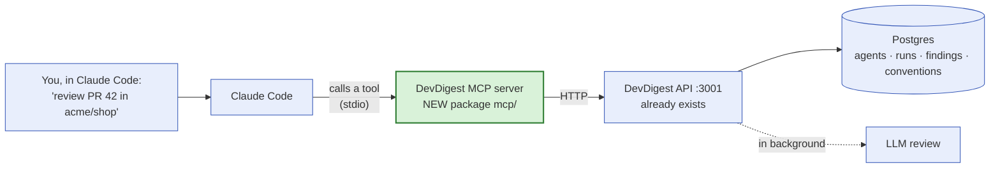
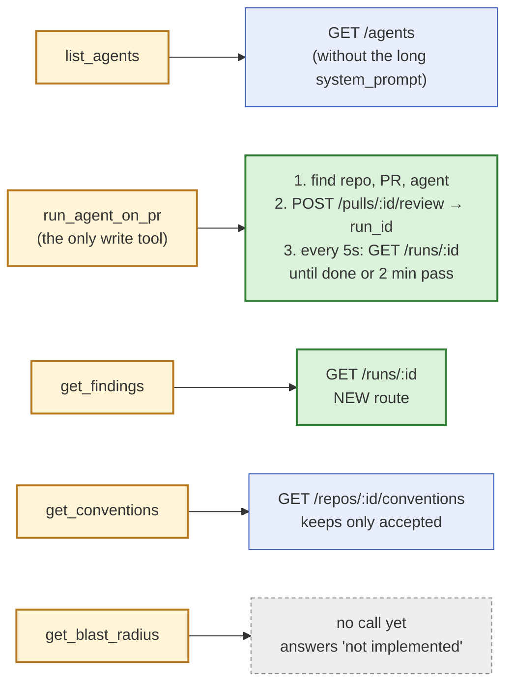
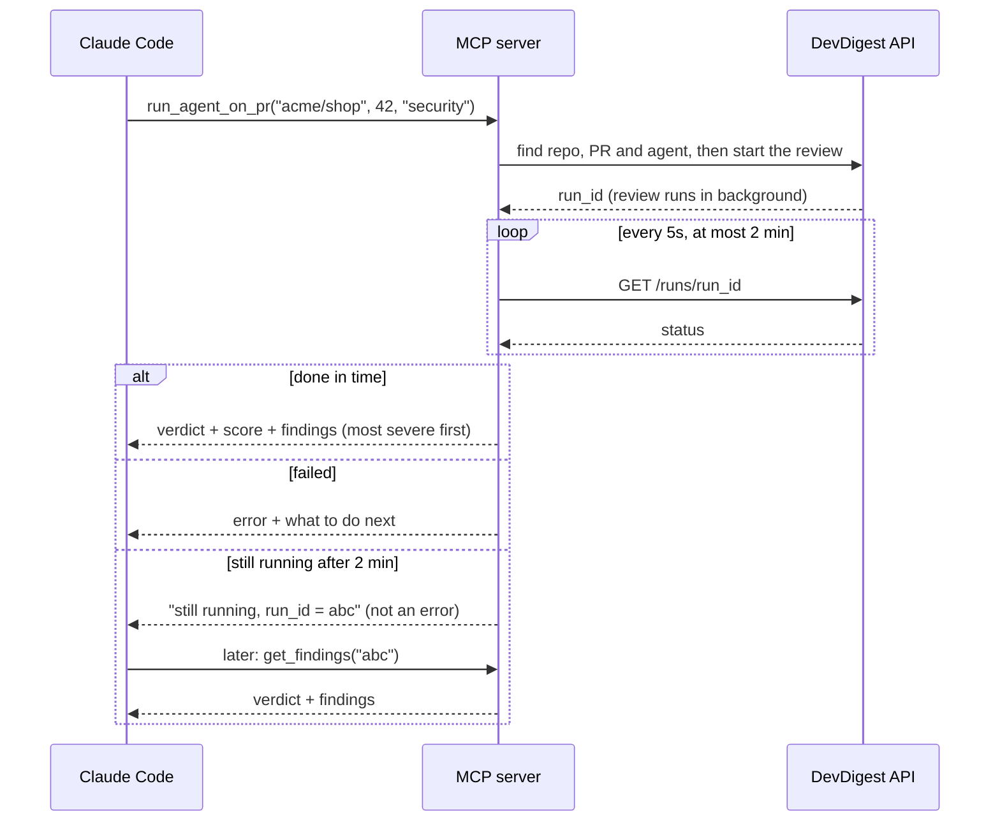
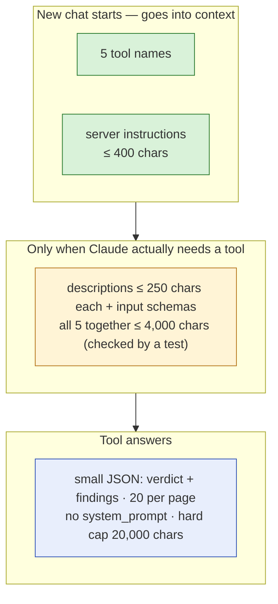
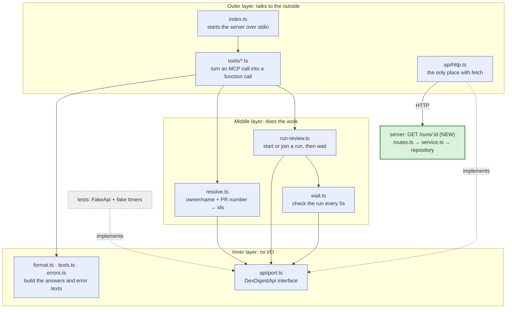

# Spec 11 — diagram sources

Mermaid sources for the PNGs embedded in `specs/11-devdigest-mcp-server.md` §1.
Edit here, then re-render (`11-diagram-N.png`, N = block order).

```mermaid
flowchart LR
  U["You, in Claude Code:<br/>'review PR 42 in acme/shop'"] --> CC["Claude Code"]
  CC -- "calls a tool<br/>(stdio)" --> M["DevDigest MCP server<br/>NEW package mcp/"]
  M -- "HTTP" --> API["DevDigest API :3001<br/>already exists"]
  API --> DB[("Postgres<br/>agents · runs · findings · conventions")]
  API -. "in background" .-> LLM["LLM review"]
  classDef new fill:#d9f2d9,stroke:#2e7d32,stroke-width:2px;
  classDef old fill:#e8eefc,stroke:#3557b7;
  class M new;
  class CC,API,DB,LLM,U old;
```

```mermaid
flowchart LR
  t1["list_agents"] --> e1["GET /agents<br/>(without the long system_prompt)"]
  t2["run_agent_on_pr<br/>(the only write tool)"] --> e2["1. find repo, PR, agent<br/>2. POST /pulls/:id/review → run_id<br/>3. every 5s: GET /runs/:id<br/>until done or 2 min pass"]
  t3["get_findings"] --> e3["GET /runs/:id<br/>NEW route"]
  t4["get_conventions"] --> e4["GET /repos/:id/conventions<br/>keeps only accepted"]
  t5["get_blast_radius"] --> e5["no call yet<br/>answers 'not implemented'"]
  classDef tool fill:#fff4d6,stroke:#b7791f,stroke-width:2px;
  classDef ep fill:#e8eefc,stroke:#3557b7;
  classDef new fill:#d9f2d9,stroke:#2e7d32,stroke-width:2px;
  classDef stub fill:#eeeeee,stroke:#888,stroke-dasharray:4 3;
  class t1,t2,t3,t4,t5 tool;
  class e1,e4 ep;
  class e2,e3 new;
  class e5 stub;
```

```mermaid
sequenceDiagram
  participant C as Claude Code
  participant M as MCP server
  participant A as DevDigest API
  C->>M: run_agent_on_pr("acme/shop", 42, "security")
  M->>A: find repo, PR and agent, then start the review
  A-->>M: run_id (review runs in background)
  loop every 5s, at most 2 min
    M->>A: GET /runs/run_id
    A-->>M: status
  end
  alt done in time
    M-->>C: verdict + score + findings (most severe first)
  else failed
    M-->>C: error + what to do next
  else still running after 2 min
    M-->>C: "still running, run_id = abc" (not an error)
    C->>M: later: get_findings("abc")
    M-->>C: verdict + findings
  end
```

```mermaid
flowchart TB
  subgraph S["New chat starts — goes into context"]
    N["5 tool names"]
    I["server instructions<br/>≤ 400 chars"]
  end
  subgraph L["Only when Claude actually needs a tool"]
    D["descriptions ≤ 250 chars each + input schemas<br/>all 5 together ≤ 4,000 chars (checked by a test)"]
  end
  subgraph O["Tool answers"]
    R["small JSON: verdict + findings · 20 per page<br/>no system_prompt · hard cap 20,000 chars"]
  end
  S --> L --> O
  classDef a fill:#d9f2d9,stroke:#2e7d32;
  classDef b fill:#fff4d6,stroke:#b7791f;
  classDef c fill:#e8eefc,stroke:#3557b7;
  class N,I a;
  class D b;
  class R c;
```

```mermaid
flowchart TB
  subgraph RIM["Outer layer: talks to the outside"]
    IDX["index.ts<br/>starts the server over stdio"]
    TOOLS["tools/*.ts<br/>turn an MCP call into a function call"]
    HTTP["api/http.ts<br/>the only place with fetch"]
  end
  subgraph APP["Middle layer: does the work"]
    RR["run-review.ts<br/>start or join a run, then wait"]
    RES["resolve.ts<br/>owner/name + PR number → ids"]
    WAIT["wait.ts<br/>check the run every 5s"]
  end
  subgraph PURE["Inner layer: no I/O"]
    FMT["format.ts · texts.ts · errors.ts<br/>build the answers and error texts"]
    PORT["api/port.ts<br/>DevDigestApi interface"]
  end
  IDX --> TOOLS
  TOOLS --> RR & RES
  TOOLS --> FMT
  RR --> WAIT
  RR & RES & WAIT --> PORT
  HTTP -. implements .-> PORT
  FAKE["tests: FakeApi + fake timers"] -. implements .-> PORT
  HTTP -- "HTTP" --> ROUTE["server: GET /runs/:id (NEW)<br/>routes.ts → service.ts → repository"]
  classDef new fill:#d9f2d9,stroke:#2e7d32,stroke-width:2px;
  classDef box fill:#e8eefc,stroke:#3557b7;
  classDef test fill:#eeeeee,stroke:#888,stroke-dasharray:4 3;
  class IDX,TOOLS,HTTP,RR,RES,WAIT,FMT,PORT box;
  class ROUTE new;
  class FAKE test;
```
